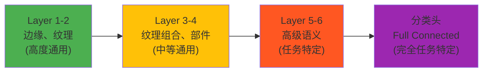
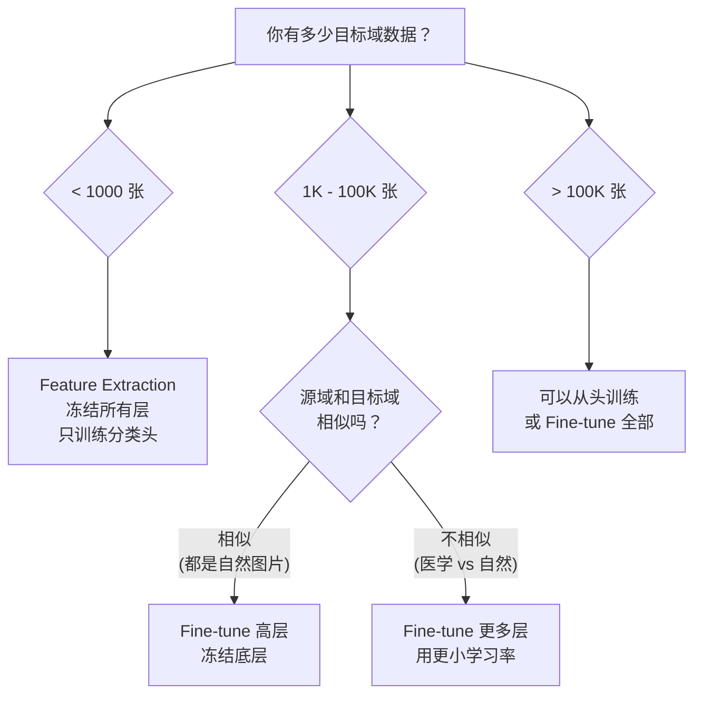

# Transfer Learning 教程

> **前置知识：** 监督学习、CNN 基础、梯度下降、过拟合/正则化
> **参考来源：** [《Deep Learning》Ch.15](../../../textbooks/goodfellow_deep_learning.pdf) · [Yosinski 2014](../../../.documents/papers/transfer_learning/yosinski_2014_transferable_features.pdf) · [PyTorch Tutorial](https://pytorch.org/tutorials/beginner/transfer_learning_tutorial.html)

---

## Section 0: 前置知识速查

1. **CNN 架构**：卷积层提取空间特征，池化层降维，全连接层做分类。参见 [cnn/](../cnn/cnn_map.md)
2. **过拟合**：模型在训练集上表现好但在新数据上差。参见 [../machine-learning/overfitting/](../../machine-learning/overfitting/overfitting_map.md)
3. **梯度下降**：${θ_{new}} = θ_{old} - \eta \nabla L$。参见 [optimizers/](../optimizers/optimizers_map.md)
4. **正则化**：Dropout, Weight Decay, Data Augmentation 等防过拟合手段

---

## Section 1: 它解决什么问题（Why）

### 没有它会怎样？

- 🔥 **痛点 1：数据稀缺** — 你只有 500 张医学影像，从头训练 ResNet-50（2300 万参数）必然严重过拟合。但 ImageNet 有 120 万张图片……能不能借用它的知识？
- 🔥 **痛点 2：训练成本** — GPT-3 从头训练需要数百万美元和数周时间。每个下游任务都从头训练，经济上不可行
- 🔥 **痛点 3：冷启动** — 新领域（如卫星图像分析）没有足够的标注数据。标注一张卫星图需要领域专家花 30 分钟
- 🔥 **痛点 4：重复劳动** — 所有图像任务都需要学习"边缘检测""纹理识别"等底层特征。每个任务都从头学一遍是浪费

### 它的核心价值

1. **以少胜多** — 用预训练模型的通用特征 + 少量目标数据就能获得好性能
2. **以快对慢** — Fine-tuning 几个 epoch vs 从头训练几百个 epoch
3. **站在巨人肩上** — 复用 ImageNet/Wikipedia 上学到的世界知识
4. **降低门槛** — 不需要大型 GPU 集群，普通 GPU 也能 Fine-tune

> 📚 Book: Goodfellow et al., [《Deep Learning》](../../../textbooks/goodfellow_deep_learning.pdf), Ch.15.1
> 📖 Paper: Yosinski et al., [How transferable are features? (2014)](../../../.documents/papers/transfer_learning/yosinski_2014_transferable_features.pdf)

---

## Section 2: 它怎么工作的（How — 底层原理）

### 2.1 为什么特征可以迁移？

Yosinski et al. (2014) 的开创性实验发现，深度网络的不同层学到的特征有**层级结构**：

- **底层**（绿色）：学到边缘检测器、颜色斑块——几乎所有视觉任务都需要，**高度可迁移**
- **中层**（黄色）：学到纹理组合、物体部件——中等可迁移
- **高层**（红色）：学到任务特定的语义特征——**需要重新学习**
- **分类头**（紫色）：直接对应原任务的类别，**必须替换**

> 📖 Paper: Yosinski et al., [How transferable are features? (2014)](../../../.documents/papers/transfer_learning/yosinski_2014_transferable_features.pdf), Figure 2

### 2.2 迁移策略决策树

### 2.3 ULMFiT 三阶段法（NLP 版迁移学习）

Howard & Ruder (2018) 为 NLP 设计了系统的迁移学习方法论：

| 阶段 | 做什么 | 数据 | 学习率 |
|------|--------|------|--------|
| ① LM Pre-training | 在大型语料上训练语言模型 | Wikipedia (通用) | 标准 |
| ② LM Fine-tuning | 在目标域文本上继续训练语言模型 | 目标域无标注文本 | Discriminative LR |
| ③ Classifier Fine-tuning | 加分类头，在目标域标注数据上训练 | 目标域有标注数据 | Gradual Unfreezing |

**Gradual Unfreezing（渐进解冻）：** 从最后一层开始解冻，每个 epoch 再解冻一层。避免一次性解冻所有层导致底层特征被破坏。

> 📖 Paper: Howard & Ruder, [ULMFiT (2018)](../../../.documents/papers/transfer_learning/howard_2018_ulmfit.pdf), Section 3

---

## Section 3: 局限性

1. **负迁移** → 源域和目标域差异太大时，迁移后性能比从头训练更差 → 应对：计算域相似度（如 MMD），相似度低时谨慎迁移
2. **灾难性遗忘** → Fine-tuning 时学习率太大，预训练学到的通用特征被"冲掉" → 应对：小学习率 + Discriminative LR + Gradual Unfreezing
3. **偏差继承** → 预训练数据中的偏见（性别/种族）会被迁移到下游任务 → 应对：偏差审计 + 去偏技术
4. **计算/存储开销** → 大模型（BERT-large 3.4 亿参数）Full Fine-tuning 需要大量 GPU 内存 → 应对：PEFT 方法（LoRA, Adapter, Prompt Tuning）

> 📖 Paper: Zhuang et al., [A Comprehensive Survey (2020)](../../../.documents/papers/transfer_learning/zhuang_2020_transfer_learning_survey.pdf), Section 4.5

---

## Section 4: 方案对比

| 方案 | 优点 | 缺点 | 适用场景 |
|------|------|------|---------| 
| **Feature Extraction** | 快速、不会过拟合 | 特征可能不够贴合 | 目标数据极少 (< 1K) |
| **Fine-tune 高层** | 平衡通用性和适应性 | 需要调学习率 | 中等数据、域相似 |
| **Full Fine-tuning** | 最大化适应目标任务 | 过拟合风险、遗忘 | 大量目标数据 |
| **Gradual Unfreezing** | 保护底层、渐进适应 | 需要更多 epoch | NLP 任务 (ULMFiT) |
| **LoRA** | 只加 0.1% 参数、快速 | 表达能力受限 | 大模型、多任务部署 |
| **Domain Adaptation** | 无需目标域标签 | MMD/对抗训练不稳定 | 源域目标域分布不同 |
| **Knowledge Distillation** | 压缩模型、加速推理 | 学生性能有上限 | 部署到边缘设备 |
| **从头训练** | 完全适配、无偏差继承 | 需要大量数据+算力 | 数据充足、新架构 |

> 📖 Paper: Yosinski et al., [How transferable are features? (2014)](../../../.documents/papers/transfer_learning/yosinski_2014_transferable_features.pdf)
> 📖 Paper: Howard & Ruder, [ULMFiT (2018)](../../../.documents/papers/transfer_learning/howard_2018_ulmfit.pdf)

---

## 参考来源表

| 来源 | 类型 | 使用位置 |
|------|------|---------|
| [《Deep Learning》Ch.15](../../../textbooks/goodfellow_deep_learning.pdf) | 📚 教科书 | Section 1-3: 理论框架 |
| [Yosinski et al. 2014](../../../.documents/papers/transfer_learning/yosinski_2014_transferable_features.pdf) | 📖 论文 | Section 2: 特征可迁移性 |
| [Howard & Ruder 2018](../../../.documents/papers/transfer_learning/howard_2018_ulmfit.pdf) | 📖 论文 | Section 2: ULMFiT 三阶段法 |
| [PyTorch Tutorial](https://pytorch.org/tutorials/beginner/transfer_learning_tutorial.html) | 📖 文档 | Section 2: 策略决策 |
| [Zhuang et al. 2020](../../../.documents/papers/transfer_learning/zhuang_2020_transfer_learning_survey.pdf) | 📖 论文 | Section 3: 局限性 |
