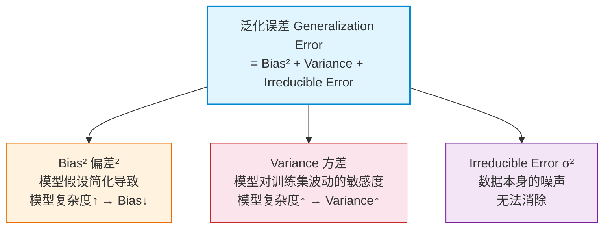

# Overfitting 核心概念

> 📚 Book: Hastie et al., [《ESL》](../../../textbooks/hastie_esl.pdf), Ch.7
> 📚 Book: James et al., [《ISLR》](../../../textbooks/james_ISLR.pdf), Ch.2.2

---

## 术语定义

### 拟合 (Fitting)

模型从训练数据中学习参数的过程。形象地说，就是让模型的"形状"去贴合数据点。拟合的目标是让模型的预测值尽可能接近训练数据的真实值，通常通过最小化损失函数来实现。

> 📚 Book: James et al., [《ISLR》](../../../textbooks/james_ISLR.pdf), Ch.2.1 "What Is Statistical Learning?"

### 过拟合 (Overfitting)

模型把训练数据中的**噪声**也当成了**真实规律**来学习。就像一个学生把考试答案死记硬背了（包括错误答案），换一套题就不会做了。过拟合的标志是：训练误差很低，但测试/验证误差很高。

> 别名：**过度拟合** / **过适应**（日文文献）— 都描述同一现象，英文社区统一用 Overfitting

> 易混淆：**过拟合 vs 记忆化(Memorization)** — 过拟合是统计学概念（模型方差过大），记忆化是计算概念（模型直接存储训练样本，如 1-NN）

> 📚 Book: Hastie et al., [《ESL》](../../../textbooks/hastie_esl.pdf), Ch.7.2 "Bias, Variance and Model Complexity"
> 📚 Book: Goodfellow et al., [《Deep Learning》](../../../textbooks/goodfellow_deep_learning.pdf), Ch.5.2 "Capacity, Overfitting and Underfitting"

### 欠拟合 (Underfitting)

模型太简单，连训练数据中的**真实规律**都没学到。就像用一条直线去拟合一个明显弯曲的数据——不管怎么调参数，直线就是拟合不了曲线。欠拟合的标志是：训练误差和测试误差都很高。

> 易混淆：**欠拟合 vs 过拟合** — 欠拟合是 bias 太高（模型太简单），过拟合是 variance 太高（模型太复杂）

> 📚 Book: James et al., [《ISLR》](../../../textbooks/james_ISLR.pdf), Ch.2.2.2 "The Bias-Variance Trade-Off"

### 偏差 (Bias)

模型的**系统性错误**——由于模型假设过于简单，即使有无穷多训练数据，模型预测的期望值与真实值之间仍有差距。白话说：偏差衡量的是"模型的平均预测离正确答案有多远"。

> 别名：**近似误差 (Approximation Error)**（统计学习理论中）— 因为 bias 来源于用简单函数"近似"复杂真实函数

> 📚 Book: Hastie et al., [《ESL》](../../../textbooks/hastie_esl.pdf), Ch.7.3, Eq. 7.9

### 方差 (Variance)

模型对训练数据的**敏感程度**——换一批训练数据，模型预测结果变化有多大。白话说：方差衡量的是"换一套训练数据，模型的预测会飘多少"。高方差 = 模型不稳定 = 过拟合的信号。

> 别名：**估计误差 (Estimation Error)**（统计学习理论中）— 因为 variance 来源于有限样本"估计"参数时的波动

> 📚 Book: Hastie et al., [《ESL》](../../../textbooks/hastie_esl.pdf), Ch.7.3, Eq. 7.9

### 偏差-方差权衡 (Bias-Variance Tradeoff)

一个核心洞察：模型复杂度增加时，bias 下降但 variance 上升；反之亦然。不存在同时让两者都最小的方案（除非有无穷数据）。最优模型是在 bias 和 variance 之间找到一个甜蜜点，使总测试误差最小。

> 📚 Book: Hastie et al., [《ESL》](../../../textbooks/hastie_esl.pdf), Ch.7.3 "The Bias-Variance Decomposition"
> 📚 Book: James et al., [《ISLR》](../../../textbooks/james_ISLR.pdf), Ch.2.2.2 "The Bias-Variance Trade-Off"

### 泛化误差 (Generalization Error)

模型在**未见过的新数据**上的期望误差。这是我们真正关心的指标——我们不在乎模型在训练集上多准，只在乎它在真实世界中表现如何。泛化误差 = bias² + variance + 不可约误差。

> 别名：**测试误差 (Test Error)** / **带外误差 (Out-of-Sample Error)** / **风险 (Risk)**（统计决策论中）— 不同教科书/领域用不同名字，但核心含义一致

> 📚 Book: Hastie et al., [《ESL》](../../../textbooks/hastie_esl.pdf), Ch.7.2, Eq. 7.3-7.5

### 不可约误差 (Irreducible Error)

数据本身固有的噪声，无论模型多完美都无法消除。白话说：真实世界本身就有随机性，比如同一个人同一天两次测量血压可能不一样——这个差异不是模型的问题，是世界的问题。

> 📚 Book: James et al., [《ISLR》](../../../textbooks/james_ISLR.pdf), Ch.2.1.1 "Why Estimate f?"

### 训练误差 (Training Error)

模型在训练数据上的平均损失。训练误差**不能**代表模型好坏——一个极度过拟合的模型训练误差可以为 0，但在新数据上一塌糊涂。

> 📚 Book: Hastie et al., [《ESL》](../../../textbooks/hastie_esl.pdf), Ch.7.1

### 模型复杂度 (Model Complexity)

模型能表达的"形状"有多丰富。也叫模型容量 (Capacity)。线性模型 < 多项式模型 < 神经网络。复杂度越高，拟合训练数据的能力越强，但过拟合风险也越大。

> 别名：**容量 (Capacity)**（Goodfellow DL 书中）/ **有效自由度 (Effective Degrees of Freedom)**（ESL 中）— Capacity 强调表达能力上界，自由度强调参数的有效数量

> 📚 Book: Goodfellow et al., [《Deep Learning》](../../../textbooks/goodfellow_deep_learning.pdf), Ch.5.2 "Capacity, Overfitting and Underfitting"
> 📚 Book: Hastie et al., [《ESL》](../../../textbooks/hastie_esl.pdf), Ch.7.6 "Effective Number of Parameters"

### 学习曲线 (Learning Curve)

以训练集大小为 x 轴、训练/验证误差为 y 轴的图。它能直观告诉你：模型是 overfitting（两条线差距大）还是 underfitting（两条线都高）、增加数据是否有帮助。

> 📖 Docs: scikit-learn, [learning_curve](https://scikit-learn.org/stable/modules/learning_curve.html)

### 验证曲线 (Validation Curve)

以超参数值为 x 轴、训练/验证误差为 y 轴的图。它能告诉你：超参数在什么范围内模型表现最好，何时开始过拟合。

> 📖 Docs: scikit-learn, [validation_curve](https://scikit-learn.org/stable/modules/learning_curve.html#validation-curve)

### VC 维 (VC Dimension)

模型能"打散"(shatter) 的最大数据点数，衡量模型的"理论复杂度"。直觉：VC 维越高，模型能表达的决策边界越复杂，过拟合风险越大。2D 线性分类器的 VC 维 = 3（能打散 3 个点但不能打散 4 个点）。

> 📚 Book: Hastie et al., [《ESL》](../../../textbooks/hastie_esl.pdf), Ch.7.9 "Vapnik-Chervonenkis Dimension"

> 📚 Book: Goodfellow et al., [《Deep Learning》](../../../textbooks/goodfellow_deep_learning.pdf), Ch.5.7 "Supervised Learning Algorithms" — Table 5.1

---

## 概念辨析

### Overfitting vs Underfitting

| 维度 | Overfitting (过拟合) | Underfitting (欠拟合) |
|------|---------------------|----------------------|
| **本质** | 模型把噪声当规律 | 模型太简单学不到规律 |
| **训练误差** | 很低（甚至为 0） | 较高 |
| **测试误差** | 很高（远高于训练误差） | 较高（与训练误差接近） |
| **主导误差** | 高 Variance | 高 Bias |
| **模型复杂度** | 过高 | 过低 |
| **解决方法** | 正则化、减少特征、增加数据 | 增加特征、用更复杂模型 |

> 📚 Book: James et al., [《ISLR》](../../../textbooks/james_ISLR.pdf), Ch.2.2.2

### Bias vs Variance

| 维度 | Bias (偏差) | Variance (方差) |
|------|------------|----------------|
| **本质** | 模型假设和真实函数的差距 | 模型对训练集变化的敏感度 |
| **来源** | 模型太简单（假设错了） | 模型太复杂（对数据波动敏感） |
| **数据量影响** | 数据再多也无法减少 | 数据越多，variance 越小 |
| **典型模型** | 线性回归拟合非线性数据 | 高阶多项式、深度神经网络 |
| **统计学名** | 近似误差 Approximation Error | 估计误差 Estimation Error |

> 📚 Book: Hastie et al., [《ESL》](../../../textbooks/hastie_esl.pdf), Ch.7.3

### Training Error vs Generalization Error

| 维度 | Training Error (训练误差) | Generalization Error (泛化误差) |
|------|--------------------------|-------------------------------|
| **计算数据** | 训练集 | 未见过的测试集 |
| **能否直接算** | 能，直接算 | 不能，只能**估计**（用验证集/CV） |
| **随模型复杂度** | 单调递减 | 先降后升（U 形） |
| **能否代表模型好坏** | ❌ 不能 | ✅ 能 |

> 📚 Book: Hastie et al., [《ESL》](../../../textbooks/hastie_esl.pdf), Ch.7.1-7.2

---

## 核心属性

### 信息架构

### 适用场景 ✅

- 所有监督学习模型的评估和选择
- 超参数调优决策
- 判断是否需要更多数据还是更好的特征
- 解释为什么集成方法（Bagging/Boosting）有效

### 不适用场景 ❌

- 无监督学习（聚类没有标签，bias-variance 分解需要真实标签）
- 数据量极大且模型简单时（现代深度学习中 double descent 现象打破了经典 U 形曲线）
- 在线学习/流式数据（i.i.d. 假设可能不成立）

> 📚 Book: Hastie et al., [《ESL》](../../../textbooks/hastie_esl.pdf), Ch.7.3
> 📚 Book: Goodfellow et al., [《Deep Learning》](../../../textbooks/goodfellow_deep_learning.pdf), Ch.5.2

---

## 速查表

| 项 | 说明 | 示例 |
|-----|------|------|
| 过拟合信号 | 训练误差 ≪ 验证误差 | 训练 acc=99%, 验证 acc=60% |
| 欠拟合信号 | 训练误差 ≈ 验证误差，但都很高 | 训练 acc=65%, 验证 acc=60% |
| 最优信号 | 训练误差略低于验证误差 | 训练 acc=92%, 验证 acc=88% |
| 增加数据 | 减少 variance，对 bias 无效 | 从 1000→10000 样本 |
| 增加特征 | 减少 bias，可能增加 variance | 添加多项式特征 |
| 正则化 λ↑ | 增加 bias，减少 variance | Ridge λ: 0.01→1.0 |
| K-fold CV 的 K | K 大→低 bias 高 variance | K=5 常用折中 |
