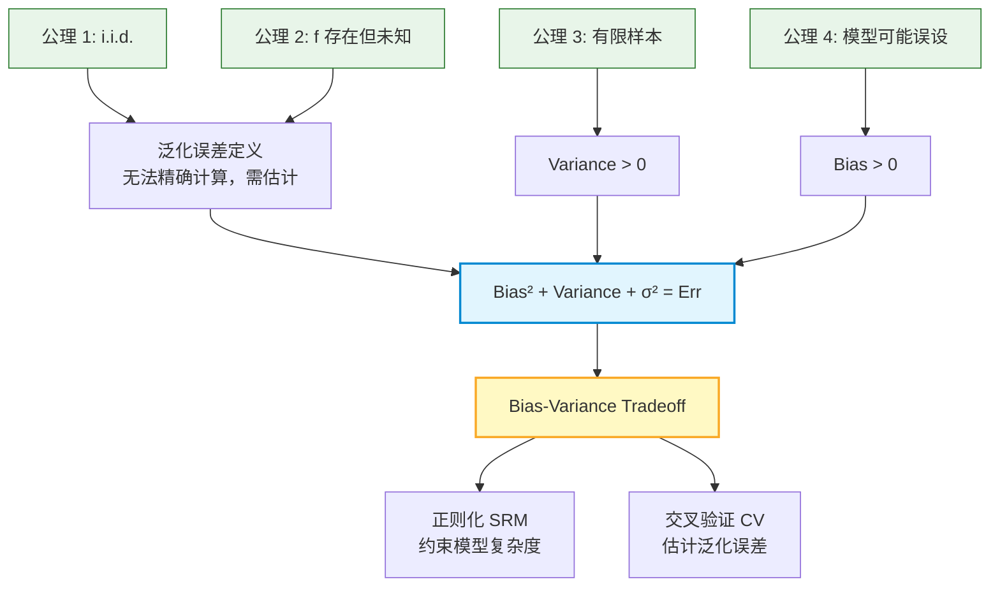

# Overfitting 第一性原理

> 📖 Paper: Vapnik, [The Nature of Statistical Learning Theory (1995)](https://doi.org/10.1007/978-1-4757-2440-0)
> 📚 Book: Hastie et al., [《ESL》](../../../textbooks/hastie_esl.pdf), Ch.7.3, Ch.7.9

---

## 核心问题链

> 用"5 个为什么"递归追问，从表层功能到不可再分公理。

1. **Overfitting 在描述什么？** → 模型在训练数据上表现好但在新数据上表现差（表层现象）
2. **为什么在训练数据上好不等于在新数据上好？** → 因为训练误差总是低估泛化误差（乐观度 > 0），模型越复杂低估越多
3. **为什么会低估？** → 因为模型的参数是通过优化训练数据得到的，它对训练数据有"先天优势"（$\text{Cov}(\hat{y}_i, y_i) > 0$）
4. **这个先天优势的根基是什么？** → 有限样本采样的波动性——同一个分布抽出不同样本，模型学到的参数不同，这就是 variance 的来源
5. **能否继续拆分？** → 不能 → **到达公理：有限样本 + 数据生成过程的随机性是不可消除的基本事实**

---

## 公理与基本假设

### 公理 1: 数据由未知分布 $P(X,Y)$ 生成 (i.i.d. 假设)

**陈述：** 训练数据 $\{(x_i, y_i)\}_{i=1}^n$ 和测试数据 $(x_0, y_0)$ 独立同分布地从同一个未知联合分布 $P(X,Y)$ 中抽取。

**白话：** 训练数据和测试数据"来自同一个世界"——用同一种规则生成的。每个数据点是独立抽取的，互不影响。

**来源：** 经典统计学假设；Vapnik (1995) Ch.1 "Setting of the Learning Problem"

**可验证性：**
- ✅ 成立条件：数据收集过程随机采样、不随时间变化、无选择偏差
- ❌ 不成立条件：分布漂移（训练和部署环境不同）、时间序列数据（有自相关）、选择偏差（如只收集某类患者数据）

> 📖 Paper: Vapnik, [SLT (1995)](https://doi.org/10.1007/978-1-4757-2440-0), Ch.1

### 公理 2: 真实函数关系存在但未知

**陈述：** 存在一个确定性函数 $f(x) = \mathbb{E}[Y|X=x]$，但我们不知道它的形式。数据 $Y = f(x) + \epsilon$，其中 $\epsilon$ 是均值为 0 的噪声。

**白话：** 数据背后有一个"真相"（真实的输入-输出关系），但我们永远看不到它——我们只能看到被噪声污染的观测值。

**来源：** 统计回归的基本设定；ESL Ch.2.3 "Two Simple Approaches to Prediction"

**可验证性：**
- ✅ 成立条件：数据有因果规律、噪声是随机的（不是系统性的）
- ❌ 不成立条件：纯随机数据（不存在 $f(x)$）、噪声不是加性的、异方差（$\sigma^2$ 随 $x$ 变化）

> 📚 Book: Hastie et al., [《ESL》](../../../textbooks/hastie_esl.pdf), Ch.2.3

### 公理 3: 有限样本导致不确定性

**陈述：** 训练集大小 $n$ 是有限的。对于任何有限 $n$，由训练集得到的估计 $\hat{f}$ 都是 $f$ 的一个带噪声的近似。

**白话：** 有限的数据点只能"看到"真实规律的一部分。就像用 100 人的调查推断全国的偏好——一定会有误差。

**来源：** 大数定律的前提条件和推论

**可验证性：**
- ✅ 成立条件：永远成立——现实中不可能有无穷数据
- 边界情况：当 $n \to \infty$ 时，一致估计量的 variance → 0（大数定律），但这是渐近极限，实践中不可达

> 📚 Book: Goodfellow et al., [《Deep Learning》](../../../textbooks/goodfellow_deep_learning.pdf), Ch.5.2

### 公理 4: 模型类不一定包含真实函数（模型误设）

**陈述：** 我们选择的模型类 $\mathcal{H}$（如线性函数族）可能不包含真实函数 $f$。即 $f \notin \mathcal{H}$ 是允许的。

**白话：** 我们可能一开始就"找错了方向"——真实关系是非线性的，但我们只用了线性模型。这时候再怎么加数据，bias 都不会降到 0。

**来源：** 近似误差的定义来源

**可验证性：**
- ✅ 当 $\mathcal{H}$ 是万能逼近器（如深度神经网络）时，bias 理论上可以任意小
- ❌ 当 $\mathcal{H}$ 有限（如线性模型），且 $f$ 是非线性函数时，不可消除的 bias 存在

> 📚 Book: Hastie et al., [《ESL》](../../../textbooks/hastie_esl.pdf), Ch.7.3

---

## 从公理到技术的推导链

### Step 1: 从公理 1+2 出发 → 泛化误差的定义

**推理：** 因为数据来自 $P(X,Y)$（公理 1），且 $Y = f(x) + \epsilon$（公理 2），我们关心的是在 $P$ 上的期望预测误差：
$$\text{Err}(\hat{f}) = \mathbb{E}_{(X,Y) \sim P}\left[L(Y, \hat{f}(X))\right]$$

**结果：** 泛化误差是一个关于未知分布 $P$ 的期望——无法精确计算，只能估计。

### Step 2: 从公理 3 出发 → Bias-Variance 分解

**推理：** 因为训练集有限（公理 3），$\hat{f}$ 是训练集 $\mathcal{T}$ 的随机函数。对固定 $x_0$，不同的 $\mathcal{T}$ 给出不同的 $\hat{f}(x_0)$。取期望得分解：
$$\text{Err}(x_0) = \text{Bias}^2 + \text{Variance} + \sigma^2$$

**结果：** 过拟合 = Variance 过大。这直接来自有限样本的随机性。

### Step 3: 从公理 4 出发 → Bias 不为零的根本原因

**推理：** 如果 $f \notin \mathcal{H}$（公理 4），则即使 $n \to \infty$，$\hat{f}$ 也不能收敛到 $f$，残留误差 = $\min_{g \in \mathcal{H}} \|g - f\|^2 > 0$。

**结果：** Bias 来自"模型类的选择"——一个先验决策，与数据无关。

### Step 4: 综合 → Bias-Variance Tradeoff 的必然性

**推理：** 要降低 bias，需要扩大 $\mathcal{H}$（更复杂的模型类）→ 但更大的 $\mathcal{H}$ 在有限数据下（公理 3）意味着更大的 variance。两者此消彼长，存在最优平衡点。

**结果：** Overfitting（variance 太大）和 Underfitting（bias 太大）是有限样本学习的不可避免的两面。

### Step 5: → 正则化和交叉验证的理论必要性

**推理：** 既然最优复杂度存在但依赖未知分布（无法直接计算），我们需要：
1. **正则化**：显式约束 $\mathcal{H}$ 的大小 → 控制 variance → SRM
2. **交叉验证**：用数据本身估计泛化误差 → 找最优复杂度

**结果：** 正则化和 CV 不是"技巧"，而是公理 1-4 的数学必然推论。

### 推导链全景图

---

## 如果公理不成立？

### 公理 1 失效：数据不是 i.i.d.

**如果不成立：** 训练数据和测试数据来自不同分布（如训练在医院 A，部署在医院 B）

**技术后果：** 即使模型在训练分布上完美（bias=0, variance=0），在测试分布上仍可能误差很大。经典 bias-variance 分解不再适用。

**替代方案：** 领域适应 (Domain Adaptation)、分布鲁棒优化 (Distributionally Robust Optimization)、因果推断方法

### 公理 2 失效：真实函数不存在

**如果不成立：** 数据完全是随机噪声，不存在 $f(x)$

**技术后果：** 任何模型的"拟合"都是在拟合纯噪声。此时 $f(x) = 0$，泛化误差 = $\sigma^2$（不可约），所有模型都是过拟合（因为它们学到的一切都是噪声）。

**替代方案：** 先做探索性分析确认数据中存在信号（如相关性检验、互信息）

### 公理 3 "边界"：如果有无穷数据

**如果不成立：** $n \to \infty$

**技术后果：** Variance → 0（大数定律），只剩 Bias + σ²。此时正则化不再需要——直接用最复杂的模型即可最小化 bias。但现实中永远达不到。

**替代方案：** 利用大数据时代的海量数据，适当增加模型复杂度（这解释了为什么深度学习在大数据上表现好）

### 公理 4 失效：模型类包含真实函数

**如果不成立：** $f \in \mathcal{H}$（如用足够宽的神经网络拟合任何连续函数）

**技术后果：** Bias → 0（渐近），只剩 Variance + σ²。此时唯一的敌人是 variance——正则化的重要性更高。

**替代方案：** 在这种情况下，过拟合控制（正则化、early stopping）变成唯一的关键问题

---

## 第一性原理速查表

| 公理/假设 | 一句话陈述 | 成立条件 | 失效后果 |
|----------|-----------|---------|---------| 
| i.i.d. 假设 | 训练数据和测试数据同分布 | 数据采集无偏、无时序依赖 | bias-variance 分解失效，需领域适应 |
| 真实函数存在 | 数据 = 规律 + 噪声 | 数据有因果结构 | 所有拟合都是过拟合 |
| 有限样本 | 训练集大小有限 | 永远成立 | Variance > 0 是固有代价 |
| 模型可能误设 | 模型类不一定包含真相 | 模型类有限时 | Bias > 0 不可消除 |
