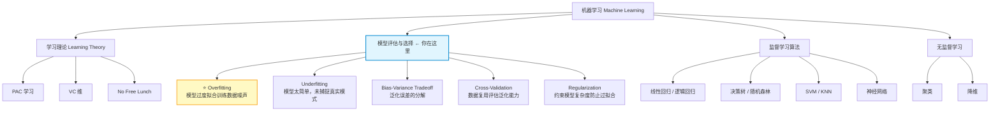
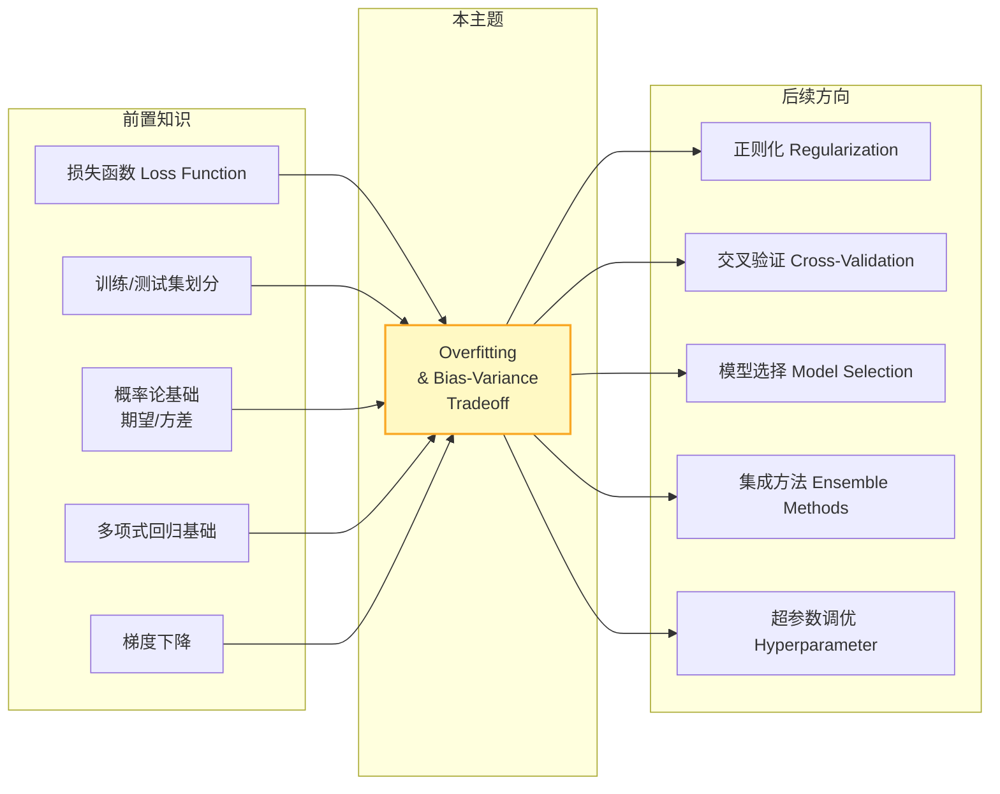

# Overfitting 知识地图

> 📚 Book: Hastie et al., [《The Elements of Statistical Learning》](../../../textbooks/hastie_esl.pdf), Ch.7 "Model Assessment and Selection"
> 📚 Book: James et al., [《An Introduction to Statistical Learning》](../../../textbooks/james_ISLR.pdf), Ch.2 "Statistical Learning"

## 1. 核心问题

- **什么是 overfitting？和 underfitting 有什么区别？** → 模型把训练数据中的噪声也当成了规律来学习，导致在新数据上表现差；underfitting 是模型太简单，连真实规律都没学到
- **为什么模型复杂度越高，训练误差越低，但测试误差反而可能升高？** → 这就是 bias-variance tradeoff：复杂模型降低 bias 但增加 variance，总误差 = bias² + variance + 不可约噪声
- **怎么判断我的模型是不是 overfitting 了？** → 看训练误差和验证误差的差距：差距大 = overfitting；两个都高 = underfitting
- **怎么防止 overfitting？** → 正则化（L1/L2）、交叉验证选模型、early stopping、增加数据、降低模型复杂度
- **Bias-Variance Tradeoff 的数学本质是什么？** → 泛化误差可分解为 bias² + variance + irreducible error，这三项此消彼长

> 📚 Book: Hastie et al., [《ESL》](../../../textbooks/hastie_esl.pdf), Ch.7.2 "Bias, Variance, and Model Complexity"
> 📚 Book: James et al., [《ISLR》](../../../textbooks/james_ISLR.pdf), Ch.2.2 "Assessing Model Accuracy"

---

## 2. 全景位置

> 📚 Book: Hastie et al., [《ESL》](../../../textbooks/hastie_esl.pdf), Ch.7 "Model Assessment and Selection"
> 📚 Book: Goodfellow et al., [《Deep Learning》](../../../textbooks/goodfellow_deep_learning.pdf), Ch.5.2 "Capacity, Overfitting and Underfitting"

---

## 3. 依赖地图

> 📚 Book: Hastie et al., [《ESL》](../../../textbooks/hastie_esl.pdf), Ch.7.1-7.3
> 📚 Book: James et al., [《ISLR》](../../../textbooks/james_ISLR.pdf), Ch.2.2, Ch.5.1

---

## 4. 文件地图

| 文件 | 定位 | 何时用 |
|------|------|--------|
| [overfitting_map.md](overfitting_map.md) | ① 导航 | 第一次接触、需要全局视角 |
| [overfitting_concepts.md](overfitting_concepts.md) | ② 概念 | 理解 overfitting/underfitting/bias/variance 等术语 |
| [overfitting_math.md](overfitting_math.md) | ③ 公式 | 推导 bias-variance 分解、理解泛化误差 |
| [overfitting_tutorial.md](overfitting_tutorial.md) | ④ 教程 | Why-First 理解为什么需要控制模型复杂度 |
| [overfitting_code.md](overfitting_code.md) | ⑤ 代码 | 用 scikit-learn 画 learning curve / validation curve |
| [overfitting_pitfalls.md](overfitting_pitfalls.md) | ⑥ 踩坑 | 调试过拟合问题 |
| [overfitting_history.md](overfitting_history.md) | ⑦ 历史 | 了解从 ERM 到 SRM 的演进 |
| [overfitting_bridge.md](overfitting_bridge.md) | ⑧ 衔接 | 找相关主题（正则化、集成学习） |
| [overfitting_first_principles.md](overfitting_first_principles.md) | ⑨ 第一性原理 | 追问 bias-variance 分解的公理基础 |

> 📚 Book: Norman, [《The Design of Everyday Things》](../../../textbooks/norman_design_everyday_things.pdf), Ch.3 "Knowledge in the World"

---

## 5. 学习/使用路线

### 第一次学习 🎒

1. 读 [overfitting_map.md](overfitting_map.md) 了解全局位置
2. 读 [overfitting_tutorial.md](overfitting_tutorial.md) Section 1 理解痛点：为什么 overfitting 是 ML 最常见的问题
3. 读 [overfitting_concepts.md](overfitting_concepts.md) 掌握核心术语：overfitting / underfitting / bias / variance
4. 读 [overfitting_math.md](overfitting_math.md) 手算一次 bias-variance 分解
5. 跟 [overfitting_code.md](overfitting_code.md) 画一次 learning curve + validation curve
6. 读 [overfitting_history.md](overfitting_history.md) 了解从 ERM 到 SRM 的技术演进
7. 读 [overfitting_first_principles.md](overfitting_first_principles.md) 追问 i.i.d. 假设和大数定律

### 日常参考 🔧

1. 查 [overfitting_code.md](overfitting_code.md) learning_curve / validation_curve API
2. 查 [overfitting_math.md](overfitting_math.md) bias-variance 公式速查
3. 查 [overfitting_pitfalls.md](overfitting_pitfalls.md) 排查模型过拟合/欠拟合

### 深度研究 🔬

1. 读 [overfitting_history.md](overfitting_history.md) 完整演进线
2. 读 [overfitting_first_principles.md](overfitting_first_principles.md) 追问 VC 维和 PAC 学习的公理
3. 读 [overfitting_bridge.md](overfitting_bridge.md) 探索正则化、集成学习
4. 阅读 ESL Ch.7 原文 + Vapnik 1995 原始论文

---

## 6. 缺口检查

| 维度 | 状态 |
|------|------|
| Map | ✅ 已完成 |
| Concepts | ✅ 已完成 |
| Math | ✅ 已完成 |
| Tutorial | ✅ 已完成 |
| Code | ✅ 已完成 |
| Pitfalls | ✅ 已完成 |
| History | ✅ 已完成 |
| Bridge | ✅ 已完成 |
| First Principles | ✅ 已完成 |

---

## 7. 新鲜度状态

| 维度 | 上次验证 | 过期时间 | 状态 |
|------|---------|---------|------|
| Map | 2026-03-18 | 12m | ✅ current |
| Concepts | 2026-03-18 | 12m | ✅ current |
| Math | 2026-03-18 | 12m | ✅ current |
| Tutorial | 2026-03-18 | 12m | ✅ current |
| Code | 2026-03-18 | 6m | ✅ current |
| Pitfalls | 2026-03-18 | 6m | ✅ current |
| History | 2026-03-18 | never | ✅ current |
| Bridge | 2026-03-18 | 12m | ✅ current |
| First Principles | 2026-03-18 | 12m | ✅ current |

---

## 8. 参考来源表

| 来源 | 类型 | 使用位置 |
|------|------|---------|
| [《ESL》Ch.7](../../../textbooks/hastie_esl.pdf) | 📚 教科书 | 全文核心参考：bias-variance 分解、交叉验证、模型选择 |
| [《ISLR》Ch.2, Ch.5](../../../textbooks/james_ISLR.pdf) | 📚 教科书 | 概念入门、交叉验证实操 |
| [《PML1》Ch.4](../../../textbooks/murphy_pml1.pdf) | 📚 教科书 | 贝叶斯视角的 overfitting |
| [《PRML》Ch.3](../../../textbooks/bishop_prml.pdf) | 📚 教科书 | 贝叶斯正则化 |
| [《Deep Learning》Ch.5](../../../textbooks/goodfellow_deep_learning.pdf) | 📚 教科书 | 深度学习中的 capacity 与 overfitting |
| [scikit-learn Model Selection](https://scikit-learn.org/stable/modules/cross_validation.html) | 📖 文档 | 代码实现参考 |
| [Vapnik 1995](https://link.springer.com/book/10.1007/978-1-4757-2440-0) | 📖 论文 | SRM/VC 维原始理论 |
