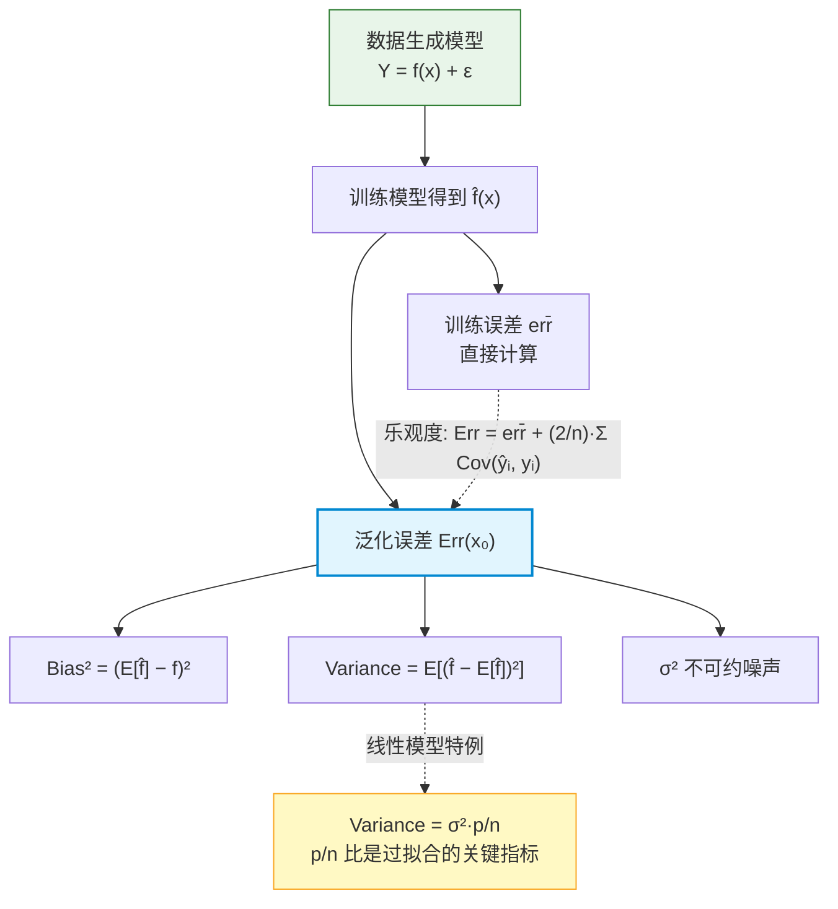

# Overfitting 数学基础

> 📚 Book: Hastie et al., [《ESL》](../../../textbooks/hastie_esl.pdf), Ch.7.3 "The Bias-Variance Decomposition"
> 📚 Book: James et al., [《ISLR》](../../../textbooks/james_ISLR.pdf), Ch.2.2.2 "The Bias-Variance Trade-Off"

---

## 符号对照表

| 符号 | 含义（白话） | 英文 | 取值范围 |
|------|-------------|------|---------|
| $Y$ | 真实响应变量 | True response | $\mathbb{R}$ |
| $f(x)$ | 真实函数（未知） | True function | — |
| $\hat{f}(x)$ | 模型的预测函数 | Estimated function | — |
| $\epsilon$ | 噪声（随机误差） | Noise | $\mathbb{E}[\epsilon]=0, \text{Var}(\epsilon)=\sigma^2$ |
| $\sigma^2$ | 不可约误差 | Irreducible error | $\sigma^2 \geq 0$ |
| $\mathcal{T}$ | 训练集 | Training set | — |
| $x_0$ | 一个固定的测试点 | Test point | — |
| $\text{Err}(x_0)$ | 在 $x_0$ 处的期望测试误差 | Expected test error at $x_0$ | $\geq 0$ |
| $n$ | 训练样本数量 | Number of training samples | $n \geq 1$ |
| $p$ | 特征维度 | Number of features | $p \geq 1$ |
| $d$ | 多项式阶数 / 模型复杂度 | Polynomial degree / complexity | $d \geq 0$ |
| $\lambda$ | 正则化参数 | Regularization parameter | $\lambda \geq 0$ |

> 📚 Book: Hastie et al., [《ESL》](../../../textbooks/hastie_esl.pdf), Ch.7 符号约定

---

## 核心公式

### 公式 1: 数据生成模型

**直觉：** 真实世界的数据 = 真实规律 + 无法消除的噪声

$$Y = f(x) + \epsilon, \quad \mathbb{E}[\epsilon] = 0, \quad \text{Var}(\epsilon) = \sigma^2$$

> 📚 Book: James et al., [《ISLR》](../../../textbooks/james_ISLR.pdf), Eq. 2.1

**参数解释：**

| 参数 | 含义 | 例子中对应 |
|------|------|-----------|
| $f(x)$ | 真实的输入-输出关系 | 例：房价与面积的真实关系 |
| $\epsilon$ | 不可控的随机因素 | 例：同户型不同楼层的价格差异 |
| $\sigma^2$ | 噪声的大小 | 例：房价波动的方差 |

> 📚 Book: James et al., [《ISLR》](../../../textbooks/james_ISLR.pdf), Ch.2.1.1

---

### 公式 2: 泛化误差分解 (Bias-Variance Decomposition)

**直觉：** 模型的测试误差可以精确拆成三部分——模型太简单的错误 + 模型太敏感的错误 + 数据本身的噪声

$$\text{Err}(x_0) = \mathbb{E}\left[(Y - \hat{f}(x_0))^2\right] = \underbrace{\text{Bias}^2(\hat{f}(x_0))}_{\text{模型假设偏差}} + \underbrace{\text{Var}(\hat{f}(x_0))}_{\text{训练集波动}} + \underbrace{\sigma^2}_{\text{不可约噪声}}$$

其中：

$$\text{Bias}(\hat{f}(x_0)) = \mathbb{E}_{\mathcal{T}}[\hat{f}(x_0)] - f(x_0)$$

$$\text{Var}(\hat{f}(x_0)) = \mathbb{E}_{\mathcal{T}}\left[(\hat{f}(x_0) - \mathbb{E}_{\mathcal{T}}[\hat{f}(x_0)])^2\right]$$

> 📚 Book: Hastie et al., [《ESL》](../../../textbooks/hastie_esl.pdf), Eq. 7.9

**参数解释：**

| 参数 | 含义 | 直觉 |
|------|------|------|
| $\text{Bias}^2$ | 模型平均预测与真实值的偏差的平方 | "平均来说离靶心多远" |
| $\text{Var}$ | 模型预测在不同训练集上的波动 | "每次射击的散布有多大" |
| $\sigma^2$ | 数据本身的噪声方差 | "即使射手完美，风也会吹偏" |

**推导过程：**（逐步，不跳步）

Step 1: 写出误差定义
$$\text{Err}(x_0) = \mathbb{E}_{Y,\mathcal{T}}[(Y - \hat{f}(x_0))^2]$$

Step 2: 代入 $Y = f(x_0) + \epsilon$
$$= \mathbb{E}_{Y,\mathcal{T}}[(f(x_0) + \epsilon - \hat{f}(x_0))^2]$$

Step 3: 定义 $\mu = \mathbb{E}_{\mathcal{T}}[\hat{f}(x_0)]$，加减 $\mu$
$$= \mathbb{E}_{Y,\mathcal{T}}[(f(x_0) - \mu + \mu - \hat{f}(x_0) + \epsilon)^2]$$

Step 4: 展开平方，利用 $\mathbb{E}[\epsilon]=0$ 且 $\epsilon$ 与 $\hat{f}$ 独立，交叉项为 0
$$= (f(x_0) - \mu)^2 + \mathbb{E}_{\mathcal{T}}[(\hat{f}(x_0) - \mu)^2] + \sigma^2$$

Step 5: 识别各项
$$= \text{Bias}^2(\hat{f}(x_0)) + \text{Var}(\hat{f}(x_0)) + \sigma^2$$

> 📚 Book: Hastie et al., [《ESL》](../../../textbooks/hastie_esl.pdf), Ch.7.3, Eq. 7.9-7.12

---

### 公式 3: 训练误差的乐观估计

**直觉：** 训练误差总是比真实泛化误差低（因为模型是在训练数据上优化的），低多少取决于模型复杂度

$$\mathbb{E}_{\mathcal{T}}[\text{Err}] = \mathbb{E}_{\mathcal{T}}[\overline{\text{err}}] + \frac{2}{n} \sum_{i=1}^{n} \text{Cov}(\hat{y}_i, y_i)$$

> 📚 Book: Hastie et al., [《ESL》](../../../textbooks/hastie_esl.pdf), Eq. 7.21 "In-sample prediction error"

**参数解释：**

| 参数 | 含义 | 直觉 |
|------|------|------|
| $\overline{\text{err}}$ | 训练误差 | 模型在训练集上的平均损失 |
| $\text{Cov}(\hat{y}_i, y_i)$ | 预测值与真实值的协方差 | 模型多大程度上"追踪"了训练数据 |
| $\frac{2}{n}\sum \text{Cov}$ | 乐观度 (optimism) | 训练误差低估泛化误差的程度 |

**关键洞察：** 模型越复杂 → $\text{Cov}(\hat{y}_i, y_i)$ 越大 → 训练误差越低估真实误差 → 越危险

> 📚 Book: Hastie et al., [《ESL》](../../../textbooks/hastie_esl.pdf), Ch.7.4 "Optimism of the Training Error Rate"

---

### 公式 4: 线性模型的 Bias-Variance（具体形式）

**直觉：** 对线性模型，bias 和 variance 有简洁的闭式解，能直接看到 p/n 比如何影响过拟合

$$\text{Err}(x_0) = \sigma^2 + \left[f(x_0) - x_0^T \beta^*\right]^2 + \sigma^2 \cdot \frac{p}{n}$$

其中 $\beta^* = \arg\min_\beta \mathbb{E}[(Y - x^T\beta)^2]$ 是最优线性系数

> 📚 Book: Hastie et al., [《ESL》](../../../textbooks/hastie_esl.pdf), Eq. 7.16

**参数解释：**

| 参数 | 含义 | 直觉 |
|------|------|------|
| $\sigma^2$ | 不可约误差 | 底线，无法消除 |
| $[f(x_0) - x_0^T\beta^*]^2$ | 模型 bias² | 真实函数不是线性时才出现 |
| $\sigma^2 \cdot p/n$ | 模型 variance | 特征越多(p↑)或数据越少(n↓)，variance 越大 |

**关键洞察：**
- $p/n$ 是过拟合的"危险信号"——当 $p \approx n$ 时，variance 项爆炸
- 这解释了为什么高维小样本问题容易过拟合

> 📚 Book: Hastie et al., [《ESL》](../../../textbooks/hastie_esl.pdf), Ch.7.3

---

## 公式关系图

> 📚 Book: Hastie et al., [《ESL》](../../../textbooks/hastie_esl.pdf), Ch.7.2-7.4

---

## 手算练习

### 练习 1: Bias-Variance 分解（多项式回归）

**题目：** 真实函数 $f(x) = \sin(\pi x)$，数据 $Y = f(x) + \epsilon$, $\epsilon \sim N(0, 0.1)$。

用阶数 $d=1$（线性回归）和 $d=9$（9 阶多项式）分别拟合 $n=10$ 个训练点。假设对 100 个不同训练集重复实验。

在测试点 $x_0 = 0.5$ 处：

| 模型 | $\mathbb{E}[\hat{f}(x_0)]$ | $f(x_0) = \sin(0.5\pi) = 1.0$ | Bias | Variance |
|------|---------------------------|-------------------------------|------|----------|
| $d=1$ | 0.65 | 1.0 | 0.35 | 0.02 |
| $d=9$ | 1.02 | 1.0 | 0.02 | 2.50 |

**解答步骤：**

1. **$d=1$ (欠拟合):**
   - Bias² = $(0.65 - 1.0)^2 = 0.1225$
   - Variance = $0.02$
   - 泛化误差 ≈ $0.1225 + 0.02 + 0.1 = 0.2425$

2. **$d=9$ (过拟合):**
   - Bias² = $(1.02 - 1.0)^2 = 0.0004$
   - Variance = $2.50$
   - 泛化误差 ≈ $0.0004 + 2.50 + 0.1 = 2.6004$

3. **结论：** $d=1$ 的误差主要来自 bias（模型太简单），$d=9$ 的误差主要来自 variance（模型对训练数据过度敏感）。最优阶数大约在 $d=3$ 左右。

> 📚 Book: James et al., [《ISLR》](../../../textbooks/james_ISLR.pdf), Fig. 2.9-2.12

### 练习 2: p/n 比影响

**题目：** 线性模型，$\sigma^2 = 1.0$，真实函数是线性的（bias = 0）。

| 场景 | p (特征数) | n (样本数) | p/n | Variance = σ²·p/n | 总误差 |
|------|-----------|-----------|-----|-------------------|--------|
| A | 5 | 100 | 0.05 | 0.05 | 1.05 |
| B | 50 | 100 | 0.50 | 0.50 | 1.50 |
| C | 95 | 100 | 0.95 | 0.95 | 1.95 |

**解答步骤：**

1. 代入公式: $\text{Err} = \sigma^2 + 0 + \sigma^2 \cdot p/n = 1 + p/n$
2. 场景 A: $1 + 0.05 = 1.05$ ✅ 健康
3. 场景 B: $1 + 0.50 = 1.50$ ⚠️ 注意
4. 场景 C: $1 + 0.95 = 1.95$ 🚨 接近崩溃

**结论：** 即使模型假设完全正确（bias=0），当 $p/n \to 1$ 时 variance 也会让误差翻倍。

> 📚 Book: Hastie et al., [《ESL》](../../../textbooks/hastie_esl.pdf), Ch.7.3, Eq. 7.16

---

## 公式速查表

| 名称 | 公式 | 用途 | 前置公式 |
|------|------|------|---------|
| 数据模型 | $Y = f(x) + \epsilon$ | 一切推导的起点 | — |
| Bias-Variance 分解 | $\text{Err} = \text{Bias}^2 + \text{Var} + \sigma^2$ | 分析过拟合/欠拟合来源 | 数据模型 |
| Bias 定义 | $\text{Bias} = \mathbb{E}[\hat{f}] - f$ | 衡量系统性偏差 | — |
| Variance 定义 | $\text{Var} = \mathbb{E}[(\hat{f} - \mathbb{E}[\hat{f}])^2]$ | 衡量模型稳定性 | — |
| 乐观度 | $\text{Err} = \overline{\text{err}} + \frac{2}{n}\sum\text{Cov}$ | 训练误差→泛化误差 | Bias-Variance |
| 线性模型 Variance | $\text{Var} = \sigma^2 \cdot p/n$ | 评估高维风险 | Bias-Variance |
