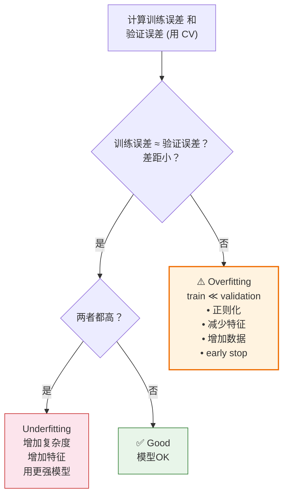

# Overfitting 教程

> **前置知识：** 损失函数、训练集/测试集划分、期望与方差的数学定义
> **参考来源：** [《ESL》Ch.7](../../../textbooks/hastie_esl.pdf), [《ISLR》Ch.2](../../../textbooks/james_ISLR.pdf)

---

## Section 0: 前置知识速查

1. **损失函数 (Loss Function)**：衡量模型预测值和真实值差距的函数，如 MSE = $\frac{1}{n}\sum(y_i - \hat{y}_i)^2$
2. **训练集/测试集划分**：把数据分两份——一份训练模型，一份评估模型，目的是模拟"未见过的数据"
3. **期望 $\mathbb{E}$**：一个随机变量的"平均值"；方差 $\text{Var}$：一个随机变量"偏离平均"的程度
4. **多项式回归**：$\hat{y} = \beta_0 + \beta_1 x + \beta_2 x^2 + ... + \beta_d x^d$，阶数 $d$ 控制模型复杂度

---

## Section 1: 它解决什么问题（Why）

### 没有它会怎样？

- 🔥 **痛点 1：模型在训练集上 99% 准确率，上线后 50%**。你花了两周调模型、调参数，训练集指标好看到爆——结果一部署到生产环境就翻车。原因？你的模型把训练数据的噪声也"学会了"，在新数据上全部白搭。这就是 overfitting。

- 🔥 **痛点 2：不知道该增加模型复杂度还是减少**。你的模型效果不好——是因为太简单（underfitting）还是太复杂（overfitting）？如果搞反了方向，越调越差。不理解 bias-variance tradeoff，你就是在盲调。

- 🔥 **痛点 3：交叉验证不理解，选模型全靠运气**。"K-fold CV 为什么要切 K 份？为什么不能用训练误差选模型？" 不理解这些，超参数调优就是开盲盒。

### 它的核心价值

1. **理解测试误差的来源**：泛化误差 = Bias² + Variance + σ²。知道了这个分解，你就能精准诊断模型问题，而不是盲目调参数
2. **知道什么时候该停**：模型复杂度存在一个最优点，过了这个点继续复杂化只会让模型更差。学习曲线 / 验证曲线能可视化这个拐点
3. **统一理解所有"防止过拟合"的技术**：正则化（L1/L2）、early stopping、Dropout、数据增强——它们都在做同一件事：控制 variance

> 📚 Book: James et al., [《ISLR》](../../../textbooks/james_ISLR.pdf), Ch.2.2 "Assessing Model Accuracy"
> 📚 Book: Goodfellow et al., [《Deep Learning》](../../../textbooks/goodfellow_deep_learning.pdf), Ch.5.2

---

## Section 2: 它怎么工作的（How — 底层原理）

### 2.1 Model Complexity → Error 的 U 形曲线

这是 overfitting 最核心的一张图——随着模型复杂度增加，测试误差从高（underfitting）降到最优点，然后再升高（overfitting）。

```mermaid
xychart-beta
    title "Model Complexity vs Error"
    x-axis "模型复杂度 Model Complexity" ["简单", "", "", "最优★", "", "", "复杂"]
    y-axis "Error"
    line "测试误差 Test Error" [0.9, 0.6, 0.35, 0.25, 0.35, 0.55, 0.85]
    line "训练误差 Train Error" [0.7, 0.45, 0.25, 0.15, 0.08, 0.03, 0.01]
```

| 区域 | 状态 | Bias | Variance | 表现 |
|------|------|------|----------|------|
| 左侧（简单） | Underfitting | 高 | 低 | 训练/测试误差都高 |
| 中间（最优★） | Good Fit | 均衡 | 均衡 | 测试误差最低 |
| 右侧（复杂） | Overfitting | 低 | 高 | 训练误差低，测试误差高 |

**为什么是 U 形？**
- 左侧（模型太简单）：Bias 主导，模型连基本规律都学不到
- 右侧（模型太复杂）：Variance 主导，模型开始拟合噪声
- 中间（最优复杂度）：Bias 和 Variance 的总和最小

> 📚 Book: Hastie et al., [《ESL》](../../../textbooks/hastie_esl.pdf), Fig. 7.1-7.2

### 2.2 核心机制：为什么复杂模型会拟合噪声？

**为什么用简单模型而不是让模型尽可能复杂？**

直觉：假设你有 10 个数据点。

- **1 阶多项式**（直线）：2 个参数 → 只能画直线，可能学不到弯曲的规律（underfitting）
- **3 阶多项式**：4 个参数 → 能画出弯曲的曲线，贴合数据的真实趋势
- **9 阶多项式**：10 个参数 → 恰好等于数据点数！模型能**完美穿过每一个点**，包括噪声点

| 模型 | 阶数 | 参数数 | Bias | Variance | 训练误差 | 测试误差 |
|------|------|--------|------|----------|----------|----------|
| 直线 | d=1 | 2 | 高 — 拟合不了弯曲 | 低 | 高 | 高 |
| 三次曲线 | d=3 | 4 | 均衡 — 贴合趋势 | 均衡 | 中 | **低** |
| 九次曲线 | d=9 | 10 | 低 — 穿过每个点 | **极高** | ≈ 0 | 极高 |

**关键洞察**：当模型参数数量 ≥ 数据点数量时，模型有足够的"自由度"去记住每一个数据点（包括噪声），而不是学习通用规律。

> 📚 Book: James et al., [《ISLR》](../../../textbooks/james_ISLR.pdf), Ch.2.2, Fig. 2.9-2.12
> 📚 Book: Goodfellow et al., [《Deep Learning》](../../../textbooks/goodfellow_deep_learning.pdf), Ch.5.2

### 2.3 诊断流程图



> 📚 Book: Hastie et al., [《ESL》](../../../textbooks/hastie_esl.pdf), Ch.7.10 "Cross-Validation"

---

## Section 3: 局限性

1. **Bias-Variance 分解只适用于 MSE 损失**：对于分类问题的 0-1 损失，分解更复杂（ESL Ch.7.3 讨论了 0-1 损失的分解）。实际中常用交叉验证直接估计泛化误差，而非理论分解。

   → **应对策略**：分类问题直接用 CV + accuracy/F1 评估，不追求理论分解

2. **经典 U 形曲线不总是对的（Double Descent）**：在极高维模型（如深度神经网络）中，模型复杂度超过某个阈值后测试误差反而再次下降，形成"双重下降"曲线。

   → **应对策略**：对传统 ML 模型（线性、树、SVM），经典 U 形仍然适用。Double descent 主要出现在过参数化的深度学习中。

3. **i.i.d. 假设不总是成立**：整个框架假设训练和测试数据来自同一分布。在分布漂移（distribution shift）场景下，即使模型不过拟合，泛化误差也会很大。

   → **应对策略**：关注领域适应 (domain adaptation) 和因果推断方法

> 📚 Book: Goodfellow et al., [《Deep Learning》](../../../textbooks/goodfellow_deep_learning.pdf), Ch.5.2-5.4
> 📚 Book: Hastie et al., [《ESL》](../../../textbooks/hastie_esl.pdf), Ch.7.3

---

## Section 4: 方案对比

| 方法 | 如何控制过拟合 | 优点 | 缺点 | 适用场景 |
|------|--------------|------|------|---------|
| **增加数据** | 降低 variance | 最"治本"的方法 | 数据获取成本高 | 数据可获取时首选 |
| **L2 正则化 (Ridge)** | 缩小参数值 → 降低 variance | 简单有效 | 不做特征选择 | 所有特征都有用时 |
| **L1 正则化 (Lasso)** | 将部分参数压为 0 → 降低 variance + 特征选择 | 自动特征选择 | 相关特征中随机选一个 | 高维稀疏场景 |
| **交叉验证** | 更可靠地估计泛化误差 → 选择最优复杂度 | 对模型无假设 | 计算成本 ×K | 永远推荐使用 |
| **Early Stopping** | 训练过程中在验证误差最低点停止 | 不需要额外超参数 | 需要验证集 | 迭代式训练（梯度下降） |
| **减少特征** | 降低 p → 降低 variance ($\sigma^2 \cdot p/n$) | 直接降维 | 可能丢有用信息 | p/n 比过高时 |
| **Bagging/集成** | 多模型平均 → 降低 variance | 不增加 bias | 计算成本 ×M | 高 variance 模型（如决策树） |
| **Dropout** | 随机关闭神经元 → 隐式集成 | 正则化效果好 | 只能用于神经网络 | 深度学习 |

> 📚 Book: Hastie et al., [《ESL》](../../../textbooks/hastie_esl.pdf), Ch.3.4 (Ridge/Lasso), Ch.7.10 (CV), Ch.8.7 (Bagging)
> 📚 Book: Goodfellow et al., [《Deep Learning》](../../../textbooks/goodfellow_deep_learning.pdf), Ch.7 (Regularization)

---

## 参考来源表

| 来源 | 类型 | 使用位置 |
|------|------|---------|
| [《ESL》Ch.7](../../../textbooks/hastie_esl.pdf) | 📚 教科书 | Section 2 (U形曲线), Section 3 (局限性) |
| [《ISLR》Ch.2](../../../textbooks/james_ISLR.pdf) | 📚 教科书 | Section 1 (Why), Section 2 (多项式示例) |
| [《Deep Learning》Ch.5](../../../textbooks/goodfellow_deep_learning.pdf) | 📚 教科书 | Section 2 (Capacity), Section 3 (Double Descent), Section 4 (Dropout) |
| [scikit-learn Model Selection](https://scikit-learn.org/stable/modules/cross_validation.html) | 📖 文档 | Section 2 (诊断流程) |
