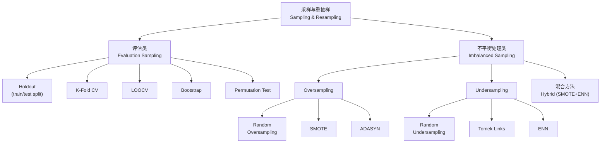

# Sampling & Resampling 核心概念

> 📚 Book: Hastie et al., [《ESL》](../../../textbooks/hastie_esl.pdf), Ch.7
> 📚 Book: James et al., [《ISLR》](../../../textbooks/james_ISLR.pdf), Ch.5

---

## 术语定义

### 训练集 / 验证集 / 测试集 (Training / Validation / Test Set)

把数据分成三份：**训练集**用来训练模型（让模型学习）；**验证集**用来调超参数和选择模型（相当于模拟考试）；**测试集**用来最终评估模型的泛化能力（相当于正式考试，只能用一次）。三者必须互不重叠。

> 易混淆：**验证集 vs 测试集** — 验证集可以反复使用来调参，测试集只在最后用一次；很多人把两个概念混用

> 📚 Book: Hastie et al., [《ESL》](../../../textbooks/hastie_esl.pdf), Ch.7.2 "Bias, Variance, and Model Complexity"

### 交叉验证 (Cross-Validation, CV)

把数据分成 K 份（fold），每次拿其中 1 份当验证集、剩下 K-1 份当训练集，轮流做 K 次，最后取 K 次评估结果的平均值。这样每个样本都有一次当"考试题"的机会，评估更稳定。

> 别名：**K-Fold CV**（最常见形式）/ **旋转估计 (Rotation Estimation)**（统计学文献）— 都是同一个方法的不同叫法

> 📚 Book: James et al., [《ISLR》](../../../textbooks/james_ISLR.pdf), Ch.5.1 "Cross-Validation"
> 📚 Book: Hastie et al., [《ESL》](../../../textbooks/hastie_esl.pdf), Ch.7.10 "Cross-Validation"

### 留一法 (Leave-One-Out Cross-Validation, LOOCV)

K-Fold CV 的极端情况：K = N（样本总数）。每次只留 1 个样本做验证，其余 N-1 个训练。偏差极低（训练集几乎等于全集），但方差高（每次只评估1个样本），且计算量大（要训练 N 次）。

> 易混淆：**LOOCV vs K-Fold CV** — LOOCV 偏差更低但方差更高、计算更贵；实践中 K=5 或 K=10 是更好的折中

> 📚 Book: Hastie et al., [《ESL》](../../../textbooks/hastie_esl.pdf), Ch.7.10

### 分层抽样 (Stratified Sampling)

划分 train/test 或 K-Fold 时，保证**每个类别的比例**在每份数据中和原始数据一致。在类别不平衡数据中尤为重要——如果不分层，可能某一折完全没有少数类样本。

> 📖 Docs: scikit-learn, [StratifiedKFold](https://scikit-learn.org/stable/modules/generated/sklearn.model_selection.StratifiedKFold.html)

### 自助法 (Bootstrap)

有放回地从 N 个样本中抽取 N 个样本（允许重复），得到一个"自助样本"。重复 B 次后，可以用 B 个统计量的分布来估计标准误差和置信区间。核心思想：**用已有数据模拟从总体中反复采样的过程**。

> 别名：**Bootstrap 抽样**（ML 领域）/ **拔靴法**（某些中文翻译）— 来自"pulling yourself up by your own bootstraps"的比喻

> 📖 Paper: Efron, [Bootstrap Methods (1979)](https://doi.org/10.1214/aos/1176344552)
> 📚 Book: Hastie et al., [《ESL》](../../../textbooks/hastie_esl.pdf), Ch.8.2 "The Bootstrap and Maximum Likelihood"

### 袋外误差 (Out-of-Bag Error, OOB)

Bootstrap 抽样时，约有 36.8% 的原始样本不会被选中（即 1 - (1-1/N)^N ≈ 1-1/e）。这些未被抽中的样本天然就是"测试集"。Random Forest 利用这个性质，无需额外划分验证集就能估计泛化误差。

> 📚 Book: Hastie et al., [《ESL》](../../../textbooks/hastie_esl.pdf), Ch.15.3.1 "Out-of-Bag Samples"

### 置换检验 (Permutation Test)

通过随机打乱标签来构建"零假设分布"。如果打乱标签后模型性能没有显著下降，说明模型学到的信号可能只是噪声。这是一种**无参数**的显著性检验方法。

> 📚 Book: Hastie et al., [《ESL》](../../../textbooks/hastie_esl.pdf), Ch.18.7

### 过采样 (Oversampling)

增加**少数类**样本数量，使各类别样本数接近平衡。最简单的方法是复制少数类样本（Random Oversampling），但容易导致过拟合。

> 📖 Paper: Chawla et al., [SMOTE (2002)](https://arxiv.org/abs/1106.1813)

### 欠采样 (Undersampling)

减少**多数类**样本数量。最简单的是随机欠采样（Random Undersampling），但会丢失有用信息。更智能的方法如 Tomek Links、Edited Nearest Neighbors (ENN) 可以有针对性地删除噪声或边界样本。

> 📖 Paper: Chawla et al., [SMOTE (2002)](https://arxiv.org/abs/1106.1813), Section 2

### SMOTE (Synthetic Minority Oversampling Technique)

在特征空间中，找到少数类样本的 K 近邻，然后在样本与近邻之间的连线上随机插值生成新的合成样本。比简单复制好因为增加了**多样性**，但注意在高维或噪声数据上可能生成无意义的样本。

> 📖 Paper: Chawla et al., [SMOTE (2002)](https://arxiv.org/abs/1106.1813)
> 📖 Docs: [imbalanced-learn SMOTE](https://imbalanced-learn.org/stable/references/generated/imblearn.over_sampling.SMOTE.html)

### 类别不平衡 (Class Imbalance)

数据集中不同类别的样本数量严重不等（如欺诈检测中正常交易 99.9% vs 欺诈 0.1%）。此时准确率失去意义（全部预测为多数类就有 99.9% 准确率），需要用精确率、召回率、F1、AUC 等指标评估。

> 📖 Paper: Chawla et al., [SMOTE (2002)](https://arxiv.org/abs/1106.1813), Section 1
> 📚 Book: Hastie et al., [《ESL》](../../../textbooks/hastie_esl.pdf), Ch.18

### 代价敏感学习 (Cost-Sensitive Learning)

不同类型的错误有不同的代价（比如把癌症患者误诊为健康的代价远大于把健康人误诊为癌症）。通过给不同类型的错误分配不同的权重（代价矩阵），让模型在训练时就考虑错误的不对称性。

> 📚 Book: Hastie et al., [《ESL》](../../../textbooks/hastie_esl.pdf), Ch.2.4

---

## 概念辨析

### 交叉验证 vs Bootstrap

| 维度 | 交叉验证 (CV) | Bootstrap |
|------|-------------|-----------|
| **抽样方式** | 无放回划分 | 有放回抽样 |
| **核心目的** | 估计泛化误差 | 估计统计量的不确定性（标准误差、置信区间） |
| **偏差** | K 小时偏差大（训练集小） | 通常偏差较大（有放回导致重复样本） |
| **方差** | K 大时方差增大 | B 增大时方差降低 |
| **计算量** | K 次训练 | B 次训练（通常 B >> K） |
| **常用 K/B** | K=5 或 K=10 | B=200-2000 |

> 📚 Book: Hastie et al., [《ESL》](../../../textbooks/hastie_esl.pdf), Ch.7.11 "Bootstrap vs Cross-Validation"

### 过采样 vs 欠采样 vs SMOTE

| 维度 | 过采样 (Random) | 欠采样 (Random) | SMOTE |
|------|----------------|----------------|-------|
| **做法** | 复制少数类 | 删除多数类 | 在特征空间插值生成新少数类 |
| **优点** | 简单、不丢信息 | 快速、降低训练时间 | 增加多样性、不简单复制 |
| **缺点** | 过拟合少数类 | 丢失有用信息 | 高维/噪声区可能生成坏样本 |
| **适用场景** | 数据量小、特征低维 | 数据量大、时间紧 | 中等规模、需要好的决策边界 |

> 📖 Paper: Chawla et al., [SMOTE (2002)](https://arxiv.org/abs/1106.1813)
> 📖 Docs: [imbalanced-learn](https://imbalanced-learn.org/stable/)

---

## 核心属性

### 信息架构

### 适用场景 ✅

- 需要可靠的模型性能估计（→ CV）
- 数据量有限，不能浪费样本（→ CV, Bootstrap）
- 需要估计统计量的置信区间（→ Bootstrap）
- 类别严重不平衡（→ SMOTE, 欠采样, 代价敏感）
- 需要检验模型学到的信号是否真实（→ Permutation Test）

### 不适用场景 ❌

- 时间序列数据：不能随机划分，必须按时间顺序（→ Time Series Split）
- 极大数据集（百万级+）：CV 计算代价太高，简单 holdout 足够
- 已有足够多的独立测试数据：不需要重抽样

> 📚 Book: Hastie et al., [《ESL》](../../../textbooks/hastie_esl.pdf), Ch.7.10

---

## 速查表

| 项 | 说明 | 示例 |
|-----|------|------|
| K-Fold CV | K 份轮流验证取平均 | K=5: 5 折交叉验证 |
| LOOCV | K=N 的极端 CV | N=100: 训练 100 次 |
| Stratified CV | 保持类别比例的 CV | 二分类 70:30 → 每fold也是 70:30 |
| Bootstrap | 有放回抽 N 个 | B=1000: 重复 1000 次 |
| OOB Error | Bootstrap 未抽中的样本做测试 | ~36.8% 样本是 OOB |
| SMOTE | K-NN 插值生成少数类 | k=5: 用 5 近邻插值 |
| Random Oversampling | 复制少数类 | 100→500: 复制 4 倍 |
| Random Undersampling | 删除多数类 | 900→100: 只留 1/9 |
| Permutation Test | 打乱标签检验信号 | 1000 次打乱取 p-value |
| Cost-Sensitive | 不对称代价权重 | FN 代价 = 10 × FP 代价 |
