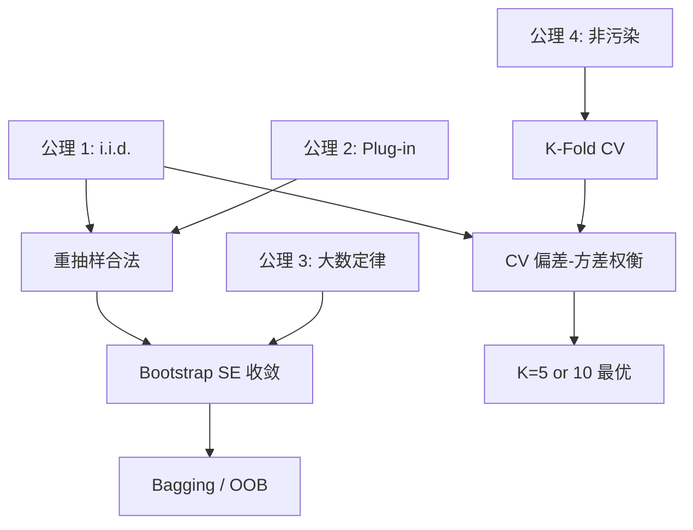

# Sampling & Resampling 第一性原理

> 📖 Paper: Efron, [Bootstrap Methods (1979)](https://doi.org/10.1214/aos/1176344552)
> 📚 Book: Hastie et al., [《ESL》](../../../textbooks/hastie_esl.pdf), Ch.7

---

## 核心问题链

> 用"5 个为什么"递归追问，从表层功能到不可再分公理。

1. **Sampling & Resampling 在做什么？** → 用已有数据反复划分或重抽样，来估计模型泛化能力和统计量的不确定性
2. **为什么要这样做？** → 因为真实的未见数据不可获得，只能用已有的有限数据来模拟"面对新数据"的场景
3. **为什么有限数据能代理无限总体？** → 因为统计学大数定律保证：样本量足够大时，样本统计量会收敛到总体参数
4. **大数定律的根基是什么？** → i.i.d. 假设（独立同分布）+ 期望存在有限——这是概率论的基本定理
5. **能否继续拆分？** → 不能 → **到达公理：i.i.d. 假设 + 大数定律**

---

## 公理与基本假设

### 公理 1: 独立同分布假设 (i.i.d. Assumption)

**陈述：** 数据集中的每个样本 $(x_i, y_i)$ 独立且来自同一个未知分布 $P(X, Y)$

**白话：** 每个数据点都是从同一个"总体"中随机抽取的，而且抽取一个不影响下一个

**来源：** 概率论基本假设。Fisher (1922) "On the Mathematical Foundations of Theoretical Statistics" 确立了这一框架

**可验证性：**
- ✅ 成立：横截面数据（调查问卷、随机对照实验）
- ❌ 不成立：时间序列（前后有依赖）、空间数据（邻近点相关）、同一患者的多次测量

> 📚 Book: Hastie et al., [《ESL》](../../../textbooks/hastie_esl.pdf), Ch.7.2

### 公理 2: 样本是总体的有效代理 (Plug-in Principle)

**陈述：** 经验分布 $\hat{F}_N$ 是总体分布 $F$ 的一致估计——对任意函数 $T(F)$，有 $T(\hat{F}_N) \to T(F)$（大样本下）

**白话：** 已有的数据虽然有限，但足以代表总体的主要特征。用数据算出来的统计量会接近"真实答案"

**来源：** Glivenko-Cantelli 定理（1933）——经验分布函数一致收敛到真实分布函数

**可验证性：**
- ✅ 成立：样本量足够大、总体分布不是极端（如重尾分布也有条件）
- ❌ 不成立：样本量太小（N < 30）、样本有系统性偏差（选择偏差）、总体分布极端非稳态

> 📖 Paper: Efron, [Bootstrap Methods (1979)](https://doi.org/10.1214/aos/1176344552)

### 公理 3: 大数定律 (Law of Large Numbers)

**陈述：** 若 $X_1, X_2, \ldots$ i.i.d. 且 $E[X_i] = \mu$ 存在，则 $\bar{X}_N = \frac{1}{N}\sum X_i \xrightarrow{p} \mu$

**白话：** 抽样次数越多，样本平均值就越接近真实的总体平均值

**来源：** Bernoulli (1713) 弱大数定律、Kolmogorov (1933) 强大数定律

**可验证性：**
- ✅ 成立：期望存在有限
- ❌ 不成立：期望不存在（如 Cauchy 分布）

> 📚 Book: Hastie et al., [《ESL》](../../../textbooks/hastie_esl.pdf), Ch.8.2

### 公理 4: 训练集和测试集必须独立 (Non-contamination)

**陈述：** 用于训练模型的数据不能出现在用于评估模型的数据中

**白话：** 不能让学生在考试前看到考卷

**来源：** 统计学习理论基本原则。Vapnik (1998) "Statistical Learning Theory"

**可验证性：**
- ✅ 成立：CV 的无放回划分天然保证
- ❌ 不成立：数据泄露（如 SMOTE 在 CV 外做、用测试集调参）

> 📚 Book: Hastie et al., [《ESL》](../../../textbooks/hastie_esl.pdf), Ch.7.2

---

## 从公理到技术的推导链

### Step 1: 从公理 1 (i.i.d.) + 公理 2 (Plug-in) → 重抽样的合法性

**推理：** 因为样本是 i.i.d. 的（公理 1），经验分布是总体的合理代理（公理 2），所以从经验分布中重抽样（Bootstrap）等价于从总体中重新采样
**结果：** 从已有数据中有放回抽样是合理的

### Step 2: 从 Step 1 + 公理 3 (大数定律) → Bootstrap 估计收敛

**推理：** 有放回抽样 B 次，每次计算统计量 $\hat{\theta}^{*b}$。由大数定律（公理 3），B 次的平均值和方差会收敛到真实的期望和方差
**结果：** $\widehat{\text{SE}}_B \to \text{SE}(\hat{\theta})$（B → ∞ 时 Bootstrap 标准误差收敛）

### Step 3: 从公理 4 (Non-contamination) → 交叉验证

**推理：** 训练和测试必须独立（公理 4）。把数据无放回地分成 K 份，每次用 K-1 份训练、1 份测试，保证了不重叠
**结果：** K-Fold CV 是在公理 4 约束下最大化数据利用率的方案

### Step 4: 从 Step 3 + 公理 1 (i.i.d.) → CV 的偏差-方差权衡

**推理：** K 越大，训练集越大（偏差越低），但 K 个模型越相似（方差越高，因为 i.i.d. 假设下相互接近的训练集产生相似的模型）
**结果：** K=5 或 K=10 是理论和实验的最佳折中

### 推导链全景图

---

## 如果公理不成立？

### 公理 1 失效：数据不是 i.i.d.

**如果不成立：** 时间序列（前后有依赖）、聚类数据（组内相关）
**技术后果：** 标准 K-Fold CV 会低估泛化误差（因为时间上的信息泄露）
**替代方案：** TimeSeriesSplit（时间序列）、GroupKFold（分组数据）、Block Bootstrap（分块有放回抽样）

### 公理 2 失效：样本不能代理总体

**如果不成立：** 样本有选择偏差（如只采集了白天数据却要预测全天）、样本量太小
**技术后果：** Bootstrap 和 CV 的估计都不可靠，因为经验分布偏离了真实分布
**替代方案：** 加权采样（Importance Sampling）、领域知识约束先验、增加数据量

### 公理 3 失效：大数定律不适用

**如果不成立：** 统计量的期望不存在（极端重尾分布，如 Cauchy）
**技术后果：** Bootstrap B 增大但 SE 估计不收敛
**替代方案：** 稳健统计量（中位数替代均值）、Trimmed Bootstrap

### 公理 4 失效：数据泄露

**如果不成立：** SMOTE 在 CV 外做、用测试集调参、时间序列用随机 K-Fold
**技术后果：** 泛化误差被低估（乐观偏差），模型部署后性能暴跌
**替代方案：** 确保所有数据变换在 Pipeline 内、使用 TimeSeriesSplit

---

## 第一性原理速查表

| 公理/假设 | 一句话陈述 | 成立条件 | 失效后果 |
|----------|-----------|---------|---------| 
| i.i.d. | 样本独立、来自同一分布 | 横截面随机抽样 | 标准 CV/Bootstrap 失效 |
| Plug-in | 经验分布可代理总体 | 样本量够大、无选择偏差 | 估计不可靠 |
| 大数定律 | N→∞ 时样本统计量收敛 | 期望存在有限 | Bootstrap SE 不收敛 |
| 非污染 | 训练和测试数据不重叠 | 正确使用 Pipeline | 数据泄露、分数虚高 |
