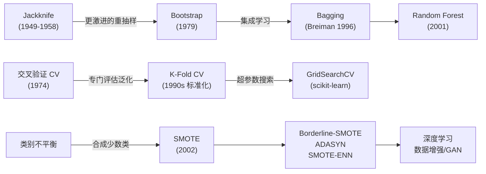

# 采样与重抽样的故事线：从 Jackknife 到 SMOTE

> **核心主题：** 如何用有限的数据做更可靠的推断——一个不断"用数据自己评估自己"的进化史
> **故事线：** 统计学家们反复追问一个问题：我们的估计有多靠谱？

---

## 🎬 序幕：一切从什么问题开始？

### 一句话概括

> 有了一个模型和一批数据，怎么知道这个模型在没见过的数据上表现如何？

在 20 世纪中叶，统计学家面对一个根本困难：从有限的样本中估计一个统计量（比如均值、回归系数），但对这个估计有多准确（标准误差）却不知道该怎么算——解析公式只有最简单的情况才有。

> 🔑 **问题提出：** 能不能用数据自己来评估自己？

---

## 📚 第一章：Quenouille 和 Tukey 的 Jackknife（1949-1958）

> **关键人物：** Maurice Quenouille（提出偏差校正）、John Tukey（命名"Jackknife"并推广）
> **关键论文：** Quenouille, "Approximate Tests of Correlation in Time-Series" (1949); Tukey, "Bias and Confidence in Not Quite Large Samples" (1958)

#### 🎥 视觉素材

| 素材 | 来源 | 链接 | 版权 |
|------|------|------|------|
| John Tukey 肖像 | Wikimedia Commons | `https://commons.wikimedia.org/wiki/File:John_Tukey.jpg` | 公有领域 |

### 发生了什么？

Quenouille 在 1949 年发现了一个巧妙的想法：如果每次去掉一个样本再算统计量，比较"完整版"和"缺一个版"的差异，就能估计偏差。Tukey 在 1958 年把这个方法发展成了标准工具，命名为"Jackknife"——意思是像瑞士军刀一样通用。

核心做法：从 N 个样本中，每次去掉第 i 个，算出 $\hat{\theta}_{-i}$，得到 N 个"伪值"(pseudo-values)。这些伪值的方差就是原始估计的标准误差。

### 为什么这很重要？

第一次让统计学家在**不知道理论分布**的情况下也能估计标准误差。不需要推导解析公式，只需要反复计算。

### 但还有一个问题……

Jackknife 每次只去掉一个样本（"削掉一层"），能捕获的变异有限。而且对某些统计量（如中位数）效果不好。

> 🔑 **故事转折点：** 能不能更激进——不只是去掉一个样本，而是**完全重新抽样**？

---

## 📚 第二章：Efron 的 Bootstrap 革命（1979）

> **关键人物：** Bradley Efron
> **关键论文：** Efron, "Bootstrap Methods: Another Look at the Jackknife" (1979)

#### 🎥 视觉素材

| 素材 | 来源 | 链接 | 版权 |
|------|------|------|------|
| Bradley Efron 肖像 | Stanford 大学官网 | `https://statistics.stanford.edu/people/bradley-efron` | 学术引用 |
| 论文首页 | Annals of Statistics | `https://doi.org/10.1214/aos/1176344552` | 学术引用 |

### 发生了什么？

Efron 在 1979 年提出了 Bootstrap：与其小心翼翼地每次去掉一个样本，不如大胆地**从已有数据中有放回地抽样**。

核心洞察：**把已有样本当作总体的代理**。有放回抽取 N 个样本（允许重复），得到一个"Bootstrap 样本"。重复 B 次（B=200~2000），就能用这 B 个统计量的分布来估计标准误差和置信区间。

这个方法的名字来自"pulling yourself up by your own bootstraps"——用数据自己帮助自己。

### 为什么这很重要？

Bootstrap 是统计学 20 世纪下半叶最重要的发明之一。它几乎**适用于任何统计量**（均值、中位数、回归系数、相关系数），不需要推导解析公式。加上 1970-80 年代计算机的普及，"暴力重复计算"变得可行。

### 但还有一个问题……

Bootstrap 很擅长估计统计量的不确定性，但用它来估计机器学习模型的泛化误差时表现不好——有放回抽样导致训练集和测试集有重叠，泛化误差估计有**下偏**。

> 🔑 **故事转折点：** 有没有专门为"模型评估"设计的重抽样方法？

---

## 📚 第三章：Stone 和 Allen 的交叉验证（1974）

> **关键人物：** Mervyn Stone、David Allen
> **关键论文：** Stone, "Cross-Validatory Choice and Assessment of Statistical Predictions" (1974); Allen, "The Relationship between Variable Selection and Data Augmentation and a Method for Prediction" (1974)

#### 🎥 视觉素材

| 素材 | 来源 | 链接 | 版权 |
|------|------|------|------|
| Stone 1974 论文首页 | JRSS | `https://doi.org/10.1111/j.2517-6161.1974.tb00994.x` | 学术引用 |

### 发生了什么？

Stone 在 1974 年系统地提出了交叉验证（Cross-Validation）的框架：把数据分成 K 份，轮流用每份做验证。虽然 LOOCV 的想法更早就有，但 Stone 给出了理论分析——证明了 CV 和 AIC 在渐近意义上是等价的。

同年，Allen 独立地从"预测"的数据增强角度得出了类似方法。

### 为什么这很重要？

CV 成为了机器学习中估计泛化误差的黄金标准。它解决了 Bootstrap 在泛化估计上的偏差问题：**无放回划分**确保训练集和验证集完全不重叠。而 K=5 或 K=10 被证明是偏差和方差的最佳折中。

### 但还有一个问题……

CV 和 Bootstrap 都假设数据是 i.i.d.（独立同分布）的。而且它们解决的是"怎么评估模型"的问题——但如果数据本身就有问题（比如类别不平衡），再好的评估也没用。

> 🔑 **故事转折点：** 如果数据中多数类和少数类严重失衡，怎么让模型"看见"少数类？

---

## 📚 第四章：Chawla 的 SMOTE 和不平衡学习兴起（2002）

> **关键人物：** Nitesh Chawla
> **关键论文：** Chawla et al., "SMOTE: Synthetic Minority Over-sampling Technique" (2002)

#### 🎥 视觉素材

| 素材 | 来源 | 链接 | 版权 |
|------|------|------|------|
| SMOTE 论文首页 | arXiv | `https://arxiv.org/abs/1106.1813` | 学术引用 |

### 发生了什么？

Chawla 等人在 2002 年提出 SMOTE：不是复制少数类样本（容易过拟合），而是在特征空间中，在少数类样本和它们的 K 近邻之间**插值生成新的合成样本**。

SMOTE 的公式简洁传神：$x_{\text{new}} = x_i + \lambda(x_{nn} - x_i)$，在两个真实样本之间"画一条线，随机取一个点"。

### 为什么这很重要？

SMOTE 催生了整个**不平衡学习（Imbalanced Learning）**研究领域。后续衍生出 Borderline-SMOTE、ADASYN、SMOTE-ENN 等方法，形成了 imbalanced-learn 库。这个问题在医疗（罕见病诊断）、金融（欺诈检测）、安全（入侵检测）等领域至关重要。

### 但还有一个问题……

SMOTE 在高维空间可能生成无意义的样本（"维度灾难"），而且只靠特征空间的几何关系、不考虑语义。深度学习时代，数据增强和对抗生成网络（GAN）提供了更强的合成数据工具。

> 🔑 **故事转折点：** 从手写规则的插值到深度学习的数据增强——合成数据的质量越来越高，但原理不变

---

## 🗺️ 全局回顾：技术演进路线图

### 每一步升级解决了什么问题？

| 从 → 到 | 解决了什么核心问题？ |
|---------|-------------------|
| Jackknife → Bootstrap | 从"去掉一个样本"到"有放回完全重抽样"——适用于任意统计量 |
| Bootstrap → K-Fold CV | Bootstrap 对泛化估计有偏 → CV 用无放回划分消除偏差 |
| 简单复制 → SMOTE | 简单复制过拟合 → 插值增加多样性 |
| SMOTE → Borderline-SMOTE | 全局插值生成噪声 → 只在决策边界附近插值 |

### 🎥 视觉素材总表（视频制作用）

| 章节 | 人物 | 肖像来源 | 论文/事件图片 | 版权 |
|------|------|---------|-------------|------|
| 第一章 | John Tukey | Wikimedia Commons: `File:John_Tukey.jpg` | — | 公有领域 |
| 第二章 | Bradley Efron | Stanford 大学官网 | Annals of Statistics 1979 | 学术引用 |
| 第三章 | Mervyn Stone | — | JRSS 1974 | 学术引用 |
| 第四章 | Nitesh Chawla | — | arXiv: `1106.1813` | 学术引用 |

> ⚠️ **素材查找优先级：**
> 1. **Wikimedia Commons** — 首选，多数科学家有公有领域肖像
> 2. **大学官网/档案馆** — 本校教授的官方照片
> 3. **论文首页截图** — arXiv / Google Scholar
>
> ❌ **禁止：** AI 生成肖像、库存图片网站、无版权标注的图片
