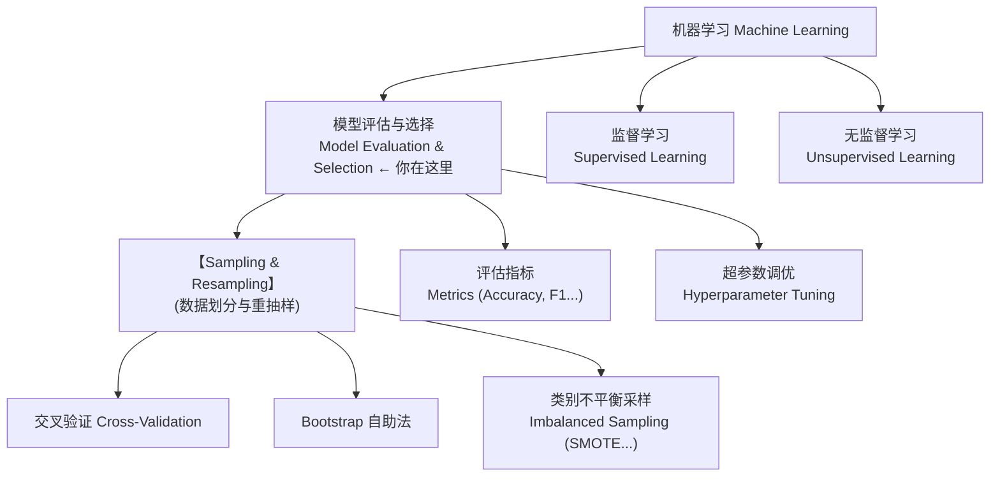
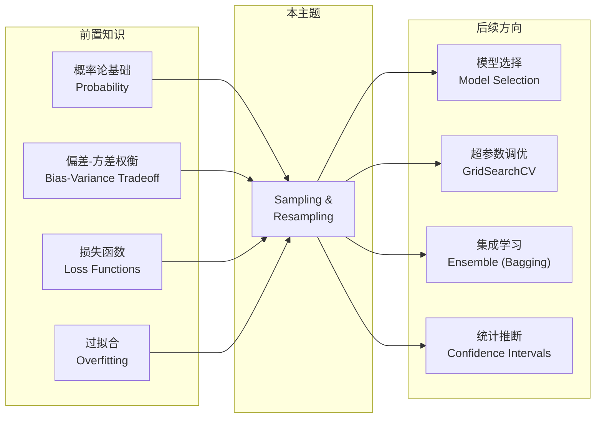

# Sampling & Resampling 知识地图

> 📚 Book: Hastie et al., [《The Elements of Statistical Learning》](../../../textbooks/hastie_esl.pdf), Ch.7-8
> 📚 Book: James et al., [《An Introduction to Statistical Learning》](../../../textbooks/james_ISLR.pdf), Ch.5
> 📖 Paper: Efron, [Bootstrap Methods (1979)](https://doi.org/10.1214/aos/1176344552)

## 1. 核心问题

- **为什么不能直接用全部数据训练再评估？** → 用训练数据评估会高估模型性能（乐观偏差），无法反映泛化能力
- **交叉验证比简单的 train/test split 好在哪？** → CV 每个样本都参与验证，降低评估方差，更可靠的性能估计
- **Bootstrap 和 Cross-Validation 有什么本质区别？** → Bootstrap 有放回抽样可估计统计量的置信区间，CV 无放回专注泛化误差估计
- **类别不平衡时，普通采样为什么失效？** → 少数类样本太少导致模型偏向多数类，需要过采样/欠采样/SMOTE 纠正
- **SMOTE 为什么比简单复制少数类样本好？** → 插值生成新合成样本增加多样性，简单复制只会过拟合少数类

> 📚 Book: James et al., [《ISLR》](../../../textbooks/james_ISLR.pdf), Ch.5 "Resampling Methods"
> 📚 Book: Hastie et al., [《ESL》](../../../textbooks/hastie_esl.pdf), Ch.7.10-7.12

---

## 2. 全景位置

> 📚 Book: Hastie et al., [《ESL》](../../../textbooks/hastie_esl.pdf), Ch.7 "Model Assessment and Selection"

---

## 3. 依赖地图

> 📚 Book: James et al., [《ISLR》](../../../textbooks/james_ISLR.pdf), Ch.5.1
> 📚 Book: Hastie et al., [《ESL》](../../../textbooks/hastie_esl.pdf), Ch.7.1

---

## 4. 文件地图

| 文件 | 定位 | 何时用 |
|------|------|--------|
| [sampling_map.md](sampling_map.md) | ① 导航 | 第一次接触、需要全局视角 |
| [sampling_concepts.md](sampling_concepts.md) | ② 概念 | 理解术语定义、辨析易混淆概念 |
| [sampling_math.md](sampling_math.md) | ③ 公式 | 推导公式、理解数学基础 |
| [sampling_tutorial.md](sampling_tutorial.md) | ④ 教程 | Why-First 理解设计动机与原理 |
| [sampling_code.md](sampling_code.md) | ⑤ 代码 | 快速上手实现 |
| [sampling_pitfalls.md](sampling_pitfalls.md) | ⑥ 踩坑 | 调试问题 |
| [sampling_history.md](sampling_history.md) | ⑦ 历史 | 了解技术演进 |
| [sampling_bridge.md](sampling_bridge.md) | ⑧ 衔接 | 找相关主题、扩展阅读 |
| [sampling_first_principles.md](sampling_first_principles.md) | ⑨ 第一性原理 | 追问底层公理、理解边界 |

> 📖 Docs: Norman, [《The Design of Everyday Things》](../../../textbooks/norman_design_everyday_things.pdf), Ch.3 "Knowledge in the World"

---

## 5. 学习/使用路线

### 第一次学习 🎒

1. 读 [sampling_map.md](sampling_map.md) 了解全局位置
2. 读 [sampling_tutorial.md](sampling_tutorial.md) Section 1 理解动机
3. 读 [sampling_concepts.md](sampling_concepts.md) 掌握核心术语
4. 读 [sampling_math.md](sampling_math.md) 手算一次核心公式
5. 跟 [sampling_code.md](sampling_code.md) 快速开始跑一个示例
6. 读 [sampling_history.md](sampling_history.md) 了解技术演进
7. 读 [sampling_first_principles.md](sampling_first_principles.md) 追问底层公理

### 日常参考 🔧

1. 查 [sampling_code.md](sampling_code.md) API 速查表
2. 查 [sampling_math.md](sampling_math.md) 公式速查
3. 查 [sampling_pitfalls.md](sampling_pitfalls.md) 排查问题

### 深度研究 🔬

1. 读 [sampling_history.md](sampling_history.md) 完整演进线
2. 读 [sampling_first_principles.md](sampling_first_principles.md) 追问底层公理
3. 读 [sampling_bridge.md](sampling_bridge.md) 探索下游任务
4. 阅读 Efron 1979 原始论文 + Chawla 2002 SMOTE 论文

---

## 6. 缺口检查

| 维度 | 状态 |
|------|------|
| Map | ✅ 已完成 |
| Concepts | ✅ 已完成 |
| Math | ✅ 已完成 |
| Tutorial | ✅ 已完成 |
| Code | ✅ 已完成 |
| Pitfalls | ✅ 已完成 |
| History | ✅ 已完成 |
| Bridge | ✅ 已完成 |
| First Principles | ✅ 已完成 |

---

## 7. 新鲜度状态

| 维度 | 上次验证 | 过期时间 | 状态 |
|------|---------|---------|------|
| Map | 2026-03-18 | 12m | ✅ current |
| Concepts | 2026-03-18 | 12m | ✅ current |
| Math | 2026-03-18 | 12m | ✅ current |
| Tutorial | 2026-03-18 | 12m | ✅ current |
| Code | 2026-03-18 | 6m | ✅ current |
| Pitfalls | 2026-03-18 | 6m | ✅ current |
| History | 2026-03-18 | never | ✅ current |
| Bridge | 2026-03-18 | 12m | ✅ current |
| First Principles | 2026-03-18 | 12m | ✅ current |

---

## 8. 参考来源表

| 来源 | 类型 | 使用位置 |
|------|------|---------|
| [《ESL》Ch.7-8](../../../textbooks/hastie_esl.pdf) | 📚 教科书 | 全文核心：CV、Bootstrap 理论 |
| [《ISLR》Ch.5](../../../textbooks/james_ISLR.pdf) | 📚 教科书 | 全文核心：Resampling Methods |
| [《PML1》Ch.4](../../../textbooks/murphy_pml1.pdf) | 📚 教科书 | 贝叶斯视角的模型评估 |
| [《PRML》Ch.1.3](../../../textbooks/bishop_prml.pdf) | 📚 教科书 | 概率框架下的模型选择 |
| [Efron 1979](https://doi.org/10.1214/aos/1176344552) | 📖 论文 | Bootstrap 原始论文 |
| [Chawla et al. 2002](https://arxiv.org/abs/1106.1813) | 📖 论文 | SMOTE 不平衡采样 |
| [scikit-learn model_selection](https://scikit-learn.org/stable/modules/cross_validation.html) | 📖 文档 | CV 实现参考 |
| [imbalanced-learn](https://imbalanced-learn.org/stable/) | 📖 文档 | SMOTE 实现参考 |
