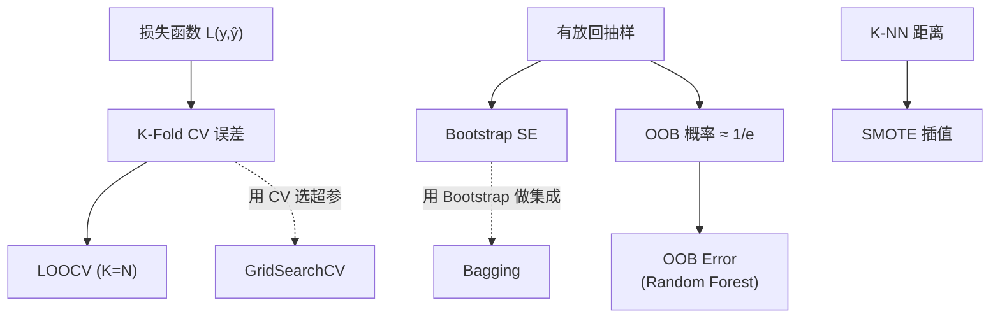

# Sampling & Resampling 数学基础

> 📚 Book: Hastie et al., [《ESL》](../../../textbooks/hastie_esl.pdf), Ch.7
> 📚 Book: James et al., [《ISLR》](../../../textbooks/james_ISLR.pdf), Ch.5

---

## 符号对照表

| 符号 | 含义（白话） | 英文 | 取值范围 |
|------|-------------|------|---------|
| $N$ | 总样本数 | Total number of samples | 正整数 |
| $K$ | 交叉验证的折数 | Number of folds | 2 ≤ K ≤ N |
| $B$ | Bootstrap 重复次数 | Number of bootstrap replicates | 通常 200-2000 |
| $\hat{f}^{-k}$ | 第 k 折被移除后训练的模型 | Model trained without fold k | — |
| $y_i$ | 第 i 个样本的真实标签 | True label of sample i | 类别或实数 |
| $\hat{y}_i$ | 第 i 个样本的预测值 | Predicted value of sample i | 类别或实数 |
| $L(y, \hat{y})$ | 损失函数 | Loss function | ≥ 0 |
| $\text{Err}$ | 真实泛化误差 | True generalization error | ≥ 0 |
| $\widehat{\text{Err}}$ | 估计的泛化误差 | Estimated generalization error | ≥ 0 |
| $\hat{\theta}$ | 从样本估计的统计量 | Estimated statistic | 取决于统计量类型 |
| $\hat{\theta}^{*b}$ | 第 b 次 Bootstrap 的统计量 | Statistic from b-th bootstrap sample | 取决于统计量类型 |
| $x_{\text{new}}$ | SMOTE 生成的新合成样本 | Newly synthesized sample | 特征空间内 |

> 📚 Book: Hastie et al., [《ESL》](../../../textbooks/hastie_esl.pdf), Ch.7.2

---

## 核心公式

### 公式 1: K-Fold 交叉验证误差

**直觉：** 把 K 次验证的损失平均起来，就是对泛化误差的一个估计。

$$
\text{CV}(K) = \frac{1}{N} \sum_{i=1}^{N} L\left(y_i, \hat{f}^{-\kappa(i)}(x_i)\right)
$$

> 📚 Book: Hastie et al., [《ESL》](../../../textbooks/hastie_esl.pdf), Eq. 7.48

**参数解释：**

| 参数 | 含义 | 例子中对应 |
|------|------|-----------| 
| $N$ | 总样本数 | 100 个样本 |
| $K$ | 折数 | K=5 |
| $\kappa(i)$ | 第 i 个样本所属的折编号 | 样本 #7 在第 2 折 |
| $\hat{f}^{-\kappa(i)}$ | 去掉样本 i 所在折后训练的模型 | 用其他 4 折训练 |
| $L$ | 损失函数 | 分类用 0-1 loss，回归用 squared error |

**推导过程：**

1. 将 $N$ 个样本随机分成 $K$ 等份（fold）：$\mathcal{F}_1, \mathcal{F}_2, \ldots, \mathcal{F}_K$
2. 对于第 $k$ 折：用 $\bigcup_{j \neq k} \mathcal{F}_j$ 训练模型 $\hat{f}^{-k}$
3. 在 $\mathcal{F}_k$ 上计算预测损失：$\sum_{i \in \mathcal{F}_k} L(y_i, \hat{f}^{-k}(x_i))$
4. 求 K 次的平均（总共 N 个样本的损失之和除以 N）→ 得到 CV(K)

> 📚 Book: Hastie et al., [《ESL》](../../../textbooks/hastie_esl.pdf), Ch.7.10

---

### 公式 2: LOOCV 误差

**直觉：** K-Fold 的特殊情况（K=N），每次只留一个样本测试。

$$
\text{CV}(N) = \frac{1}{N} \sum_{i=1}^{N} L\left(y_i, \hat{f}^{-i}(x_i)\right)
$$

> 📚 Book: James et al., [《ISLR》](../../../textbooks/james_ISLR.pdf), Eq. 5.1

**参数解释：**

| 参数 | 含义 | 例子中对应 |
|------|------|-----------| 
| $\hat{f}^{-i}$ | 去掉第 i 个样本后训练的模型 | 用 N-1 个样本训练 |

**线性回归快捷公式（无需重复训练 N 次）：**

$$
\text{CV}(N) = \frac{1}{N} \sum_{i=1}^{N} \left(\frac{y_i - \hat{y}_i}{1 - h_{ii}}\right)^2
$$

其中 $h_{ii}$ 是帽子矩阵 $H = X(X^TX)^{-1}X^T$ 的第 $i$ 个对角元素（杠杆值 leverage）。

> 📚 Book: James et al., [《ISLR》](../../../textbooks/james_ISLR.pdf), Eq. 5.2

---

### 公式 3: Bootstrap 标准误差估计

**直觉：** 对同一个统计量做 B 次"模拟替身考试"，看结果的波动范围，就是标准误差。

$$
\widehat{\text{SE}}_B = \sqrt{\frac{1}{B-1} \sum_{b=1}^{B} \left(\hat{\theta}^{*b} - \bar{\hat{\theta}}^{*}\right)^2}
$$

其中 $\bar{\hat{\theta}}^{*} = \frac{1}{B}\sum_{b=1}^{B}\hat{\theta}^{*b}$

> 📖 Paper: Efron, [Bootstrap Methods (1979)](https://doi.org/10.1214/aos/1176344552)
> 📚 Book: Hastie et al., [《ESL》](../../../textbooks/hastie_esl.pdf), Eq. 8.1

**参数解释：**

| 参数 | 含义 | 例子中对应 |
|------|------|-----------| 
| $B$ | Bootstrap 重复次数 | 1000 |
| $\hat{\theta}^{*b}$ | 第 b 次 Bootstrap 样本的统计量 | 第 b 次算出的均值 |
| $\bar{\hat{\theta}}^{*}$ | B 次统计量的平均 | 1000 次均值的"均值" |

**推导过程：**

1. 从原始数据 $\{x_1, \ldots, x_N\}$ 有放回抽取 $N$ 个样本，得到 $\mathbf{Z}^{*1}$
2. 在 $\mathbf{Z}^{*1}$ 上计算统计量 $\hat{\theta}^{*1}$
3. 重复 B 次，得到 $\hat{\theta}^{*1}, \hat{\theta}^{*2}, \ldots, \hat{\theta}^{*B}$
4. 这 B 个值的样本标准差就是 $\widehat{\text{SE}}_B$

> 📚 Book: Hastie et al., [《ESL》](../../../textbooks/hastie_esl.pdf), Ch.8.2

---

### 公式 4: OOB 概率

**直觉：** 有放回抽 N 次，某个特定样本每次都没被选中的概率是多少？当 N 很大时约等于 1/e ≈ 36.8%。

$$
P(\text{sample not selected}) = \left(1 - \frac{1}{N}\right)^N \xrightarrow{N \to \infty} \frac{1}{e} \approx 0.368
$$

> 📚 Book: Hastie et al., [《ESL》](../../../textbooks/hastie_esl.pdf), Ch.8.2

**推导过程：**

1. 每次抽样，选中某特定样本的概率 = $1/N$
2. 不选中的概率 = $1 - 1/N$
3. N 次独立抽样都不选中 = $(1 - 1/N)^N$
4. 取极限：$\lim_{N \to \infty}(1 - 1/N)^N = e^{-1} \approx 0.368$

> 📚 Book: James et al., [《ISLR》](../../../textbooks/james_ISLR.pdf), Ch.5.2

---

### 公式 5: SMOTE 合成样本公式

**直觉：** 在少数类样本和它的近邻之间"连一条线"，在线上随机取一个点作为新样本。

$$
x_{\text{new}} = x_i + \lambda \cdot (x_{nn} - x_i), \quad \lambda \sim U(0, 1)
$$

> 📖 Paper: Chawla et al., [SMOTE (2002)](https://arxiv.org/abs/1106.1813), Section 4

**参数解释：**

| 参数 | 含义 | 例子中对应 |
|------|------|-----------| 
| $x_i$ | 当前少数类样本 | 某个欺诈交易特征 |
| $x_{nn}$ | $x_i$ 的一个 K 近邻（随机选一个） | 最接近的另一个欺诈交易 |
| $\lambda$ | [0,1] 均匀分布的随机数 | 0.6 → 取偏近邻端的点 |
| $x_{\text{new}}$ | 合成的新样本 | 新的"虚拟"欺诈交易 |

---

## 公式关系图

> 📚 Book: Hastie et al., [《ESL》](../../../textbooks/hastie_esl.pdf), Ch.7-8

---

## 手算练习

### 练习 1: 5-Fold CV（分类）

**题目：** 10 个样本，0-1 loss，5-Fold CV。各折预测结果如下：

| 折 | 样本 | 真实 | 预测 | 0-1 loss |
|----|------|------|------|----------|
| 1 | s1, s2 | 1, 0 | 1, 1 | 0, 1 |
| 2 | s3, s4 | 1, 1 | 0, 1 | 1, 0 |
| 3 | s5, s6 | 0, 1 | 0, 1 | 0, 0 |
| 4 | s7, s8 | 0, 0 | 1, 0 | 1, 0 |
| 5 | s9, s10 | 1, 0 | 1, 0 | 0, 0 |

**解答步骤：**

1. 总 loss = 0+1+1+0+0+0+1+0+0+0 = 3
2. CV(5) = 3/10 = 0.30
3. 即 5-Fold CV 估计的泛化误差率 = 30%

### 练习 2: OOB 概率计算

**题目：** N=5 个样本，有放回抽 5 次，某特定样本不被选中的概率？

**解答步骤：**

1. 每次不被选中概率 = 1 - 1/5 = 0.8
2. 5 次都不被选中 = 0.8^5 = 0.32768
3. 即 ~32.8%（与 1/e ≈ 36.8% 接近但因 N 小有偏差）

### 练习 3: SMOTE 合成

**题目：** 2D 特征空间，$x_i = (2, 3)$，近邻 $x_{nn} = (4, 7)$，$\lambda = 0.4$

**解答步骤：**

1. 差值向量 = $(4-2, 7-3) = (2, 4)$
2. $x_{\text{new}} = (2, 3) + 0.4 \times (2, 4) = (2+0.8, 3+1.6) = (2.8, 4.6)$
3. 新合成样本在 $x_i$ 和 $x_{nn}$ 连线上，偏向 $x_i$ 端 40% 处

---

## 公式速查表

| 名称 | 公式 | 用途 | 前置公式 |
|------|------|------|---------|
| K-Fold CV | $\text{CV}(K) = \frac{1}{N}\sum L(y_i, \hat{f}^{-\kappa(i)}(x_i))$ | 泛化误差估计 | 损失函数 |
| LOOCV | $\text{CV}(N)$ = K-Fold with K=N | 低偏差泛化估计 | K-Fold CV |
| LOOCV 快捷 | $(y_i-\hat{y}_i)^2 / (1-h_{ii})^2$ | 线性模型快速 LOOCV | 帽子矩阵 |
| Bootstrap SE | $\sqrt{\frac{1}{B-1}\sum(\hat{\theta}^{*b}-\bar{\hat{\theta}}^*)^2}$ | 统计量不确定性 | — |
| OOB 概率 | $(1-1/N)^N \approx 1/e$ | Bootstrap 未抽中率 | — |
| SMOTE | $x_{\text{new}} = x_i + \lambda(x_{nn}-x_i)$ | 不平衡过采样 | K-NN |
