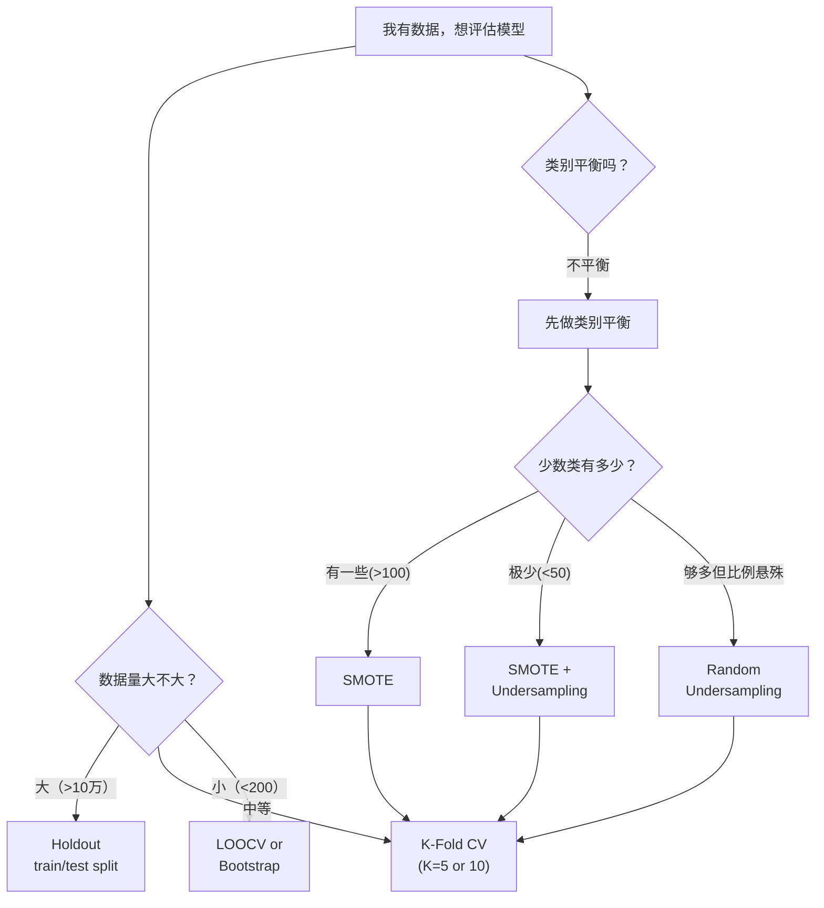

# Sampling & Resampling 教程

> **前置知识：** 概率论基础、偏差-方差权衡、过拟合概念、损失函数
> **参考来源：** [《ESL》Ch.7](../../../textbooks/hastie_esl.pdf) · [《ISLR》Ch.5](../../../textbooks/james_ISLR.pdf)

---

## Section 0: 前置知识速查

1. **偏差-方差权衡 (Bias-Variance Tradeoff)**：模型误差 = 偏差² + 方差 + 不可约噪声。模型越复杂偏差越低但方差越高。参见 [overfitting_concepts.md](../overfitting/overfitting_concepts.md)
2. **过拟合 (Overfitting)**：模型在训练集上表现好但在新数据上表现差。参见 [overfitting_tutorial.md](../overfitting/overfitting_tutorial.md)
3. **损失函数 (Loss Function)**：衡量预测值和真实值之差的函数（如 MSE, 0-1 loss, cross-entropy）
4. **概率论**：独立事件概率、期望、方差、抽样分布

---

## Section 1: 它解决什么问题（Why）

### 没有它会怎样？

- 🔥 **痛点 1：乐观偏差** — 如果用训练数据评估模型，accuracy 看起来很高（甚至100%），但拿到新数据就崩了。你以为模型很好，其实只是在背答案（过拟合）
- 🔥 **痛点 2：数据浪费** — 简单的 train/test split 只用了一次划分，如果数据少（比如只有 200 个样本），训练集/测试集都不够用，评估结果波动大
- 🔥 **痛点 3：类别不平衡被忽视** — 如果 99% 是正常样本、1% 是异常，模型全预测"正常"就有 99% accuracy, 但完全没学到有用的东西
- 🔥 **痛点 4：不知道估计有多靠谱** — 做了一次 train/test，得到 accuracy=85%。这个 85% 到底有多可信？误差范围是多少？没有 Bootstrap 就回答不了

### 它的核心价值

1. **可靠的泛化评估** — CV 通过多次划分平均，得到更稳定的性能估计
2. **高效利用数据** — CV 和 Bootstrap 让小数据集也能做可靠的评估和推断
3. **量化不确定性** — Bootstrap 能给统计量加上置信区间，知道"估计有多靠谱"
4. **解决类别不平衡** — SMOTE 等方法让模型关注少数类，学到真正有用的决策边界

> 📚 Book: Hastie et al., [《ESL》](../../../textbooks/hastie_esl.pdf), Ch.7.1-7.3
> 📚 Book: James et al., [《ISLR》](../../../textbooks/james_ISLR.pdf), Ch.5.1

---

## Section 2: 它怎么工作的（How — 底层原理）

### 2.1 重抽样方法全景

### 2.2 K-Fold CV 核心机制

**为什么用 K-Fold 而不是简单的 train/test split？**

简单 split 只用了一种划分，结果依赖于"运气"（哪些样本进了测试集）。K-Fold 轮流用每个折做测试，**每个样本都被测试过一次**，评估结果更稳定。

**为什么用 K=5 或 K=10 而不是 K=N (LOOCV)？**

理论和实验都表明（Hastie ESL Ch.7.10）：
- K 太小（如 K=2）→ 训练集太小 → **偏差高**
- K 太大（K=N, LOOCV）→ K 个模型高度相似（只差 1 个样本）→ **方差高**
- **K=5 或 K=10** 是偏差和方差的最佳折中

### 2.3 Bootstrap 核心机制

**为什么有放回抽样？**

有放回抽样让每次 Bootstrap 样本都略有不同（打乱了样本的出现频率），模拟了"如果能重新从总体中采样"的效果。Efron (1979) 的核心洞察：**把已有样本当作总体的代理**。

**为什么不用 Bootstrap 估计泛化误差？**

Bootstrap 估计泛化误差有**下偏问题**：有放回抽样导致约 63.2% 的样本出现在训练集中（某些出现了多次），测试和训练之间有重叠。.632 Bootstrap 和 .632+ 估计器试图修正此偏差。

### 2.4 SMOTE 核心机制

**为什么在特征空间插值而不是简单复制？**

简单复制只是重复已有数据点，模型会过拟合到这些特定点上。SMOTE 在已有点之间插值，创建了"合理的新变体"，扩展了少数类的**决策区域**。

> 📚 Book: Hastie et al., [《ESL》](../../../textbooks/hastie_esl.pdf), Ch.7.10-7.11
> 📖 Paper: Chawla et al., [SMOTE (2002)](https://arxiv.org/abs/1106.1813)

---

## Section 3: 局限性

1. **CV 假设 i.i.d.** → 如果数据有时间/空间依赖（时间序列、地理数据），标准 K-Fold 会泄露未来信息 → 应对：Time Series Split / Spatial CV
2. **Bootstrap 对泛化误差有偏** → 有放回抽样导致训练集和测试集有重叠 → 应对：.632+ 估计器
3. **SMOTE 在高维空间可能生成噪声** → 特征空间维度高时，近邻可能不是真正相似的样本 → 应对：先降维，或用 SMOTE-ENN / Borderline-SMOTE
4. **所有重抽样方法都增加计算成本** → K-Fold 训练 K 次模型，Bootstrap 训练 B 次 → 应对：对计算密集模型用 Holdout 或 3-Fold

> 📚 Book: Hastie et al., [《ESL》](../../../textbooks/hastie_esl.pdf), Ch.7.10
> 📖 Paper: Chawla et al., [SMOTE (2002)](https://arxiv.org/abs/1106.1813)

---

## Section 4: 方案对比

| 方案 | 优点 | 缺点 | 适用场景 |
|------|------|------|---------|
| **Train/Test Split** | 快速、简单 | 评估方差大、浪费数据 | 大数据集(>10万) |
| **5-Fold CV** | 偏差-方差折中好 | 训练 5 次 | 中等数据集、通用场景 |
| **10-Fold CV** | 偏差更低 | 训练 10 次 | 需要更可靠的估计 |
| **LOOCV** | 偏差最低 | 方差高、计算贵 | 小数据集、线性模型 |
| **Stratified CV** | 保持类别比例 | 不处理不平衡本身 | 多分类、类别不均 |
| **Bootstrap** | 可估计置信区间 | 泛化估计有偏 | 统计推断、小样本不确定性估计 |
| **SMOTE** | 增加多样性 | 高维可能生成噪声 | 类别不平衡、中等维度 |
| **Random Undersampling** | 快速降低数据量 | 丢失多数类信息 | 大数据集、时间紧 |
| **Cost-Sensitive** | 不改变数据分布 | 需要领域知识定代价 | 有明确代价结构(医疗/金融) |

> 📚 Book: James et al., [《ISLR》](../../../textbooks/james_ISLR.pdf), Ch.5
> 📖 Paper: Chawla et al., [SMOTE (2002)](https://arxiv.org/abs/1106.1813)

---

## 参考来源表

| 来源 | 类型 | 使用位置 |
|------|------|---------|
| [《ESL》Ch.7-8](../../../textbooks/hastie_esl.pdf) | 📚 教科书 | Section 1-3: CV, Bootstrap 理论 |
| [《ISLR》Ch.5](../../../textbooks/james_ISLR.pdf) | 📚 教科书 | Section 0-4: Resampling Methods |
| [Chawla et al. 2002](https://arxiv.org/abs/1106.1813) | 📖 论文 | Section 2-4: SMOTE |
| [scikit-learn CV](https://scikit-learn.org/stable/modules/cross_validation.html) | 📖 文档 | Section 2: CV 实现 |
| [imbalanced-learn](https://imbalanced-learn.org/stable/) | 📖 文档 | Section 2: SMOTE 实现 |
