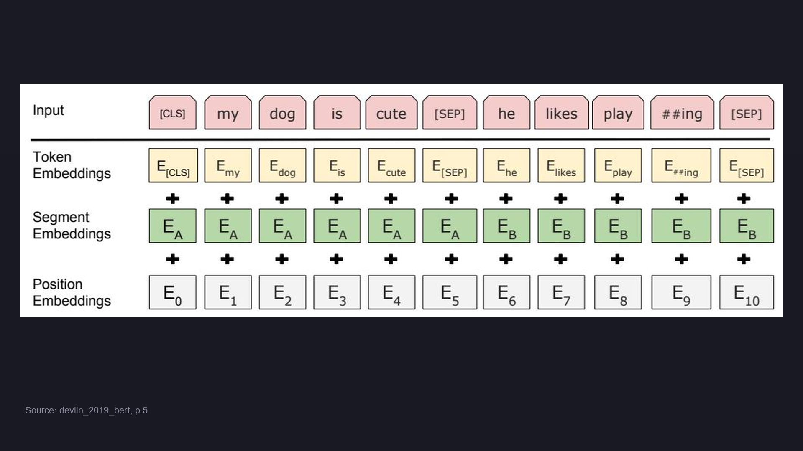

# BERT 上下游衔接

> 📖 Paper: Devlin et al., [BERT](https://arxiv.org/abs/1810.04805), NAACL 2019
> 📚 Book: Jurafsky & Martin, [SLP3](../../../textbooks/jurafsky_slp3.pdf), Ch.11

---

## 上游依赖

| 来自主题 | 复用的概念 | 在 BERT 中如何使用 |
|---------|-----------|-------------------|
| **Transformer** | Self-Attention、多头注意力、位置编码 | BERT 使用 Transformer Encoder 作为骨干网络 |
| **Word2Vec / GloVe** | 分布式词表示、嵌入空间 | BERT 的 Token Embedding 继承了词嵌入的思想，但改为上下文化 |
| **语言模型 (LM)** | 用上下文预测词的概率 | MLM 是语言模型的变体，只是从单向改为了双向掩码 |
| **迁移学习** | 预训练-微调范式 | BERT 是 NLP 领域迁移学习的标志性应用 |
| **WordPiece** | 子词分词 | BERT 使用 30K 词表的 WordPiece 处理未知词 |

> 📖 Paper: Devlin et al. (2019), Section 2 Related Work
> 📚 Book: Jurafsky & Martin, SLP3, Ch.5 (Word Vectors), Ch.8 (Transformer)

---

## 下游去向

| 去向主题 | BERT 提供的概念 | 在下游如何被使用 |
|---------|----------------|-----------------|
| **RoBERTa** | MLM 预训练架构 | 去掉 NSP，动态 masking，更大 batch/数据 |
| **ALBERT** | Transformer Encoder 结构 | 跨层参数共享 + embedding 矩阵分解 |
| **ELECTRA** | 预训练-微调范式 | 将 MLM 替换为"替换检测"任务，100% token 参与 |
| **SpanBERT** | MLM 掩码策略 | 改为掩盖连续 span + span boundary 预测 |
| **DistilBERT** | BERT 的知识 | 通过知识蒸馏压缩到 6 层，速度 2x |
| **Sentence-BERT** | [CLS] 输出 | 用孪生网络微调，专门用于句子相似度 |
| **GPT-3/4** | 预训练规模的价值 | 沿自回归路线扩大到千亿参数，证明 scaling 有效 |

> 📚 Source: Devlin et al. (2019), p.5

---

## 概念演变

| 概念 | 在 BERT 中 | 在后续模型中 | 变化原因 |
|------|-----------|-------------|---------|
| NSP 任务 | 作为预训练目标之一 | RoBERTa 去掉了 NSP | 实验证明 NSP 对下游任务帮助不大 |
| 静态 masking | 预处理时固定 mask 位置 | RoBERTa 使用动态 masking | 每个 epoch 看到不同的 mask 增加多样性 |
| MLM (15% token) | 随机 mask 单个 token | SpanBERT mask 连续 span | 连续 span 更接近实际理解单元 |
| MLM (预测被mask词) | 生成式预测原始 token | ELECTRA 判别式检测替换 | 100% token 参与训练，效率更高 |
| 12 层固定 | 完整 12 层 | DistilBERT 蒸馏到 6 层 | 推理速度需求，保留 97% 性能 |

> 📖 Paper: Liu et al. "RoBERTa" (2019); Clark et al. "ELECTRA" (2020)

---

## 扩展阅读

| 资源 | 类型 | 为什么值得读 | 难度 |
|------|------|-------------|------|
| [Illustrated BERT](http://jalammar.github.io/illustrated-bert/) | 📝 博客 | 最佳可视化讲解，适合初学者 | ⭐⭐ |
| [RoBERTa paper](https://arxiv.org/abs/1907.11692) | 📖 论文 | 理解 BERT 哪些设计是必要的 | ⭐⭐⭐ |
| [ELECTRA paper](https://arxiv.org/abs/2003.10555) | 📖 论文 | 理解 MLM 的替代方案 | ⭐⭐⭐ |
| [HuggingFace Course](https://huggingface.co/learn/nlp-course) | 📖 教程 | 动手实践 BERT 微调 | ⭐⭐ |
| [The Annotated Transformer](https://nlp.seas.harvard.edu/2018/04/03/attention.html) | 💻 代码 | 逐行理解 Transformer 实现 | ⭐⭐⭐⭐ |

---
