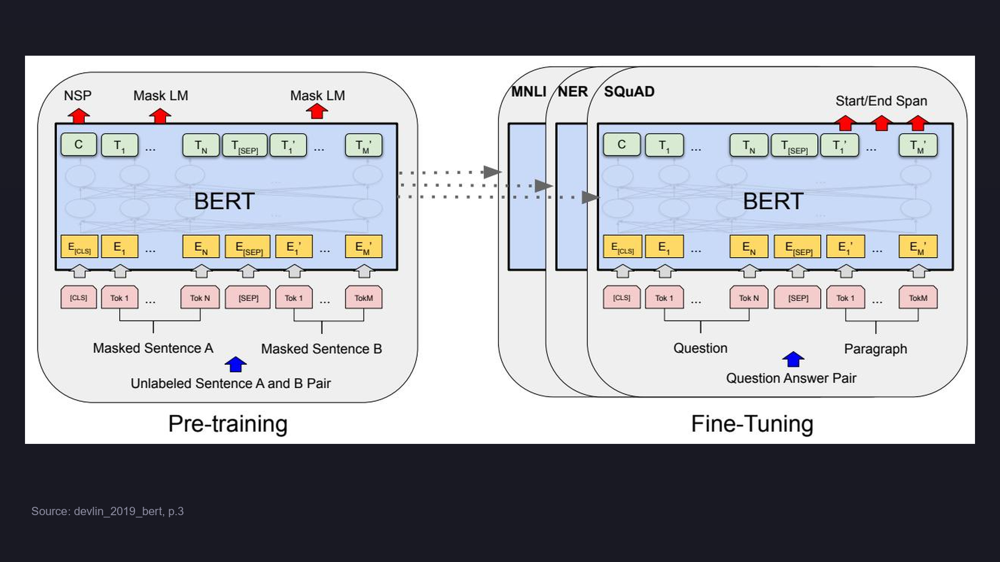
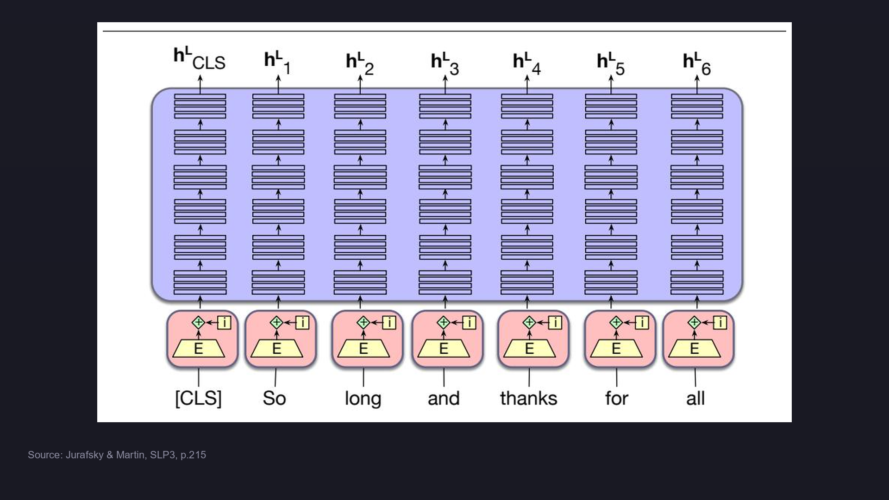

# BERT 核心概念

> 📖 Paper: Devlin et al., [BERT](https://arxiv.org/abs/1810.04805), NAACL 2019
> 📚 Book: Jurafsky & Martin, [SLP3](../../../textbooks/jurafsky_slp3.pdf), Ch.11

---

## 术语定义

> 📚 Source: Devlin et al. (2019), Figure 1, p.3

> 📚 Source: Jurafsky & Martin, SLP3, p.215

### 预训练 (Pre-training)

在大规模无标注文本（BooksCorpus 800M词 + Wikipedia 2500M词）上，通过自监督任务让模型学习通用语言知识。预训练后的参数可以迁移到各种下游任务。

> **教科书原文**（Devlin et al. 2019, Section 3）：
> "During pre-training, the model is trained on unlabeled data over different pre-training tasks."

> 📖 Paper: Devlin et al. (2019), Section 3

### 微调 (Fine-tuning)

用预训练好的参数初始化模型，再用下游任务的标注数据对所有参数端到端训练。只需添加一个输出层。

> **教科书原文**（Devlin et al. 2019, Section 3）：
> "For fine-tuning, the BERT model is first initialized with the pre-trained parameters, and all of the parameters are fine-tuned using labeled data from the downstream tasks."

> 别名：Fine-tuning, 下游任务适配

> 📖 Paper: Devlin et al. (2019), Section 3 & 4

### Masked Language Model (MLM)

BERT 的核心预训练任务。随机遮盖输入序列中 15% 的 token，让模型预测被遮盖的原始词。遮盖策略：80% 替换为 [MASK]，10% 替换为随机词，10% 保持不变。

> **教科书原文**（SLP3 p.210）：
> "We then train the model to guess the correct token for the manipulated tokens. Why the three possible manipulations? Adding the [MASK] token creates a mismatch between pretraining and downstream finetuning."

> 别名：完形填空任务 (Cloze Task)
> 易混淆：**MLM vs Causal LM** — MLM 双向关注上下文预测被遮盖词；Causal LM（如 GPT）只看左侧上下文预测下一个词

> 📖 Paper: Devlin et al. (2019), Section 3.1
> 📚 Book: Jurafsky & Martin, SLP3, Ch.11, p.210

### Next Sentence Prediction (NSP)

第二个预训练任务。给定句对 (A, B)，判断 B 是否是 A 的真实后续句子（50%正例 / 50%负例）。帮助模型理解句间关系。

> **教科书原文**（Devlin et al. 2019, Section 3.1）：
> "The training data generator chooses 15% of the token positions at random for prediction."

> 📚 Book: Jurafsky & Martin, SLP3, Ch.11, p.212

### [CLS] Token

插入在每个输入序列开头的特殊分类标记。其最终隐层输出用作整个序列的聚合表示，输入到分类器中。

> 易混淆：**[CLS] vs [SEP]** — [CLS] 用于序列级分类输出；[SEP] 用于分隔两个句子

> 📖 Paper: Devlin et al. (2019), Section 3

### [SEP] Token

放在两个句子之间和最后一个 token 之后的特殊分隔标记。配合 Segment Embedding 区分 Sentence A 和 Sentence B。

> 📖 Paper: Devlin et al. (2019), Section 3

### 输入表示 (Input Representation)

BERT 的输入由三种 embedding 求和构成：Token Embedding (WordPiece) + Segment Embedding (句子归属) + Position Embedding (位置编码)。

> **教科书原文**（Devlin et al. 2019, Section 3）：
> "For a given token, its input representation is constructed by summing the corresponding token, segment, and position embeddings."

> 📖 Paper: Devlin et al. (2019), Figure 2, Section 3

### WordPiece Tokenization

BERT 使用的子词分词算法，词表大小 30,000。将罕见词拆分为子词单元（如 "playing" → "play" + "##ing"），平衡词表大小与覆盖率。

> 📖 Paper: Devlin et al. (2019), Section 3

---

## 概念辨析

### BERT vs GPT

| 维度 | BERT | GPT |
|------|------|-----|
| 方向性 | **双向** — 同时看左右上下文 | **单向** — 只看左侧上下文 |
| 预训练目标 | MLM + NSP | Causal Language Model (预测下一个词) |
| 架构 | Transformer **Encoder** | Transformer **Decoder** |
| 适用任务 | 理解型（分类、问答、NER） | 生成型（文本生成、对话） |
| 微调方式 | 添加输出层，微调所有参数 | 同上 |

> **教科书原文**（Devlin et al. 2019, Appendix, p.13）：
> "The most comparable existing pre-training method to BERT is OpenAI GPT... The core argument of this work is that the bi-directionality and the two pretraining tasks presented in Section 3.1 account for the majority of the empirical improvements."

> 📖 Paper: Devlin et al. (2019), Appendix A.4, Figure 3

### ELMo vs BERT

| 维度 | ELMo | BERT |
|------|------|------|
| 双向方式 | 两个独立单向 LSTM **拼接** | 单个 Transformer **联合** 双向 |
| 迁移方式 | Feature-based (冻结+提取特征) | Fine-tuning (全参数微调) |
| 上下文融合 | 浅层拼接 | 深层联合注意力 |

> 📖 Paper: Devlin et al. (2019), Section 2 & Appendix A.4

### BERT-BASE vs BERT-LARGE

| 参数 | BERT-BASE | BERT-LARGE |
|------|-----------|------------|
| L (层数) | 12 | 24 |
| H (隐层维度) | 768 | 1024 |
| A (注意力头数) | 12 | 16 |
| 总参数 | 110M | 340M |

> 📖 Paper: Devlin et al. (2019), Section 3

---

## 核心属性

### 适用场景 ✅

- **文本分类** — 情感分析、主题分类（用 [CLS] 输出）
- **问答系统** — 抽取式 QA（预测 start/end span）
- **命名实体识别** — 序列标注（每个 token 单独分类）
- **自然语言推理** — 句对关系判断（MNLI、RTE）
- **语义相似度** — 句对相似度评估（STS-B）

### 不适用场景 ❌

- **文本生成** — BERT 是 Encoder-only，不擅长自回归生成（用 GPT）
- **超长文档** — 输入限制 512 token（用 Longformer / BigBird）
- **实时推理** — 大模型推理延迟高（用 DistilBERT / TinyBERT 蒸馏）
- **低资源场景** — 预训练需大规模算力（但微调成本低）

> 📖 Paper: Devlin et al. (2019), Section 4
> 📚 Book: Jurafsky & Martin, SLP3, p.254

---

## 速查表

| 项 | 说明 | 示例/值 |
|----|------|---------|
| 全称 | Bidirectional Encoder Representations from Transformers | — |
| 发布 | Google AI, 2018 年 10 月 | arXiv: 1810.04805 |
| 预训练目标 | MLM + NSP | 15% mask, 50/50 NSP |
| 输入格式 | [CLS] + Sentence A + [SEP] + Sentence B + [SEP] | — |
| 输入表示 | Token + Segment + Position Embedding | 三者相加 |
| 分词器 | WordPiece | 30K 词表 |
| 最大序列长度 | 512 tokens | — |
| Base 参数 | L=12, H=768, A=12 | 110M 参数 |
| Large 参数 | L=24, H=1024, A=16 | 340M 参数 |
| 预训练数据 | BooksCorpus + Wikipedia | 3.3B 词 |
| 训练时长 | 4 天 (Base) / 4 天 (Large, 64 TPU) | — |
| 代表性成绩 | GLUE 80.5%, SQuAD F1 93.2 | 发布时 SOTA |

> 📖 Paper: Devlin et al. (2019), Section 3 & 4

---
