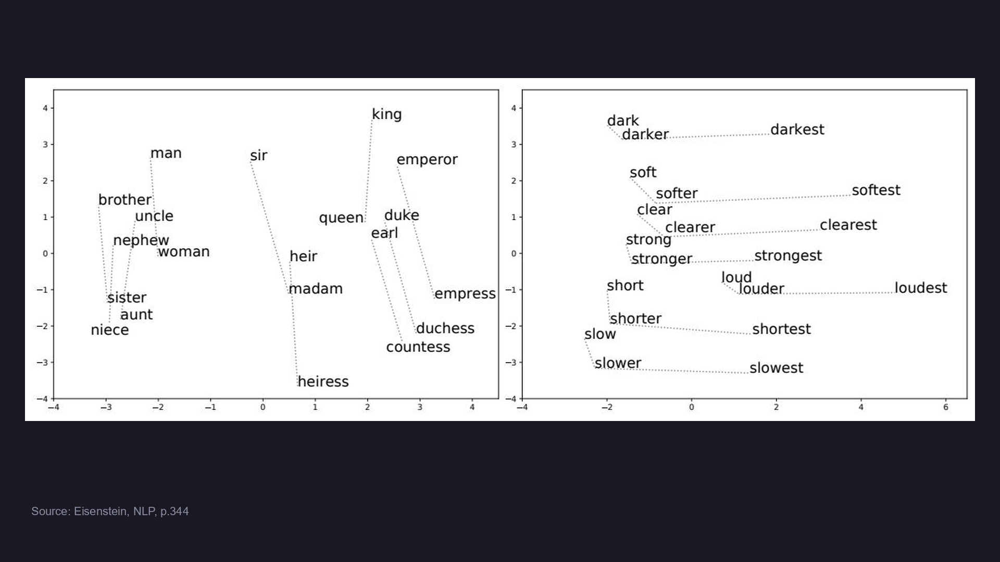
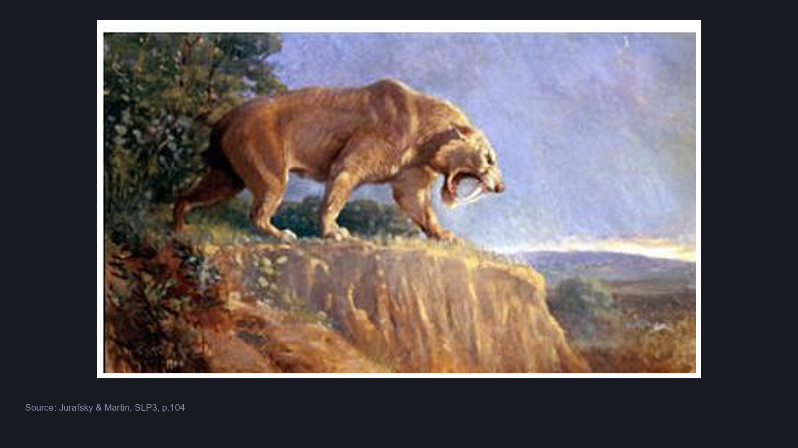
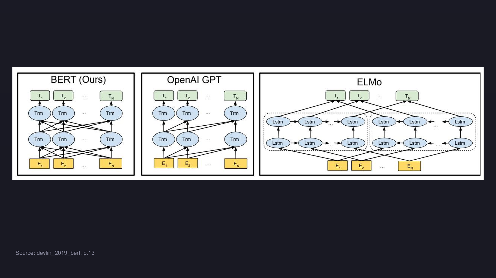

# BERT 的故事线：从静态词向量到双向预训练

> 📖 Paper: Devlin et al., [BERT](https://arxiv.org/abs/1810.04805), NAACL 2019
> 📚 Book: Jurafsky & Martin, [SLP3](../../../textbooks/jurafsky_slp3.pdf), Ch.11

---

## 🎬 序幕：一切从什么问题开始？

2013 年以前，NLP 的主流范式是"特征工程 + 浅层模型"——每个任务需要人工设计特征（n-gram、POS tag、语法树），然后喂给 SVM/CRF。换一个任务就要重新设计一套特征。**核心痛点：知识不能跨任务迁移。**

> 📚 Book: Eisenstein, NLP, Ch.14 — "Distributional statistics have a striking ability to capture lexical semantic relationships such as analogies."

---

## 📚 第一章：词向量革命（2013-2014）



> 📚 Source: Eisenstein, NLP, Figure 14.1, p.344

### 发生了什么？

- **2013**: Mikolov 等人发布 **Word2Vec**（CBOW + Skip-gram），用浅层神经网络在大规模文本上学习词向量。"king - man + woman ≈ queen" 惊艳了整个领域
- **2014**: Pennington 等人发布 **GloVe**，用全局共现矩阵分解学词向量

> 关键人物：Tomas Mikolov (Google), Jeffrey Pennington (Stanford)
> 关键论文：Mikolov et al. "Efficient Estimation of Word Representations", ICLR 2013

### 为什么这很重要？

词向量实现了**无监督的语义表示**：不需要标注数据，从文本自身学到词的含义。大幅降低了 NLP 任务的特征工程成本。

### 但还有一个问题……

Word2Vec/GloVe 给每个词**一个固定向量**。但 "bank" 在 "river bank" 和 "bank account" 中含义完全不同。**静态词向量无法处理一词多义。**

🔑 **故事转折点**：我们需要"上下文化"的词向量——让同一个词根据语境有不同的表示。

---

## 📚 第二章：上下文化表示的崛起（2017-2018）



> 📚 Source: Jurafsky & Martin, SLP3, p.104

### 发生了什么？

- **2017**: McCann 等人发布 **CoVe**，用机器翻译的 Encoder 生成上下文化词向量
- **2018.02**: Peters 等人发布 **ELMo**（Embeddings from Language Models），用双向 LSTM 语言模型生成上下文化表示。每个词在不同句子里有不同的向量
- **2018.06**: Radford 等人发布 **OpenAI GPT**，用 Transformer Decoder + 单向语言模型预训练，再在各任务上微调

> 关键人物：Matthew Peters (AI2), Alec Radford (OpenAI)
> 关键论文：Peters et al. "Deep contextualized word representations", NAACL 2018

### 为什么这很重要？

ELMo 证明了**预训练语言模型可以显著提升下游任务**。GPT 证明了 **Transformer + 微调** 的范式行得通。

### 但还有一个问题……

- **ELMo 是 feature-based**：只提取特征，下游任务还需要独立的模型架构
- **GPT 是单向的**：只能看左边的上下文，不能同时利用右侧信息
- **ELMo 的"双向"是浅层拼接**：左→右和右→左两个 LSTM 独立训练，最后拼接，不是真正的联合双向

🔑 **故事转折点**：我们需要一个**真正联合双向 + 统一架构 + 微调范式**的模型。

---

## 📚 第三章：BERT 横空出世（2018.10）



> 📚 Source: Devlin et al. (2019), Figure 3, p.13

### 发生了什么？

- **2018.10**: Google AI 的 Jacob Devlin 等人发布 **BERT**。核心创新：用 Masked Language Model 实现真正的双向预训练

> 关键人物：Jacob Devlin, Ming-Wei Chang, Kenton Lee, Kristina Toutanova (Google AI Language)
> 关键论文：Devlin et al. "BERT: Pre-training of Deep Bidirectional Transformers", NAACL 2019

### 为什么这很重要？

BERT 一次性在 11 个 NLP 基准上刷新 SOTA：
- GLUE: 80.5%（比之前 +7.7%）
- SQuAD v1.1: F1 93.2（+1.5）
- SQuAD v2.0: F1 83.1（+5.1）

> 📖 Paper: Devlin et al. (2019), Section 1

### 但还有一个问题……

- NSP 任务被证明效果有限（RoBERTa 去掉了 NSP）
- 预训练效率低（只有 15% token 参与训练）
- 不适合生成任务

🔑 **故事转折点**：BERT 开创了 "预训练-微调" 时代，后续工作在此基础上不断改良。

---

## 📚 第四章：后 BERT 时代（2019-2020）

### 发生了什么？

| 年份 | 模型 | 核心改进 |
|------|------|---------|
| 2019.07 | **RoBERTa** | 去掉 NSP，更大 batch，更多数据，动态 masking |
| 2019.09 | **ALBERT** | 参数共享 + embedding 分解，轻量化 |
| 2019.12 | **ELECTRA** | 用"替换检测"替代 MLM，100% token 参与训练 |
| 2019 | **SpanBERT** | 掩盖连续 span 而非随机 token |
| 2019 | **DistilBERT** | 知识蒸馏，6 层，速度 2x，保留 97% 性能 |

> 关键论文：Liu et al. "RoBERTa", 2019; Clark et al. "ELECTRA", ICLR 2020

### 每一步升级解决了什么问题？

这些工作共同验证了：BERT 的核心设计（双向 Transformer + 预训练-微调）是正确的，但具体的预训练策略还有大量改进空间。

---

## 🗺️ 全局回顾：技术演进路线图

```
2013 ─── Word2Vec ─── 静态词向量 ("king-man+woman=queen")
  │
2014 ─── GloVe ────── 全局共现矩阵分解
  │
2017 ─── Transformer ─ "Attention Is All You Need" (Vaswani et al.)  
  │
2018.02 ─ ELMo ────── 双向 LSTM 上下文化 (feature-based)
  │
2018.06 ─ GPT ─────── 单向 Transformer + fine-tuning
  │
2018.10 ─ BERT ────── ★ 双向 Transformer + MLM + fine-tuning
  │
2019 ──── RoBERTa ─── 更强预训练策略
  │        ALBERT ──── 参数压缩
  │        ELECTRA ─── 替换检测预训练
  │
2020+ ─── GPT-3 ────── 大规模自回归 → LLM 时代
```

> 📚 Book: Jurafsky & Martin, SLP3, Ch.11

---
