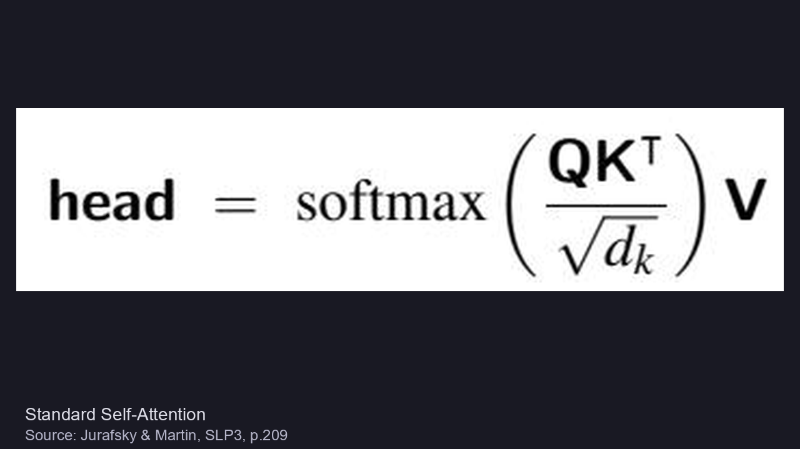
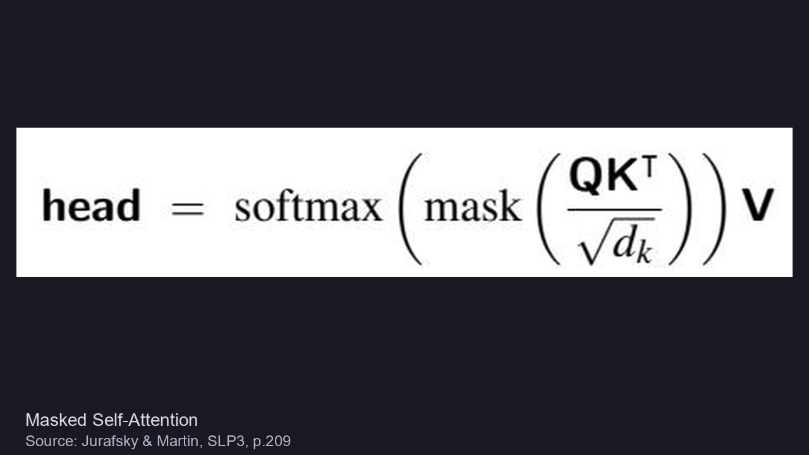
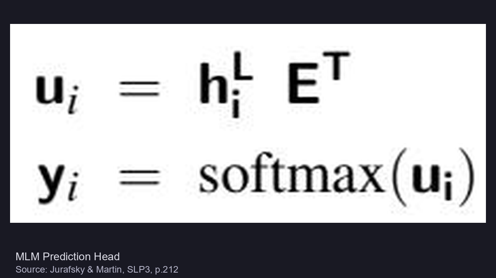
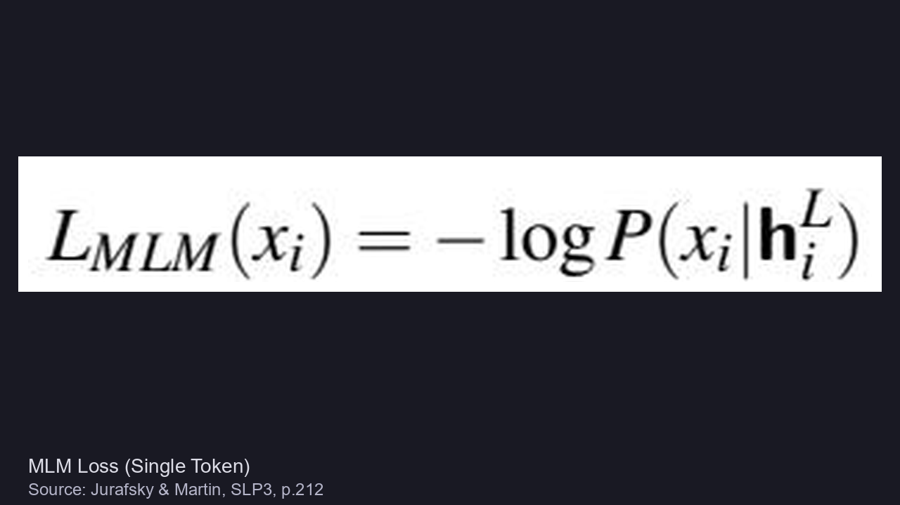
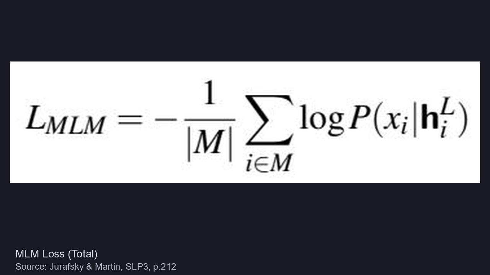
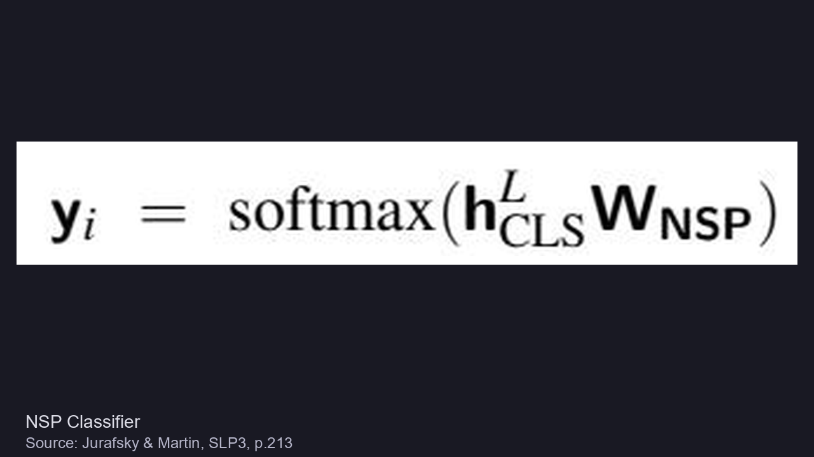

# BERT 数学基础

> 📖 Paper: Devlin et al., [BERT](https://arxiv.org/abs/1810.04805), NAACL 2019
> 📚 Book: Jurafsky & Martin, [SLP3](../../../textbooks/jurafsky_slp3.pdf), Ch.11

---

## 符号对照表

| 符号 | 含义（白话） | 英文 | 取值范围 |
|------|-------------|------|---------|
| L | Transformer 层数 | Number of layers | Base: 12, Large: 24 |
| H | 隐层维度 | Hidden size | Base: 768, Large: 1024 |
| A | 多头注意力头数 | Attention heads | Base: 12, Large: 16 |
| h_i^L | 第 i 个 token 在第 L 层的输出 | Token output | 向量 ∈ ℝ^H |
| h_CLS^L | [CLS] token 的最终层输出 | CLS output | 向量 ∈ ℝ^H |
| M | 被 mask 的 token 索引集合 | Masked set | 约 15% 的 token |
| E | Embedding 矩阵 | Embedding matrix | V×H，V=30522 |
| W_NSP | NSP 分类器权重 | NSP weights | 2×H |

> 📚 Book: Jurafsky & Martin, SLP3, p.209-212

---

## 核心公式

### 公式 1: Self-Attention（BERT 的基础计算单元）

**直觉**：每个词"看"所有其他词，计算注意力权重，加权汇总信息。



> 📚 Source: Jurafsky & Martin, SLP3, p.209

---

### 公式 2: Masked Self-Attention（带遮罩的注意力）

**直觉**：和标准 Self-Attention 一样，但用 mask 隐藏未来位置（在 GPT 中使用；BERT 不需要 mask 未来，因为它是双向的）。



> 📚 Source: Jurafsky & Martin, SLP3, p.209

---

### 公式 3: MLM Prediction Head（预测被遮盖词的头部）

**直觉**：把最后一层的隐层输出 h_i^L 过一个线性变换 + softmax，预测原始词的概率分布。



> 📚 Source: Jurafsky & Martin, SLP3, p.212

**参数解释**：
| 参数 | 含义 |
|------|------|
| u_i | logit 向量，h_i^L 乘以词表嵌入矩阵的转置 |
| y_i | softmax 后的概率分布，维度 = 词表大小 |
| E^T | 词表嵌入矩阵的转置（共享输入 embedding 权重） |

---

### 公式 4: MLM Loss（单 token 损失）

**直觉**：对一个被遮盖的 token，交叉熵损失 = 预测正确词概率的负对数。



> 📚 Source: Jurafsky & Martin, SLP3, p.212

---

### 公式 5: MLM Loss（总损失）

**直觉**：对所有被遮盖的 token 求平均损失。|M| 是被遮盖的 token 总数。



> 📚 Source: Jurafsky & Martin, SLP3, p.212

> **教科书原文**（SLP3 p.211）：
> "Note that only the tokens in M play a role in learning; the other words play no role in the loss function, so in that sense BERT and its descendents are inefficient; only 15% of the input samples in the training data are actually used for training weights."

---

### 公式 6: NSP Classifier（下一句预测分类器）

**直觉**：用 [CLS] 的输出过一个线性层 + softmax，二分类判断两个句子是否连续。



> 📚 Source: Jurafsky & Martin, SLP3, p.213

> **教科书原文**（SLP3 p.212）：
> "Cross entropy is used to compute the NSP loss for each sentence pair presented to the model. The NSP loss was used in conjunction with the MLM training objective to form final loss."

---

### 公式 7: 总预训练损失

**直觉**：MLM 和 NSP 两个损失直接相加，联合优化整个模型。

> **教科书原文**（SLP3 p.212）：
> "In BERT, the NSP loss was used in conjunction with the MLM training objective to form final loss."

即: L_total = L_MLM + L_NSP

> 📚 Book: Jurafsky & Martin, SLP3, p.212

---

### 公式 8: 微调分类 softmax

**直觉**：微调时加一个线性层，[CLS] 输出 × W → softmax 得到分类概率。

> **教科书原文**（Devlin et al. 2019, Section 4.1）：
> "The only new parameters introduced during fine-tuning are classification layer weights W ∈ ℝ^{K×H}... We compute a standard classification loss with C and W, i.e., log(softmax(CW^T))."

> 📖 Paper: Devlin et al. (2019), Section 4.1

---

### 公式 9: SQuAD 答案跨度概率

**直觉**：QA 任务中，用 start/end 两个向量分别和每个 token 做点积 + softmax，定位答案的起止位置。

> **教科书原文**（Devlin et al. 2019, Section 4.2）：
> "The probability of word i being the start of the answer span is computed as a dot product between T_i and S followed by a softmax over all words in the paragraph."

> 📖 Paper: Devlin et al. (2019), Section 4.2

---

## 公式关系图

```
输入: [CLS] tok1 tok2 ... [SEP] tok_a tok_b ... [SEP]
         │
         ▼
    Token + Segment + Position Embedding (相加)
         │
         ▼
    ┌────────────────────────────┐
    │  Transformer Encoder × L  │ ← Self-Attention (公式 1)
    │  → h_1^L ... h_n^L, h_CLS│
    └────────────────────────────┘
         │              │
    预训练阶段         微调阶段
    ┌────┴────┐    ┌────┴──────┐
    │ MLM Head│    │ 分类: CW^T│ → softmax (公式 8)
    │(公式 3) │    │ QA: S·T_i │ → softmax (公式 9)
    │→ u_i=h·E│    └───────────┘
    │→ y_i=sfm│
    └─────────┘
         │
    Loss = L_MLM (公式 5) + L_NSP (公式 6)
```

> 📚 Book: Jurafsky & Martin, SLP3, p.208-213

---

## 手算练习

### 练习 1: MLM 损失计算（对应公式 4、5）

**题目**：输入序列 "So long and thanks for all the fish"（8 tokens），15% mask → 选中 1 个 token "thanks"（位置 i=4）。模型对该位置预测出以下概率分布（词表简化为 5 个词）：

| 词 | P(词 \| h_4^L) |
|---|---|
| thanks | 0.6 |
| hello | 0.15 |
| the | 0.1 |
| and | 0.1 |
| \<其他\> | 0.05 |

**Step 1**: 计算单 token MLM 损失（公式 4）


> 应用: L_MLM(x_4) = -log P("thanks" | h_4^L) = -log(0.6) = **0.511**

**Step 2**: 如果还 mask 了 "all"（位置 i=6），P("all" | h_6^L) = 0.8

> L_MLM(x_6) = -log(0.8) = **0.223**

**Step 3**: 计算总损失（公式 5）


> L_MLM = -(1/|M|) × Σ = -(1/2) × (log 0.6 + log 0.8)
> L_MLM = -(1/2) × (-0.511 + (-0.223)) = -(1/2) × (-0.734) = **0.367**

**教训**：预测越准（P 越大），loss 越小。如果模型完美预测 P=1.0，则 loss=0。

> 📚 公式来源: Jurafsky & Martin, SLP3, p.212

---

### 练习 2: NSP 分类计算（对应公式 6）

**题目**：给定句对 A="Cancel my flight" + B="And the hotel"，模型的 [CLS] 最终输出 h_CLS^L = [0.3, 0.7, 0.1, 0.5]（H=4），NSP 权重矩阵 W_NSP 为 2×4:

```
W_NSP = [[0.5, 0.2, 0.1, 0.3],    ← IsNext
          [0.1, 0.6, 0.4, 0.2]]    ← NotNext
```

**Step 1**: 线性变换 h_CLS × W_NSP^T


> logit_IsNext  = 0.3×0.5 + 0.7×0.2 + 0.1×0.1 + 0.5×0.3 = 0.15 + 0.14 + 0.01 + 0.15 = **0.45**
> logit_NotNext = 0.3×0.1 + 0.7×0.6 + 0.1×0.4 + 0.5×0.2 = 0.03 + 0.42 + 0.04 + 0.10 = **0.59**

**Step 2**: softmax

> P(IsNext)  = e^0.45 / (e^0.45 + e^0.59) = 1.568 / (1.568 + 1.804) = **0.465**
> P(NotNext) = e^0.59 / (e^0.45 + e^0.59) = 1.804 / (1.568 + 1.804) = **0.535**

**Step 3**: 假设真实标签是 IsNext（y=1），计算交叉熵损失

> L_NSP = -log P(IsNext) = -log(0.465) = **0.765**

**教训**：模型给出 53.5% 认为 NotNext，但实际是 IsNext → loss 较高（0.765），模型需要继续学习。

> 📚 公式来源: Jurafsky & Martin, SLP3, p.213

> **注**：SLP3 Ch.9 没有课后练习题（原文 Historical Notes 标注 "TBD"）。以上手算练习基于教科书公式自行设计，用于辅助理解。

---

## 公式速查表

| 名称 | 截图 | 用途 | 来源 |
|------|------|------|------|
| Self-Attention | math_eq_2 | Transformer 核心计算 | SLP3 p.209 |
| MLM Prediction | math_eq_3 | 预测被遮盖词 | SLP3 p.212 |
| MLM Loss (单) | math_eq_4 | 单 token 交叉熵 | SLP3 p.212 |
| MLM Loss (总) | math_eq_5 | 所有遮盖位平均 | SLP3 p.212 |
| NSP Classifier | math_eq_6 | 句对关系分类 | SLP3 p.213 |
| Fine-tune cls | — | softmax(CW^T) | Devlin §4.1 |
| QA span | — | S·T_i + E·T_j | Devlin §4.2 |

---
