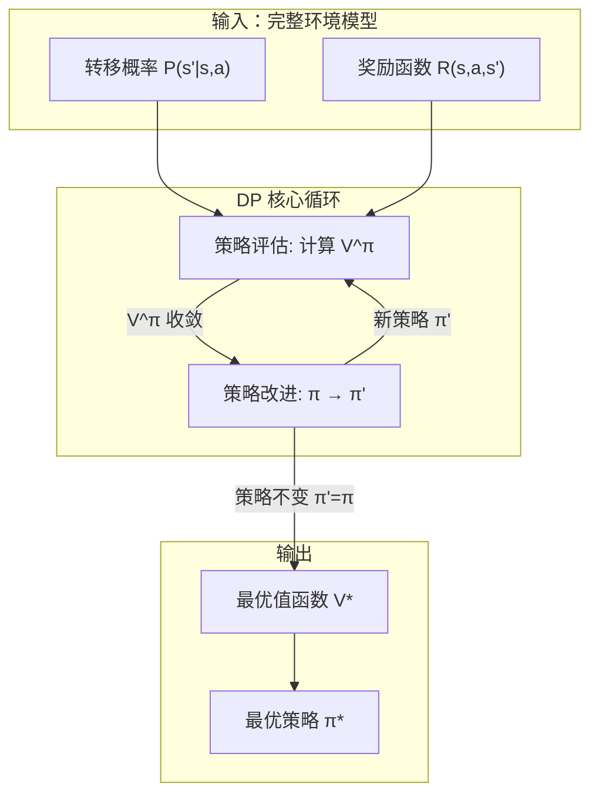

# 动态规划 核心概念

> 📚 Book: Sutton & Barto, [《Reinforcement Learning: An Introduction》](../../../textbooks/sutton_barto_rl_intro.pdf), Ch.4

---

## 术语定义

### 动态规划 (Dynamic Programming, DP)

一类利用**已知完整环境模型**（转移概率 P(s'|s,a) 和奖励函数 R(s,a)）来计算最优策略的算法。在 RL 语境中，DP 不是指编程竞赛里的"动态规划"（递推分治），而是指在 MDP 上利用贝尔曼方程迭代求解值函数和最优策略。就像你有一张完整地图——DP 就是在地图上算出从任意起点到目标的最短路，不用实际走。

> 易混淆：**Model-Free RL (MC/TD)** — DP 需要完整环境模型（Model-Based），MC/TD 不需要模型，直接从交互经验中学习

> 📚 Book: Sutton & Barto, [《Reinforcement Learning: An Introduction》](../../../textbooks/sutton_barto_rl_intro.pdf), Ch.4 §4.1

### 策略评估 (Policy Evaluation)

给定一个固定策略 π，计算每个状态在该策略下的值函数 V^π(s) 的过程。就是回答"如果我一直按策略 π 行动，从状态 s 出发平均能拿多少回报？"。方法：反复用贝尔曼期望方程更新所有状态的值，直到值不再变化（收敛）。

> 别名：**迭代策略评估 (Iterative Policy Evaluation)** — 强调通过迭代计算，区别于直接解线性方程组的精确求解

> 📚 Book: Sutton & Barto, [《Reinforcement Learning: An Introduction》](../../../textbooks/sutton_barto_rl_intro.pdf), Ch.4 §4.1

### 策略改进 (Policy Improvement)

在已知当前策略 π 的值函数 V^π 后，通过在每个状态贪心选择最优动作来构造一个新策略 π' 的过程。核心思想：对每个状态 s，计算所有动作的 Q^π(s,a)，选 Q 值最大的那个动作。**策略改进定理**保证 π' ≥ π（至少不差），如果 π' = π 则已经是最优策略。

> 📚 Book: Sutton & Barto, [《Reinforcement Learning: An Introduction》](../../../textbooks/sutton_barto_rl_intro.pdf), Ch.4 §4.2

### 策略迭代 (Policy Iteration)

交替执行**策略评估**和**策略改进**的完整算法：(1) 初始化一个随机策略 → (2) 评估它（算出 V^π）→ (3) 改进它（用贪心得到 π'）→ (4) 重复 2-3 直到策略不再变化。就像"先考试知道自己几分（评估），然后针对弱项改进（改进），再考试看分数涨没涨，循环"。

> 📚 Book: Sutton & Barto, [《Reinforcement Learning: An Introduction》](../../../textbooks/sutton_barto_rl_intro.pdf), Ch.4 §4.3

### 值迭代 (Value Iteration)

把策略评估和策略改进合并成一步：直接对贝尔曼**最优**方程做迭代更新。每个状态只做一次 max 操作就更新，不需要等策略评估完全收敛。比策略迭代更高效的变体——牺牲了"完整评估"换来更快的总体收敛。

> 易混淆：**策略迭代 (Policy Iteration)** — 策略迭代在每轮做完整评估后再改进；值迭代每轮只做一步评估就直接用 max

> 📚 Book: Sutton & Barto, [《Reinforcement Learning: An Introduction》](../../../textbooks/sutton_barto_rl_intro.pdf), Ch.4 §4.4

### 收敛性 (Convergence)

DP 算法在有限次迭代后值函数趋于稳定不再变化的性质。数学保证：对于有限 MDP，策略迭代在有限步内精确收敛到最优策略；值迭代在极限下收敛到最优值函数。实际中用 θ 阈值检测是否收敛：max_s |V_new(s) - V_old(s)| < θ 则停止。

> 📚 Book: Sutton & Barto, [《Reinforcement Learning: An Introduction》](../../../textbooks/sutton_barto_rl_intro.pdf), Ch.4 §4.4

### 完备模型 (Model-Based / Full Model)

DP 的前提条件：已知环境的完整动力学模型，即对所有 (s, a) 对知道转移概率 P(s'|s,a) 和期望奖励 R(s,a,s')。没有这个模型，DP 就无法运行——这也是 DP 在实践中的主要局限，催生了不需要模型的 MC 和 TD 方法。

> 📚 Book: Sutton & Barto, [《Reinforcement Learning: An Introduction》](../../../textbooks/sutton_barto_rl_intro.pdf), Ch.4 §4.1

### 同步更新 (Synchronous Update)

在一次迭代中，对**所有状态**同时计算新值，然后一次性替换旧值。实现时用两个数组：V_old 读取旧值，V_new 写入新值，一轮结束后 V_old ← V_new。优点是实现简单、收敛性分析清晰。

> 易混淆：**异步更新 (Asynchronous Update)** — 同步更新一轮更新所有状态；异步更新可以只更新部分状态，按任意顺序

> 📚 Book: Sutton & Barto, [《Reinforcement Learning: An Introduction》](../../../textbooks/sutton_barto_rl_intro.pdf), Ch.4 §4.5

### 异步更新 (Asynchronous Update)

不一次更新所有状态，而是逐个或部分更新，且新值立即被后续更新使用。比如 in-place 更新：只用一个数组 V，更新 V(s) 后立即用新值去更新其他状态。优点是可以优先更新重要状态、节省计算，在大状态空间中特别有用。

> 📚 Book: Sutton & Barto, [《Reinforcement Learning: An Introduction》](../../../textbooks/sutton_barto_rl_intro.pdf), Ch.4 §4.5

### 贝尔曼期望方程 (Bellman Expectation Equation)

用于策略评估的递推方程：V^π(s) = Σ_a π(a|s) Σ_{s'} P(s'|s,a) [R(s,a,s') + γ V^π(s')]。直觉：一个状态的值 = 按策略概率选动作 → 按转移概率到下一状态 → 即时奖励 + 折扣后的下一状态值的加权平均。

> 📚 Book: Sutton & Barto, [《Reinforcement Learning: An Introduction》](../../../textbooks/sutton_barto_rl_intro.pdf), Ch.3 §3.5, Eq. 3.14

### 贝尔曼最优方程 (Bellman Optimality Equation)

用于值迭代的递推方程：V*(s) = max_a Σ_{s'} P(s'|s,a) [R(s,a,s') + γ V*(s')]。与期望方程的区别：用 max 替代策略概率加权——直接找最优动作而非评估给定策略。

> 📚 Book: Sutton & Barto, [《Reinforcement Learning: An Introduction》](../../../textbooks/sutton_barto_rl_intro.pdf), Ch.3 §3.6, Eq. 3.19

---

## 概念辨析

### 策略迭代 vs 值迭代

| 维度 | 策略迭代 (Policy Iteration) | 值迭代 (Value Iteration) |
|------|---------------------------|------------------------|
| **步骤** | 评估（多轮）→ 改进 → 评估 → 改进 → … | 每轮一步 max 更新 |
| **每轮计算量** | 高（评估需要多次扫描） | 低（只扫描一次） |
| **总迭代次数** | 少（通常 3-10 轮策略就收敛） | 多（值函数需要更多轮收敛） |
| **总计算量** | 通常较大（但可用截断评估优化） | 通常较小 |
| **使用方程** | 贝尔曼期望方程 → 贝尔曼最优方程 | 贝尔曼最优方程 |
| **适用场景** | 精确求解、小-中规模 MDP | 大规模 MDP、快速近似 |

> 📚 Book: Sutton & Barto, [《Reinforcement Learning: An Introduction》](../../../textbooks/sutton_barto_rl_intro.pdf), Ch.4 §4.3-4.4

### 同步更新 vs 异步更新

| 维度 | 同步更新 (Synchronous) | 异步更新 (Asynchronous) |
|------|----------------------|------------------------|
| **更新范围** | 一轮更新所有状态 | 一轮更新部分/单个状态 |
| **数据依赖** | 用旧值计算新值（需两个数组） | 用最新值计算（一个数组 in-place） |
| **收敛速度** | 理论清晰但可能浪费计算 | 实际更快（优先更新变化大的状态） |
| **实现复杂度** | 简单 | 需要决定更新顺序/优先级 |

> 📚 Book: Sutton & Barto, [《Reinforcement Learning: An Introduction》](../../../textbooks/sutton_barto_rl_intro.pdf), Ch.4 §4.5

### DP vs 蒙特卡洛 vs TD

| 维度 | DP | Monte Carlo | TD |
|------|-----|-------------|-----|
| **需要模型？** | ✅ 需要完整模型 | ❌ 不需要 | ❌ 不需要 |
| **更新时机** | 每轮迭代（全状态） | 回合结束 | 每步 |
| **学习来源** | 贝尔曼方程 | 完整回报 Gₜ | TD Target r + γV(s') |
| **自举？** | ✅ 是 | ❌ 否 | ✅ 是 |
| **偏差/方差** | 无偏差（精确模型） | 无偏高方差 | 有偏低方差 |

> 📚 Book: Sutton & Barto, [《Reinforcement Learning: An Introduction》](../../../textbooks/sutton_barto_rl_intro.pdf), Ch.4-6

---

## 核心属性

### 信息架构

> 📚 Book: Sutton & Barto, [《Reinforcement Learning: An Introduction》](../../../textbooks/sutton_barto_rl_intro.pdf), Ch.4 §4.3

### 适用场景 ✅

- **已知完整环境模型**：如棋盘游戏（已知规则）、工厂调度（已知转移概率）
- **状态空间有限且不太大**：表格 DP 需要存储每个状态的值，状态太多存不下
- **需要精确最优策略**：DP 保证收敛到最优，不像 MC/TD 有采样噪声
- **作为基线 (Baseline)**：验证其他算法是否正确时，用 DP 结果作为参照

### 不适用场景 ❌

- **不知道环境模型**：真实世界通常不知道 P(s'|s,a)，必须用 MC/TD
- **状态空间极大/连续**：Atari 游戏有 10^数千种状态，表格 DP 无法处理
- **需要在线学习**：DP 是 offline 规划，不能边交互边学

> 📚 Book: Sutton & Barto, [《Reinforcement Learning: An Introduction》](../../../textbooks/sutton_barto_rl_intro.pdf), Ch.4 §4.7

---

## 速查表

| 项 | 说明 | 示例 |
|-----|------|------|
| DP 前置条件 | 完整环境模型 P(s'\|s,a) + R | 4×4 GridWorld 的转移概率表 |
| Policy Evaluation | 给定 π，迭代算 V^π | 反复扫描所有状态更新值 |
| Policy Improvement | 用 V^π 贪心改进策略 | 在每个 s 选 argmax_a Q^π(s,a) |
| Policy Iteration | 评估→改进→评估→…直到收敛 | 通常 3-10 轮就收敛 |
| Value Iteration | 每轮一步 max 更新 | V(s) ← max_a Σ P[R + γV(s')] |
| 收敛检测 | max\|ΔV\| < θ | θ = 1e-4 常用 |
| 同步更新 | 用旧值算新值，一轮后替换 | V_new \| V_old 双数组 |
| 异步更新 | 用最新值 in-place 更新 | 单数组，更新后立即生效 |
