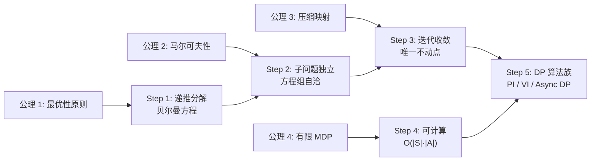

# 动态规划 第一性原理

> 📖 Paper: Bellman, [Dynamic Programming](https://press.princeton.edu/books/paperback/9780691146683/dynamic-programming), 1957
> 📚 Book: Sutton & Barto, [《Reinforcement Learning: An Introduction》](../../../textbooks/sutton_barto_rl_intro.pdf), Ch.4

---

## 核心问题链

> 用"5 个为什么"递归追问，从表层功能到不可再分公理。

1. **DP 在做什么？** → 用迭代方式计算 MDP 中的最优值函数和最优策略（表层）
2. **为什么能迭代求解？** → 因为**最优性原则**：最优策略的每一步都是局部最优的，多步问题可拆成一步+子问题（动机）
3. **为什么拆成子问题就能解？** → 因为**马尔可夫性**：子问题只依赖当前状态，不依赖历史——每个子问题独立（更深层）
4. **为什么迭代能收敛？** → 因为贝尔曼算子是 **γ-压缩映射**，在完备度量空间中压缩映射有且仅有一个不动点，迭代必定收敛（基本事实）
5. **能否继续拆分？** → 不能——这依赖于 **巴拿赫不动点定理** + **马尔可夫性** + **最优性原则** → **到达公理**

---

## 公理与基本假设

### 公理 1: 最优性原则 (Principle of Optimality)

**陈述：** 一个最优策略的任何后缀（从任意中间状态到终点的部分）也必须是该子问题的最优策略。

**白话：** 不管你怎么走到某个路口，从那个路口到目的地的最优走法不会因为来路不同而改变。"走到这里了，剩下的路该怎么走最好，只取决于现在在哪。"

**来源：** Bellman (1957)，是 DP 方法的根本假设。

**可验证性：**
- ✅ 成立条件：MDP 框架（马尔可夫性成立）、确定性/随机环境
- ❌ 不成立条件：路径相关的约束（如"不能经过同一城市两次"的 TSP 问题——子问题依赖历史路径）

> 📚 Book: Sutton & Barto, [《Reinforcement Learning: An Introduction》](../../../textbooks/sutton_barto_rl_intro.pdf), Ch.4 §4.1

### 公理 2: 马尔可夫性 (Markov Property)

**陈述：** P(sₜ₊₁ | sₜ, aₜ, sₜ₋₁, aₜ₋₁, …) = P(sₜ₊₁ | sₜ, aₜ)

**白话：** 知道现在在哪就够了，不需要知道怎么到这里的。这让递推成为可能——每个子问题可以独立求解。

**来源：** Markov (1906)。在 DP 中，马尔可夫性保证了贝尔曼方程的递推分解是合法的。

**可验证性：**
- ✅ 成立条件：状态完整描述了环境（棋盘、GridWorld）
- ❌ 不成立条件：部分可观察环境（POMDP）

> 📚 Book: Sutton & Barto, [《Reinforcement Learning: An Introduction》](../../../textbooks/sutton_barto_rl_intro.pdf), Ch.3 §3.1

### 公理 3: 压缩映射定理 (Banach Fixed-Point Theorem)

**陈述：** 在完备度量空间中，如果映射 T 满足 d(T(x), T(y)) ≤ γ·d(x, y)（0 ≤ γ < 1），则 T 有且仅有一个不动点 x*，且从任意初始点迭代 T 都收敛到 x*。

**白话：** 如果一个操作每次都把两个东西拉得更近（压缩），那么反复做这个操作，最终一定会收敛到同一个点——不管从哪开始。

**来源：** Stefan Banach (1922)。贝尔曼算子被证明是 γ-压缩映射（γ 就是折扣因子），因此 DP 迭代保证收敛。

**可验证性：**
- ✅ 成立条件：γ < 1 且状态空间有限
- ❌ 不成立条件：γ = 1 时不保证压缩（但在有终止状态的 episodic 任务中仍可收敛）

### 公理 4: 有限 MDP 假设

**陈述：** 状态空间 S 和动作空间 A 都是有限集合。

**白话：** 状态和动作的数量是有限的，可以用表格存储和遍历。

**来源：** DP 算法分析的基本假设。

**可验证性：**
- ✅ 成立条件：离散的、可枚举的状态/动作空间
- ❌ 不成立条件：连续状态空间（如机器人的位姿）→ 需要函数近似

---

## 从公理到技术的推导链

### Step 1: 从最优性原则 → 递推分解

**推理：** 因为最优策略的后缀也是最优的（公理 1），多步决策问题可以分解为"当前一步 + 剩余子问题"

**结果：** → 贝尔曼方程：V*(s) = max_a [R + γ V*(s')]

### Step 2: 从马尔可夫性 → 子问题独立

**推理：** 因为未来只依赖当前（公理 2），每个子问题 V*(s') 不依赖之前的路径

**结果：** → 贝尔曼方程中的 V*(s') 可以独立计算，所有状态的方程组成自洽的方程组

### Step 3: 从压缩映射 → 迭代收敛

**推理：** 贝尔曼算子 T[V](s) = max_a Σ_P [R + γV(s')] 是 γ-压缩映射（公理 3）

**结果：** → 从任意 V₀ 出发，反复应用 T 必定收敛到唯一不动点 V*

### Step 4: 从有限 MDP → 可计算

**推理：** 因为状态空间有限（公理 4），可以用表格存储 V 并遍历更新

**结果：** → 策略迭代和值迭代算法：每轮 O(|S|·|A|) 计算

### Step 5: → 完整的 DP 算法族

**推理：** 有了递推分解（Step 1-2）、收敛保证（Step 3）、可计算性（Step 4），就能构建一系列精确求解 MDP 的算法

**结果：** 策略评估 → 策略迭代 → 值迭代 → 异步 DP → GPI 框架

### 推导链全景图

---

## 如果公理不成立？

### 公理 1 失效：最优性原则不满足

**如果不成立：** 路径相关约束（如 TSP 的"不能重复访问"、资源限制"背包容量"）

**技术后果：** 子问题不独立，贝尔曼方程需要在扩展状态空间上定义（状态包含历史信息）

**替代方案：** 扩展状态空间（加入已访问集合）、约束 MDP、启发式搜索

### 公理 2 失效：马尔可夫性不满足

**如果不成立：** 部分可观察环境（POMDP）——Agent 当前观察不能确定真实状态

**技术后果：** 贝尔曼方程在观察空间上不成立，需要在信念空间（概率分布）上做 DP

**替代方案：** POMDP 求解、信念状态 MDP、RNN/Transformer 编码历史

### 公理 3 失效：压缩映射条件不满足

**如果不成立：** γ = 1 的持续任务、奖励无界

**技术后果：** 迭代不保证收敛，或收敛到错误的不动点

**替代方案：** 平均奖励公式、差分值函数、γ ≈ 1 但 < 1

### 公理 4 失效：状态空间无限/连续

**如果不成立：** 连续控制（机器人关节角度）、高维状态（图像像素）

**技术后果：** 无法用表格存储 V，无法遍历所有状态更新

**替代方案：** 近似 DP（函数近似）、DQN（神经网络）、基于采样的方法（MC/TD）

---

## 第一性原理速查表

| 公理/假设 | 一句话陈述 | 成立条件 | 失效后果 |
|----------|-----------|---------|---------| 
| 最优性原则 | 最优路径的子路径也是最优的 | 无路径约束、MDP | 路径依赖 → 扩展状态 |
| 马尔可夫性 | 未来只依赖现在 | 状态完全可观 | POMDP → 信念状态 DP |
| 压缩映射 | γ < 1 保证迭代收敛到唯一解 | γ < 1 且奖励有界 | γ=1 → 平均奖励 |
| 有限 MDP | 状态和动作数量有限 | 离散有限空间 | 连续空间 → 函数近似 |
