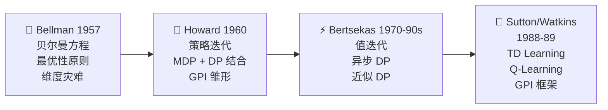

# 动态规划的故事线：从军事运筹到 RL 基石

> **核心主题：** 一个运筹学家为了拿军方经费起的名字，最终成了整个强化学习理论的基石
> **故事线：** 递推求解多步决策问题的思想是怎么诞生、发展、然后融入 RL 的

---

## 🎬 序幕：一切从什么问题开始？

### 一句话概括

> 二战后的美国军方需要解决复杂的多步决策问题（后勤调配、库存管理、飞行路线），怎么在无数种决策组合中找到最优方案？

1940 年代末，Richard Bellman 在兰德公司（RAND Corporation）面对一个核心挑战：**多步决策的组合爆炸**。如果有 T 步决策、每步 K 个选择，穷举需要 K^T 次计算。Bellman 的天才洞察——**最优性原则**——把这个指数级问题变成了线性级的递推求解。

> 🔑 **问题提出：** 序贯决策能不能不穷举，而是一步步递推求解？

---

## 📚 第一章：Bellman 与动态规划的诞生（1950s）

> **关键人物：** Richard Bellman
> **关键著作：** Bellman, "Dynamic Programming", Princeton University Press (1957)

#### 🎥 视觉素材

| 素材 | 来源 | 链接 | 版权 |
|------|------|------|------|
| Bellman 肖像 | Wikimedia Commons | `https://commons.wikimedia.org/wiki/File:Richard_Bellman.jpg` | 公有领域 |
| RAND Corporation | Wikimedia Commons | `https://commons.wikimedia.org/wiki/File:RAND_Corporation_headquarters.jpg` | CC 许可 |

### 发生了什么？

1953 年，Richard Bellman 在兰德公司工作期间提出了**动态规划 (Dynamic Programming)** 的方法和名称。他后来回忆，选择 "Dynamic Programming" 这个名字是一种**政治策略**——当时国防部长 Charles Wilson 对"研究 (research)"这个词极度反感。Bellman 需要一个听起来既不像数学研究、又让政客无法反对的名字：

> "动态"这个词已经不可能有贬义了——没有人能反对"动态"。"规划"也是个好词——谁会反对"规划"呢？所以我选定了"动态规划"。 —— Bellman 自传 "Eye of the Hurricane"

1957 年，Bellman 出版了同名著作，系统化了这个方法。核心思想是**最优性原则 (Principle of Optimality)**：

> 最优策略的尾部也是最优的 —— 不管你怎么到达中间状态，从那个状态到终点的最优策略不依赖于之前的路径。

这直接导出了**贝尔曼方程**——将多步决策问题分解为"当前一步 + 剩余子问题"的递推关系。

### 为什么这很重要？

贝尔曼方程是整个 RL 的数学基础。无论后来的 Q-Learning、Actor-Critic 还是 DQN，所有值函数方法的核心都是贝尔曼方程的某种形式。Bellman 命名的"维度灾难 (Curse of Dimensionality)"至今仍是 RL 的核心挑战。

### 但还有一个问题……

贝尔曼方程给出了最优值满足的条件，但**怎么实际计算**？直接解方程组对大问题太贵。需要高效的迭代算法。

> 🔑 **故事转折点：** Howard 提出了策略迭代算法

---

## 📚 第二章：Howard 与策略迭代（1960）

> **关键人物：** Ronald Howard
> **关键著作：** Howard, "Dynamic Programming and Markov Processes", MIT Press (1960)

#### 🎥 视觉素材

| 素材 | 来源 | 链接 | 版权 |
|------|------|------|------|
| Howard 著作封面 | MIT Press | `https://mitpress.mit.edu/9780262080095/` | 学术引用 |

### 发生了什么？

1960 年，Ronald Howard 在其博士论文中提出了**策略迭代 (Policy Iteration)** 算法——将"评估当前策略"和"改进当前策略"交替进行。这是 DP 从贝尔曼的理论框架走向实用算法的关键一步。

Howard 还首次系统化地将 DP 与**马尔可夫决策过程 (MDP)** 结合，建立了"DP + MDP"的完整框架。

### 为什么这很重要？

策略迭代引入了 RL 中最核心的算法框架——**评估→改进循环 (Generalized Policy Iteration, GPI)**。后来 Sutton & Barto 指出，几乎所有 RL 算法都可以理解为 GPI 的变体：MC 控制、SARSA、Q-Learning、Actor-Critic 本质上都在做"评估当前行为→改进当前行为"的交替。

### 但还有一个问题……

策略迭代每轮需要完整的策略评估（多次迭代扫描），能不能更高效？

> 🔑 **故事转折点：** 值迭代和各种截断方法出现

---

## 📚 第三章：值迭代与效率优化（1960s-1980s）

> **关键人物：** Bellman, Bertsekas
> **关键著作：** Bertsekas, "Dynamic Programming and Optimal Control" (1995)

### 发生了什么？

**值迭代** 的思想其实已经隐含在 Bellman 1957 的著作中——直接迭代贝尔曼最优方程。后来人们发现：策略迭代的内循环（策略评估）不需要完全收敛，截断几步（甚至只做一步）就改进效果也很好。一步截断的极端情况就是值迭代。

1970-80 年代，Dimitri Bertsekas 等人深入研究了 DP 的计算效率：
- **异步动态规划**：不按固定顺序更新所有状态，可以优先更新"最重要"的状态
- **实时动态规划 (RTDP)**：只更新 Agent 实际遇到的状态
- **近似动态规划 (Approximate DP)**：用函数近似替代表格

### 为什么这很重要？

这些变体直接催生了后来的 RL 方法。实时 DP 的思想体现在 TD Learning 中——只更新 Agent 经历的状态；近似 DP 直接导向了 DQN——用神经网络近似值函数。

### 但还有一个问题……

所有 DP 方法都需要完整的环境模型 P(s'|s,a)。真实世界几乎不知道这个模型。

> 🔑 **故事转折点：** 从 Model-Based DP 到 Model-Free RL

---

## 📚 第四章：DP 思想融入 RL（1988-至今）

> **关键人物：** Richard Sutton, Chris Watkins
> **关键论文：** Sutton (1988), Watkins (1989)

### 发生了什么？

1988 年，Richard Sutton 提出 **TD Learning**——不需要模型，用 r + γV(s') 作为目标更新值函数。这本质上是 DP 的贝尔曼更新的**无模型版本**：
- DP：V(s) ← Σ_P [R + γV(s')] （期望：用模型算所有可能）
- TD：V(s) ← V(s) + α[r + γV(s') - V(s)] （采样：用一次实际经验）

1989 年，Chris Watkins 的 Q-Learning 把这进一步推向最优方程：用采样替代 max over transitions。

Sutton 在教科书中提出了 **GPI (Generalized Policy Iteration)** 的统一框架——所有 RL 方法都是"评估+改进"两个过程的某种交互。DP 是 GPI 的最纯粹形式，MC 和 TD 是它的采样近似。

### 为什么这很重要？

DP 不是"过时的方法"——它是理解所有 RL 算法的理论基础。学 DP 的真正目的不是用 DP 解实际问题（因为需要完整模型），而是理解：
1. 贝尔曼方程是怎么工作的
2. 评估→改进循环为什么有效
3. 自举 (bootstrapping) 是什么意思
4. 为什么后来的 MC/TD 方法要这样设计

> 📚 Book: Sutton & Barto, [《Reinforcement Learning: An Introduction》](../../../textbooks/sutton_barto_rl_intro.pdf), Ch.4 §4.7

---

## 🗺️ 全局回顾：技术演进路线图

### 每一步升级解决了什么问题？

| 从 → 到 | 解决了什么核心问题？ |
|---------|-------------------|
| 穷举 → 贝尔曼方程 | 指数级搜索变成递推求解 |
| 贝尔曼方程 → 策略迭代 | 从方程到可运行的算法 |
| 策略迭代 → 值迭代 | 省去完整评估，更高效 |
| 值迭代 → 异步/近似 DP | 大规模状态空间可处理 |
| DP → TD/Q-Learning | 不需要模型，从经验学习 |

### 🎥 视觉素材总表（视频制作用）

| 章节 | 人物 | 肖像来源 | 论文/事件图片 | 版权 |
|------|------|---------|-------------|------|
| 第一章 | Bellman | Wikimedia Commons: `File:Richard_Bellman.jpg` | 1957 著作封面 | 公有领域 |
| 第二章 | Howard | — | 1960 MIT Press 著作 | 学术引用 |
| 第三章 | Bertsekas | MIT 官网 | 教科书封面 | 学术使用 |
| 第四章 | Sutton | University of Alberta | — | 学术使用 |
