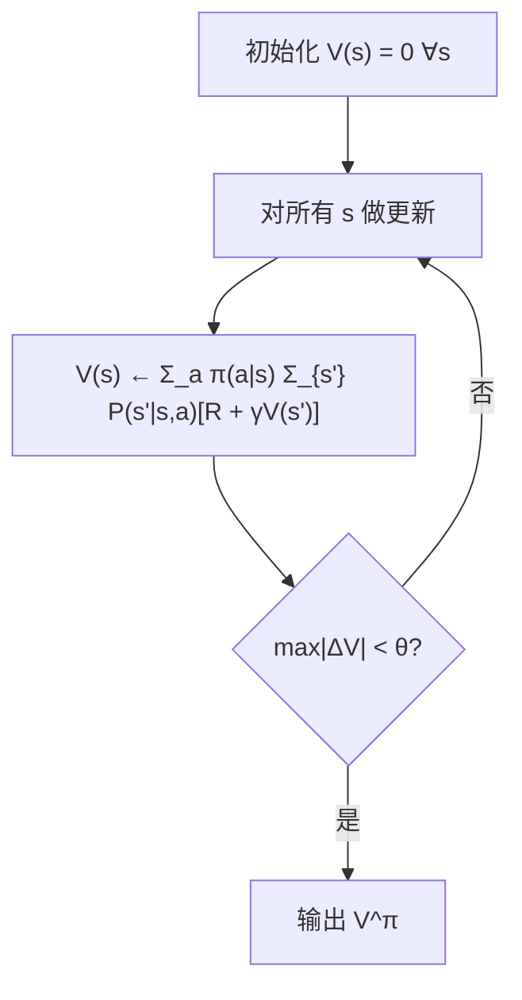
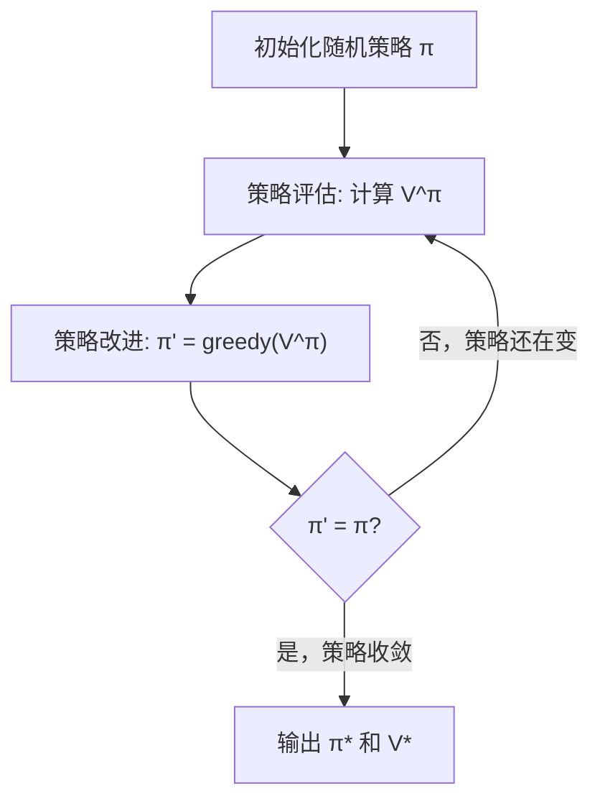
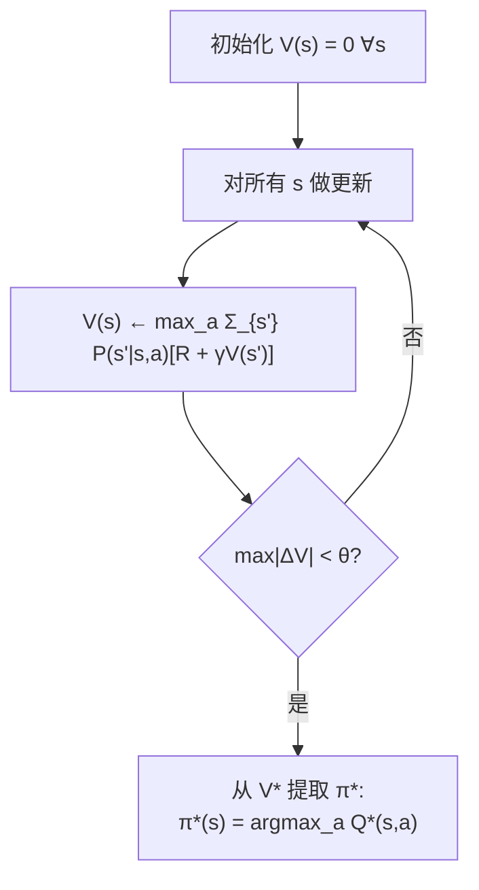

# 动态规划 教程

> **前置知识：** MDP 基础（状态/动作/转移概率/贝尔曼方程）、线性代数基础（矩阵向量乘法）
> **参考来源：** [Sutton & Barto](../../../textbooks/sutton_barto_rl_intro.pdf) Ch.4, [Gymnasium Docs](https://gymnasium.farama.org/)

---

## Section 0: 前置知识速查

1. **贝尔曼方程**：V(s) = E[r + γV(s') | s]——值函数的核心递推关系
2. **MDP 四元组**：(S, A, P, R) — 状态空间、动作空间、转移概率、奖励函数
3. **折扣因子 γ**：控制 Agent 多"远视"，0.9~0.99 是常见值
4. **argmax**：返回使函数值最大的参数

---

## Section 1: 它解决什么问题（Why）

### 没有它会怎样？

- 🔥 **痛点 1：有完整地图但不知道最优路线**。你已经知道了 MDP 的完整模型（转移概率和奖励），但是有 |S| 个状态和 |A| 个动作，穷举所有策略需要 |A|^|S| 次比较——状态多了直接爆炸。DP 用迭代方式高效求解。

- 🔥 **痛点 2：直接解方程组太贵**。贝尔曼方程组有 |S| 个方程 |S| 个未知数，直接解需要 O(|S|³) 的矩阵求逆。DP 用迭代逼近，每轮只要 O(|S|·|A|) 计算。

- 🔥 **痛点 3：不知道策略好不好**。给你一个策略 π，不跑大量实验的话无法知道它的值函数。策略评估在已知模型下精确回答这个问题。

### 它的核心价值

1. **精确求解**：在已知模型下保证收敛到最优策略，没有采样噪声
2. **理论基础**：策略迭代和值迭代是理解所有 RL 算法的起点——MC、TD 本质上是 DP 的无模型近似
3. **算法框架**：评估→改进的 GPI (Generalized Policy Iteration) 思想贯穿全部 RL 方法

> 📚 Book: Sutton & Barto, [《Reinforcement Learning: An Introduction》](../../../textbooks/sutton_barto_rl_intro.pdf), Ch.4 §4.1

---

## Section 2: 它怎么工作的（How — 底层原理）

### 2.1 策略评估：给策略打分

**整个策略评估就是这个循环**：
1. 从全零值函数开始
2. 对每个状态用贝尔曼期望方程更新
3. 检查值是否还在变（收敛检测）
4. 不变了就输出——这就是策略 π 的精确值函数

### 2.2 策略迭代：评估→改进→评估→改进→…

**为什么这管用？** 策略改进定理保证每次改进后策略至少不变差，有限 MDP 中策略数有限，所以必定收敛。

### 2.3 值迭代：一步到位

**与策略迭代的区别：** 不做完整评估，每轮直接取 max——相当于把策略评估截断为 1 步后立即改进。

> 📚 Book: Sutton & Barto, [《Reinforcement Learning: An Introduction》](../../../textbooks/sutton_barto_rl_intro.pdf), Ch.4 §4.1-4.4

---

## Section 3: 局限性

1. **需要完整模型**：DP 要求已知 P(s'|s,a) 和 R(s,a,s')。真实世界几乎不知道精确转移概率。→ **应对：** Model-Free 方法（MC、TD）直接从经验学习

2. **状态空间爆炸**：表格 DP 需要存储和遍历所有状态。Atari 屏幕有 ~10^数千种状态，表格 DP 完全不可行。→ **应对：** 函数近似（DQN 用神经网络替代表格）

3. **维度灾难（Curse of Dimensionality）**：Bellman 自己命名的问题——状态维度每增加 1，状态空间指数增长。→ **应对：** 近似 DP、状态抽象、分层 RL

4. **只能离线规划**：DP 不在线学习，需要先有完整模型再算。→ **应对：** Dyna 架构（学模型 + 用 DP 规划 + 与环境交互）

> 📚 Book: Sutton & Barto, [《Reinforcement Learning: An Introduction》](../../../textbooks/sutton_barto_rl_intro.pdf), Ch.4 §4.7

---

## Section 4: 方案对比

| 方案 | 优点 | 缺点 | 适用场景 |
|------|------|------|---------|
| **策略迭代** | 收敛快（轮次少）、精确 | 每轮评估计算量大 | 小-中规模、需要精确解 |
| **值迭代** | 实现简单、每轮计算少 | 收敛轮次多 | 大规模、快速近似 |
| **截断策略迭代** | 平衡轮次和每轮成本 | 需要调截断步数 | 通用折中 |
| **异步 DP** | 省计算、可优先更新 | 实现复杂 | 超大状态空间 |
| **线性方程组直解** | 一步精确求解 | O(|S|³) 太贵 | 非常小的 MDP |

> 📚 Book: Sutton & Barto, [《Reinforcement Learning: An Introduction》](../../../textbooks/sutton_barto_rl_intro.pdf), Ch.4

---

## 参考来源表

| 来源 | 类型 | 使用位置 |
|------|------|---------|
| [《Reinforcement Learning: An Introduction》Ch.4](../../../textbooks/sutton_barto_rl_intro.pdf) | 📚 教科书 | 全文核心参考 |
| [Bellman 1957 "Dynamic Programming"](https://press.princeton.edu/books/paperback/9780691146683/dynamic-programming) | 📖 著作 | DP 理论奠基 |
| [Howard 1960 "Dynamic Programming and Markov Processes"](https://mitpress.mit.edu/9780262080095/dynamic-programming-and-markov-processes/) | 📖 著作 | 策略迭代算法提出 |
