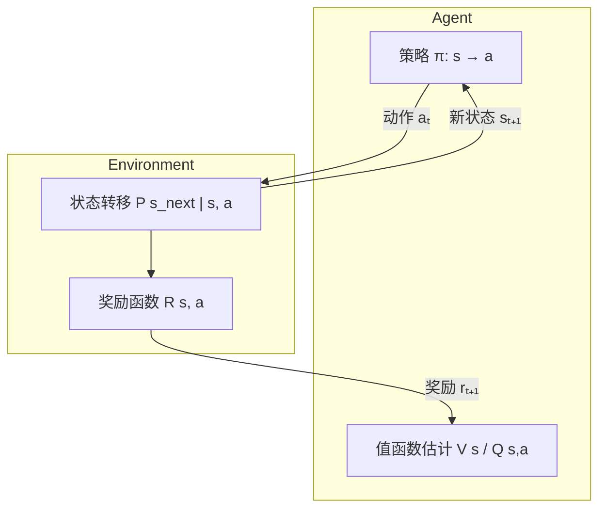

# RL 基础 核心概念

> 📚 Book: Sutton & Barto, [《Reinforcement Learning: An Introduction》](../../../textbooks/sutton_barto_rl_intro.pdf), Ch.1-2

---

## 术语定义

### 强化学习 (Reinforcement Learning, RL)

一种机器学习范式：**学习者**（Agent）不是从标注数据中学习，而是通过与**环境**交互，根据收到的**奖励信号**来学习应该怎么做，目标是让累积奖励最大化。就像训练小狗——做对了给零食（正奖励），做错了不给（零/负奖励），小狗慢慢学会什么行为能得到更多零食。

> 易混淆：**监督学习 (Supervised Learning)** — 监督学习有"老师"告诉你正确答案（标签），RL 只有奖励信号，不会直接告诉你最优动作是什么

> 📚 Book: Sutton & Barto, [《Reinforcement Learning: An Introduction》](../../../textbooks/sutton_barto_rl_intro.pdf), Ch.1 §1.1

### 智能体 (Agent)

在 RL 中做决策的那个"角色"。Agent 观察环境的状态，选择要执行的动作，然后收到环境反馈的奖励。简单来说就是"学习者+决策者"——它既要学习什么是好的行为，又要实时做决定。

> 易混淆：**环境 (Environment)** — Agent 是"做决策的"，Environment 是"给反馈的"，两者是交互关系，不是同一个东西

> 📚 Book: Sutton & Barto, [《Reinforcement Learning: An Introduction》](../../../textbooks/sutton_barto_rl_intro.pdf), Ch.1 §1.1

### 环境 (Environment)

Agent 之外的一切东西。Environment 接收 Agent 的动作，产生新的状态和奖励返回给 Agent。环境可以是真实世界（机器人走路的物理世界），也可以是模拟器（Atari 游戏、棋盘）。

> 📚 Book: Sutton & Barto, [《Reinforcement Learning: An Introduction》](../../../textbooks/sutton_barto_rl_intro.pdf), Ch.1 §1.1, Ch.3 §3.1

### 状态 (State, s)

对环境当前情况的描述。比如下棋时棋盘上所有棋子的位置就是一个状态，自动驾驶中车的位置/速度/周围车辆信息也是状态。Agent 根据状态来决定下一步做什么。

> 易混淆：**观察 (Observation)** — 状态是环境的完整描述，观察是 Agent 实际看到的（可能只是状态的一部分，比如扑克牌你看不到对手的牌）

> 📚 Book: Sutton & Barto, [《Reinforcement Learning: An Introduction》](../../../textbooks/sutton_barto_rl_intro.pdf), Ch.3 §3.1

### 动作 (Action, a)

Agent 在某个状态下可以做的事情。比如走棋、加速/刹车、投放广告等。动作空间可以是**离散的**（上/下/左/右）也可以是**连续的**（方向盘转角 0°~360°）。

> 📚 Book: Sutton & Barto, [《Reinforcement Learning: An Introduction》](../../../textbooks/sutton_barto_rl_intro.pdf), Ch.3 §3.1

### 奖励 (Reward, r)

环境在每一步反馈给 Agent 的标量信号，表示"你刚才做的那个动作好不好"。正奖励意味着好，负奖励意味着坏，零表示中性。**奖励假说 (Reward Hypothesis)**：所有目标都可以描述为最大化累积奖励。

> 易混淆：**回报 (Return, G)** — 奖励是单步反馈，回报是从当前时刻开始所有未来奖励的（加权）总和

> 📚 Book: Sutton & Barto, [《Reinforcement Learning: An Introduction》](../../../textbooks/sutton_barto_rl_intro.pdf), Ch.3 §3.2

### 策略 (Policy, π)

Agent 的行为规则——告诉 Agent 在每个状态下应该做什么动作。可以是**确定性的**（状态 s → 一定选动作 a）也可以是**随机性的**（状态 s → 各个动作的概率分布）。RL 的终极目标就是找到**最优策略**。

> 别名：**行为策略 (Behavior Policy)** — 指 Agent 实际使用的策略；**目标策略 (Target Policy)** — 指 Agent 想要学习/评估的策略

> 📚 Book: Sutton & Barto, [《Reinforcement Learning: An Introduction》](../../../textbooks/sutton_barto_rl_intro.pdf), Ch.1 §1.3

### 轨迹 (Trajectory / Episode)

Agent 与环境交互的一整段经历：从开始到结束的状态-动作-奖励序列。比如一局围棋从第一步到分出胜负就是一个 episode。不是所有 RL 任务都有"结束"——持续运行的叫**持续任务 (Continuing Task)**。

> 别名：**回合 (Episode)**（来自 RL 文献）/ **轨迹 (Trajectory)**（来自控制论文献）— 含义完全相同，不同社区习惯不同

> 📚 Book: Sutton & Barto, [《Reinforcement Learning: An Introduction》](../../../textbooks/sutton_barto_rl_intro.pdf), Ch.3 §3.3

### 时间步 (Time Step)

Agent-环境交互的一个离散单位。在每个时间步 t，Agent 观察状态 sₜ，选择动作 aₜ，环境返回奖励 rₜ₊₁ 和新状态 sₜ₊₁。这个循环不断重复。

> 📚 Book: Sutton & Barto, [《Reinforcement Learning: An Introduction》](../../../textbooks/sutton_barto_rl_intro.pdf), Ch.3 §3.1

### 折扣因子 (Discount Factor, γ)

一个 0 到 1 之间的数，控制 Agent 有多"着急"。γ = 0 表示只看眼前奖励（极端短视），γ = 1 表示未来所有奖励和当前一样重要（完全远视）。通常取 0.9~0.99。γ 的数学作用：让无穷时间步的回报收敛到有限值。

> 📚 Book: Sutton & Barto, [《Reinforcement Learning: An Introduction》](../../../textbooks/sutton_barto_rl_intro.pdf), Ch.3 §3.3

### 回报 (Return, G)

从当前时刻开始，所有未来奖励的折扣累加和：Gₜ = rₜ₊₁ + γ·rₜ₊₂ + γ²·rₜ₊₃ + …。这是 Agent 真正要最大化的目标。用折扣是因为：(1) 越远的奖励越不确定，(2) 数学上保证和有限。

> 📚 Book: Sutton & Barto, [《Reinforcement Learning: An Introduction》](../../../textbooks/sutton_barto_rl_intro.pdf), Ch.3 §3.3, Eq. 3.8

### 探索 vs 利用 (Exploration vs Exploitation)

RL 的核心困境：**利用 (Exploitation)** 是选目前已知最好的动作（赚眼前的钱），**探索 (Exploration)** 是尝试不确定的动作（发现可能更好的选择）。只利用可能陷入局部最优，只探索则浪费已有知识。好的策略需要平衡两者。

> 📚 Book: Sutton & Barto, [《Reinforcement Learning: An Introduction》](../../../textbooks/sutton_barto_rl_intro.pdf), Ch.2 §2.1

### ε-贪心 (ε-Greedy)

最简单的探索策略：以 1-ε 的概率选当前最优动作（利用），以 ε 的概率随机选一个动作（探索）。ε 通常在 0.01~0.1 之间。优点是简单好实现，缺点是探索是"盲目"的——不区分哪些动作更值得探索。

> 📚 Book: Sutton & Barto, [《Reinforcement Learning: An Introduction》](../../../textbooks/sutton_barto_rl_intro.pdf), Ch.2 §2.2

### 多臂赌博机 (Multi-Armed Bandit)

RL 的最简模型：面前有 k 台老虎机，每台的中奖概率不同但你不知道，每次只能拉一台。目标是在有限次数内赢最多的钱。这个问题只有动作-奖励关系，没有状态转移——是探索 vs 利用的纯粹形式。

> 📖 Paper: Robbins, [Some aspects of the sequential design of experiments](https://projecteuclid.org/euclid.bams/1183517370), Bull. Amer. Math. Soc. 1952

### 上置信界 (Upper Confidence Bound, UCB)

一种比 ε-greedy 更聪明的探索策略：选动作时不仅考虑当前估计值，还考虑"这个动作我试了多少次"。试得少的动作有更大的不确定性，给它加一个"探索奖励"。公式核心思想：**乐观面对不确定性** (Optimism in the Face of Uncertainty)。

> 📖 Paper: Auer et al., [Finite-time Analysis of the Multiarmed Bandit Problem](https://link.springer.com/article/10.1023/A:1013689704352), Machine Learning 2002

---

## 概念辨析

### 强化学习 vs 监督学习 vs 无监督学习

| 维度 | 强化学习 (RL) | 监督学习 (SL) | 无监督学习 (UL) |
|------|-------------|-------------|----------------|
| **反馈信号** | 奖励（标量，延迟） | 标签（精确答案） | 无反馈 |
| **目标** | 最大化累积奖励 | 最小化预测误差 | 发现数据结构 |
| **数据来源** | Agent 自己生成 | 给定的数据集 | 给定的数据集 |
| **时间依赖** | 有，决策影响未来 | 无，样本独立 | 无，样本独立 |
| **典型任务** | 游戏、机器人控制 | 图像分类、翻译 | 聚类、降维 |

> 📚 Book: Sutton & Barto, [《Reinforcement Learning: An Introduction》](../../../textbooks/sutton_barto_rl_intro.pdf), Ch.1 §1.1

### 探索 vs 利用 (Exploration vs Exploitation)

| 维度 | 探索 (Exploration) | 利用 (Exploitation) |
|------|-------------------|-------------------|
| **做什么** | 尝试不确定的动作 | 选当前最优动作 |
| **短期回报** | 可能较低 | 较高 |
| **长期回报** | 可能更高（发现更好选择） | 可能较低（陷入局部最优） |
| **信息价值** | 高（获取新知识） | 低（利用已有知识） |
| **典型策略** | ε-greedy 的随机部分、UCB | ε-greedy 的贪心部分 |

> 📚 Book: Sutton & Barto, [《Reinforcement Learning: An Introduction》](../../../textbooks/sutton_barto_rl_intro.pdf), Ch.2 §2.1

### ε-Greedy vs UCB

| 维度 | ε-Greedy | UCB |
|------|---------|-----|
| **探索方式** | 随机均匀探索 | 优先探索不确定性大的动作 |
| **超参数** | ε（探索率） | c（探索系数） |
| **理论保证** | 无遗憾界 | 有对数遗憾界 |
| **计算复杂度** | O(1) | O(k)（需要维护计数） |
| **适用场景** | 动作空间大/简单场景 | 动作空间不太大/需要高效探索 |

> 📖 Paper: Auer et al., [Finite-time Analysis of the Multiarmed Bandit Problem](https://link.springer.com/article/10.1023/A:1013689704352), Machine Learning 2002

---

## 核心属性

### 信息架构

> 📚 Book: Sutton & Barto, [《Reinforcement Learning: An Introduction》](../../../textbooks/sutton_barto_rl_intro.pdf), Ch.3 Figure 3.1

### 适用场景 ✅

- **序贯决策问题**：需要连续做多步决策，当前决策影响未来（如游戏、导航）
- **无标注数据但有反馈信号**：没有正确答案的标签，但能衡量结果好坏（如推荐系统）
- **可模拟的环境**：有仿真器可以大量试错（如 Atari、MuJoCo）
- **探索有意义**：需要发现新策略，不是简单匹配已有模式（如 AlphaGo 发现人类从未走过的棋招）

### 不适用场景 ❌

- **有大量标注数据**：直接用监督学习更高效
- **无法定义奖励**：如果不知道什么是"好"，RL 无法训练
- **试错代价太高**：如医疗法律等高风险场景，不能随便探索
- **单步决策**：如果决策不影响未来状态，简单的分类器/回归足够

> 📚 Book: Sutton & Barto, [《Reinforcement Learning: An Introduction》](../../../textbooks/sutton_barto_rl_intro.pdf), Ch.1 §1.1

---

## 速查表

| 项 | 说明 | 示例 |
|-----|------|------|
| Agent | 做决策的学习者 | 棋手、机器人、推荐引擎 |
| Environment | Agent 之外的一切 | 棋盘、物理世界、用户 |
| State sₜ | 环境当前描述 | 棋盘局面、车的位置速度 |
| Action aₜ | Agent 可做的事 | 走棋、转方向盘 |
| Reward rₜ₊₁ | 单步反馈信号 | +1 赢棋、-1 碰撞 |
| Policy π | 状态→动作映射 | π(s) = "在 s 下向右走" |
| Return Gₜ | 未来折扣奖励总和 | Gₜ = rₜ₊₁ + γrₜ₊₂ + … |
| γ (Discount) | 未来奖励衰减系数 | 0.99 → 重视长期，0.5 → 重视短期 |
| ε-Greedy | (1-ε) 贪心 + ε 随机 | ε=0.1 → 90%利用+10%探索 |
| UCB | 估计值 + 探索奖励 | 选 argmax[Q(a) + c√(ln t / N(a))] |
| Episode | 一段完整交互 | 一局游戏 |
