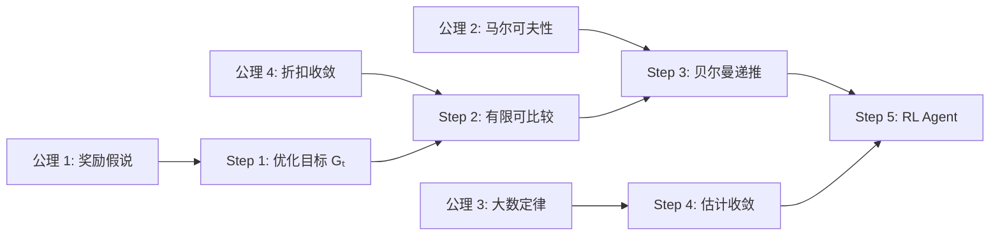

# RL 基础 第一性原理

> 📖 Paper: Robbins, [Some aspects of the sequential design of experiments](https://projecteuclid.org/euclid.bams/1183517370), 1952
> 📚 Book: Sutton & Barto, [《Reinforcement Learning: An Introduction》](../../../textbooks/sutton_barto_rl_intro.pdf), Ch.1-3

---

## 核心问题链

> 用"5 个为什么"递归追问，从表层功能到不可再分公理。

1. **RL 在做什么？** → 通过与环境交互学习最优行为策略（表层）
2. **为什么要通过交互学习？** → 因为没有标签，只有奖励反馈，必须自己探索发现什么是好的（动机）
3. **为什么奖励信号就够了？** → 因为**奖励假说**：所有目标都能描述为最大化累积标量奖励（更深层）
4. **为什么能最大化累积奖励？** → 因为**决策的可优化性**：存在某个策略比其他策略获得更多回报，且可通过试错逼近（基本事实）
5. **能否继续拆分？** → 不能——这依赖于两个不可再分的公理：**序贯决策的马尔可夫性** + **大数定律保证估计收敛** → **到达公理**

---

## 公理与基本假设

### 公理 1: 奖励假说 (Reward Hypothesis)

**陈述：** 所有目标和目的都可以用一个标量奖励信号的期望累积和来形式化表达。

**白话：** 不管你想让机器人做什么事，最终都能用一个数字来打分——分越高越好。

**来源：** 经验假设，由 Sutton & Barto 明确提出并作为 RL 的基础假设（Ch.3.2）。

**可验证性：**
- ✅ 成立条件：目标单一、可量化、可分配到时间步
- ❌ 不成立条件：多目标冲突（安全 vs 效率）、目标模糊（"有趣"怎么打分？）、人类价值太复杂无法用标量刻画

> 📚 Book: Sutton & Barto, [《Reinforcement Learning: An Introduction》](../../../textbooks/sutton_barto_rl_intro.pdf), Ch.3 §3.2

### 公理 2: 马尔可夫性 (Markov Property)

**陈述：** 未来状态仅依赖于当前状态和当前动作，与历史无关：P(sₜ₊₁ | sₜ, aₜ, sₜ₋₁, aₜ₋₁, …) = P(sₜ₊₁ | sₜ, aₜ)

**白话：** 当前状态已经包含了做决策所需的所有信息，不需要回头看历史。"知道现在就够了，不用知道怎么到这里的。"

**来源：** 数学性质，源自 Andrey Markov 的随机过程理论 (1906)。在 RL 中作为 MDP 框架的核心假设。

**可验证性：**
- ✅ 成立条件：状态完整描述了环境（如棋盘上所有棋子位置）
- ❌ 不成立条件：观察不完整（如扑克你只看得到自己的牌）→ 变成 POMDP

> 📚 Book: Sutton & Barto, [《Reinforcement Learning: An Introduction》](../../../textbooks/sutton_barto_rl_intro.pdf), Ch.3 §3.1

### 公理 3: 大数定律 (Law of Large Numbers)

**陈述：** 当独立同分布的随机变量的样本数趋向无穷时，样本均值以概率 1 收敛到期望值。

**白话：** 同一台老虎机拉得越多，你算出来的平均奖金就越接近真实值。"试够多次就知道了。"

**来源：** 概率论基本定理，Jakob Bernoulli (1713)。

**可验证性：**
- ✅ 成立条件：每次试验独立、分布不变（平稳环境）
- ❌ 不成立条件：分布会变（非平稳环境）、样本不独立（相邻决策高度相关）

> 📚 Book: Sutton & Barto, [《Reinforcement Learning: An Introduction》](../../../textbooks/sutton_barto_rl_intro.pdf), Ch.2 §2.4

### 公理 4: 折扣和的有限性

**陈述：** 当 0 ≤ γ < 1 时，无穷折扣和 Σ γᵏrₖ 是有限的（几何级数收敛）。

**白话：** 只要我们不完全"等权"对待所有未来（γ < 1），总回报就不会是无穷大，数学上就能算。

**来源：** 数学分析，几何级数收敛定理。

**可验证性：**
- ✅ 成立条件：γ < 1 且奖励有界
- ❌ 不成立条件：γ = 1（持续任务中需要特殊处理，如 average reward）

> 📚 Book: Sutton & Barto, [《Reinforcement Learning: An Introduction》](../../../textbooks/sutton_barto_rl_intro.pdf), Ch.3 §3.3

---

## 从公理到技术的推导链

### Step 1: 从奖励假说 → 优化目标

**推理：** 因为所有目标可用奖励表达（公理 1），RL 问题变为"最大化累积奖励"

**结果：** → 定义回报 Gₜ = Σ γᵏrₜ₊ₖ₊₁ 作为优化目标

### Step 2: 从回报 + 折扣收敛 → 有限优化问题

**推理：** 因为折扣和有限（公理 4），Gₜ 是一个有限实数，可以比较大小

**结果：** → 策略优劣可以排序：π* = argmax_π E[Gₜ | π]

### Step 3: 从马尔可夫性 → 递推关系

**推理：** 因为未来只依赖当前（公理 2），回报可以递推：Gₜ = rₜ₊₁ + γGₜ₊₁

**结果：** → 贝尔曼方程：V(s) = E[r + γV(s') | s]（→ MDP 主题详解）

### Step 4: 从大数定律 → 值估计收敛

**推理：** 因为样本均值收敛到期望（公理 3），多次采样可以逼近真实动作价值

**结果：** → 样本均值估计 Qₜ(a) → q*(a)，增量更新规则有效

### Step 5: → 完整的 RL Agent

**推理：** 有了可优化的目标（Step 1-2）、递推分解（Step 3）、可收敛的估计（Step 4），就能构建一个从试错中学习最优策略的 Agent

**结果：** ε-Greedy / UCB 多臂赌博机 → Q-Learning → DQN → …

### 推导链全景图

---

## 如果公理不成立？

### 公理 1 失效：奖励无法刻画目标

**如果不成立：** 多目标冲突（自动驾驶要安全又要快又要省电），或目标太模糊（"创造一首好听的曲子"）

**技术后果：** 标量奖励无法同时表达冲突目标，Agent 可能优化了一个目标牺牲了另一个

**替代方案：** 多目标 RL (Multi-Objective RL)、约束 MDP (Constrained MDP)、RLHF 从人类偏好学习

### 公理 2 失效：观察不完整

**如果不成立：** Agent 看不到完整状态（如扑克、真实世界的部分可观察性）

**技术后果：** Agent 在相同观察下可能处于不同的真实状态，无法做出最优决策

**替代方案：** POMDP 框架、使用记忆机制（RNN/Transformer）、信念状态 (Belief State)

### 公理 3 失效：分布非平稳

**如果不成立：** 环境的奖励分布随时间变化（对手策略在变、用户偏好在变）

**技术后果：** 样本均值不再收敛到真实值，旧经验误导新决策

**替代方案：** 固定步长 α 替代 1/n、滑窗估计、重启探索

### 公理 4 失效：γ = 1 或奖励无界

**如果不成立：** 持续任务中 γ=1，或者奖励可以无穷大

**技术后果：** 回报可能发散到无穷，值函数没有意义

**替代方案：** 平均奖励公式 (Average Reward)、差分回报 (Differential Return)

---

## 第一性原理速查表

| 公理/假设 | 一句话陈述 | 成立条件 | 失效后果 |
|----------|-----------|---------|---------|
| 奖励假说 | 所有目标可用标量奖励表达 | 单目标、可量化 | 多目标冲突 → 用 Multi-Objective RL |
| 马尔可夫性 | 未来只依赖现在 | 状态完全可观 | 部分可观 → 用 POMDP |
| 大数定律 | 试够多次就能估准 | 分布平稳、独立同分布 | 非平稳 → 用固定步长 α |
| 折扣收敛 | γ < 1 保证回报有限 | γ < 1 且奖励有界 | γ=1 → 用 Average Reward |
