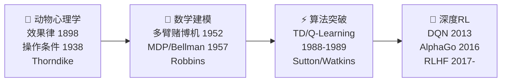

# RL 基础的故事线：从动物心理学到 AlphaGo

> **核心主题：** 人类花了 100 年才把"试错学习"从动物行为观察变成数学框架再变成打败世界冠军的 AI
> **故事线：** 一个不断追问"怎么让机器学会做决策"的打怪升级历程

---

## 🎬 序幕：一切从什么问题开始？

### 一句话概括

> 动物只靠"做了→得到奖惩→调整行为"就能学会复杂技能（走迷宫、觅食、社交），能不能让机器也这样学？

19 世纪末，心理学家开始系统研究动物学习行为。他们发现一个规律：无论是猫、鸽子还是老鼠，学习的核心机制惊人地一致——**做某件事 → 得到好/坏结果 → 以后更多/更少做这件事**。这个简单的"试错-反馈"循环，后来成为整个强化学习领域的基石。

> 🔑 **问题提出：** 能不能把动物的"试错学习"形式化为数学，然后教给机器？

---

## 📚 第一章：试错学习的发现（1890s-1950s）

> **关键人物：** Edward Thorndike, B.F. Skinner
> **关键论文：** Thorndike, "Animal Intelligence" (1898)

#### 🎥 视觉素材

| 素材 | 来源 | 链接 | 版权 |
|------|------|------|------|
| Thorndike 肖像 | Wikimedia Commons | `https://commons.wikimedia.org/wiki/File:Edward_Thorndike.jpg` | 公有领域 |
| Skinner Box 示意 | Wikimedia Commons | `https://commons.wikimedia.org/wiki/File:Skinner_box_scheme_01.png` | CC BY-SA |

### 发生了什么？

1898 年，心理学家 Edward Thorndike 把猫关进"迷箱"（puzzle box）——猫必须找到机关才能出来吃到食物。他发现猫不是"顿悟"出解法的，而是**反复试错**，偶然踩到机关获得食物（奖励），然后逐渐学会更快地踩机关。Thorndike 把这总结为**效果律 (Law of Effect)**："带来满意结果的行为会被强化，带来不满意结果的行为会被削弱。"

30 年后，B.F. Skinner 把这个想法推到极致：设计了 Skinner Box，用奖惩来精确控制鸽子的行为——让鸽子学会转圈、啄特定按钮、甚至"打乒乓球"。Skinner 称之为**操作性条件反射 (Operant Conditioning)**。

### 为什么这很重要？

效果律是整个 RL 领域的生物学根基：Agent 的行为被奖励塑造。这个简单思想在 100 年后仍然是 RL 的核心——Q-learning 的更新规则本质上就是 Thorndike 发现的规律的数学版本。

### 但还有一个问题……

心理学实验证明动物能试错学习，但**没有数学模型**。怎么把"试错学习"变成方程？怎么在有多个选择时做出最优决策？

> 🔑 **故事转折点：** 数学家们接手了——多臂赌博机问题诞生

---

## 📚 第二章：多臂赌博机——探索的数学（1950s-1970s）

> **关键人物：** Herbert Robbins
> **关键论文：** Robbins, "Some aspects of the sequential design of experiments" (1952)

#### 🎥 视觉素材

| 素材 | 来源 | 链接 | 版权 |
|------|------|------|------|
| Robbins 论文首页 | ProjectEuclid | `https://projecteuclid.org/euclid.bams/1183517370` | 学术引用 |

### 发生了什么？

1952 年，统计学家 Herbert Robbins 提出了**多臂赌博机问题 (Multi-Armed Bandit)**：面前有 k 台老虎机，每台的中奖概率不同但你不知道。你有 N 次机会，怎么选才能赢最多钱？

这个看似简单的问题，抓住了 RL 的核心困境：**探索 vs 利用**。如果你只玩觉得最好的那台（利用），可能错过真正最好的；如果你花太多时间试每台（探索），又浪费了已知信息。

### 为什么这很重要？

多臂赌博机是 RL 最简单的数学模型——只有动作和奖励，没有状态转移。它让"试错学习"第一次有了严格的数学分析框架。后来的 ε-greedy、UCB（2002年 Auer 等人提出）等探索策略都源于对这个问题的深入研究。

### 但还有一个问题……

现实世界不是老虎机——你的决定会改变下一步的处境。你不光要选"拉哪台机器"，还要考虑"拉完之后世界变了怎么办"。多臂赌博机没有**状态**的概念。

> 🔑 **故事转折点：** 需要一个能描述"状态会变化"的框架——马尔可夫决策过程

---

## 📚 第三章：从理论到算法——TD 学习（1980s-1990s）

> **关键人物：** Richard Sutton, Chris Watkins
> **关键论文：** Sutton, "Learning to Predict by the Methods of Temporal Differences" (1988); Watkins, "Learning from Delayed Rewards" (1989)

#### 🎥 视觉素材

| 素材 | 来源 | 链接 | 版权 |
|------|------|------|------|
| Sutton 肖像 | University of Alberta | `https://www.amii.ca/about/team/richard-sutton/` | 学术使用 |
| Watkins PhD 论文封面 | Royal Holloway | `https://www.cs.rhul.ac.uk/~chrisw/thesis.html` | 学术引用 |

### 发生了什么？

1988 年，Richard Sutton 提出了 **TD 学习 (Temporal Difference Learning)**——一种不用等到回合结束就能更新值估计的方法。核心思想：**用当前估计来更新当前估计**（bootstrapping），不需要像 Monte Carlo 那样等完完整的回合。

1989 年，Chris Watkins 在博士论文中提出了 **Q-Learning**——一个 off-policy 的 TD 控制算法。Q-Learning 直接学习最优动作值函数，不需要知道环境模型，被证明在一定条件下保证收敛到最优策略。

### 为什么这很重要？

TD 学习和 Q-Learning 是 RL 从理论走向实用的关键一步。Q-Learning 尤其重要——它的增量更新规则 Q(s,a) ← Q(s,a) + α[r + γ max Q(s',a') - Q(s,a)] 本质上就是 Thorndike 效果律 + Bellman 最优性 + 增量更新的三合一。

### 但还有一个问题……

Q-Learning 用表格存储每个 (状态,动作) 对的值，状态空间大了就炸（Atari 游戏像素空间有 10^几万种状态）。怎么处理超大/连续的状态空间？

> 🔑 **故事转折点：** 深度学习来了——神经网络替代表格

---

## 📚 第四章：深度强化学习爆发（2013-2016）

> **关键人物：** Volodymyr Mnih, David Silver
> **关键论文：** Mnih et al., "Playing Atari with Deep Reinforcement Learning" (2013)

#### 🎥 视觉素材

| 素材 | 来源 | 链接 | 版权 |
|------|------|------|------|
| Atari DQN 游戏截图 | arXiv 论文 | `https://arxiv.org/abs/1312.5602` | 学术引用 |
| AlphaGo vs 李世石 | Wikimedia Commons | `https://commons.wikimedia.org/wiki/File:Lee_Sedol.jpg` | CC BY-SA |

### 发生了什么？

2013 年，DeepMind 团队把深度卷积神经网络 (CNN) 接到 Q-Learning 上，创造了 **DQN (Deep Q-Network)**。DQN 直接以原始像素为输入，用 CNN 近似 Q 值函数，在 Atari 游戏上达到甚至超过人类水平。两个关键技巧——**经验回放**（打乱训练数据顺序）和**目标网络**（稳定训练）——解决了"致命三角"问题。

2016 年，AlphaGo 击败围棋世界冠军李世石，成为 RL 出圈的标志性事件。它结合了深度学习、蒙特卡洛树搜索和自我博弈，证明 RL 能解决人类级别的复杂决策问题。

### 为什么这很重要？

DQN 和 AlphaGo 让 RL 从学术圈的小众方向变成了 AI 领域的核心驱动力。它证明了一个事实：Thorndike 100 年前发现的"试错学习"原理，加上足够的计算力和神经网络，可以产生超越人类的智能行为。

### 但还有一个问题……

RL 还有很多未解难题：样本效率低、奖励设计难、安全探索、与人类价值对齐……这些方向正在催生 RLHF、Offline RL、Safe RL 等新领域。

> 🔑 **展望：** RL 的故事还在继续——RLHF 让 ChatGPT 从"会说话"变成"说人话"

---

## 🗺️ 全局回顾：技术演进路线图

### 每一步升级解决了什么问题？

| 从 → 到 | 解决了什么核心问题？ |
|---------|-------------------|
| 心理学观察 → 多臂赌博机 | 给"试错学习"一个数学模型 |
| 多臂赌博机 → MDP | 加入"状态"：动作影响下一步的处境 |
| MDP → TD/Q-Learning | 不需要环境模型、每步都能学习 |
| Q-Learning → DQN | 用神经网络处理超大状态空间 |
| DQN → AlphaGo/RLHF | 超越人类的决策 + 与人类价值对齐 |

### 🎥 视觉素材总表（视频制作用）

| 章节 | 人物 | 肖像来源 | 论文/事件图片 | 版权 |
|------|------|---------|-------------|------|
| 第一章 | Thorndike | Wikimedia Commons: `File:Edward_Thorndike.jpg` | Puzzle Box 示意 | 公有领域 |
| 第一章 | Skinner | Wikimedia Commons | Skinner Box: `File:Skinner_box_scheme_01.png` | CC BY-SA |
| 第二章 | Robbins | — | 论文首页 ProjectEuclid | 学术引用 |
| 第三章 | Sutton | University of Alberta | — | 学术使用 |
| 第三章 | Watkins | — | PhD 论文封面 | 学术引用 |
| 第四章 | Mnih/Silver | — | Atari DQN arXiv | 学术引用 |
