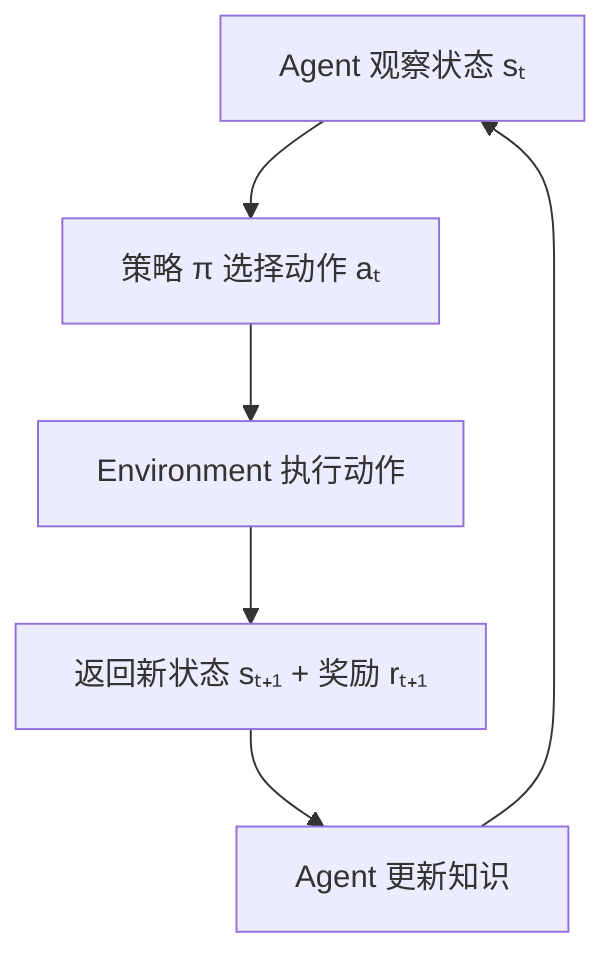
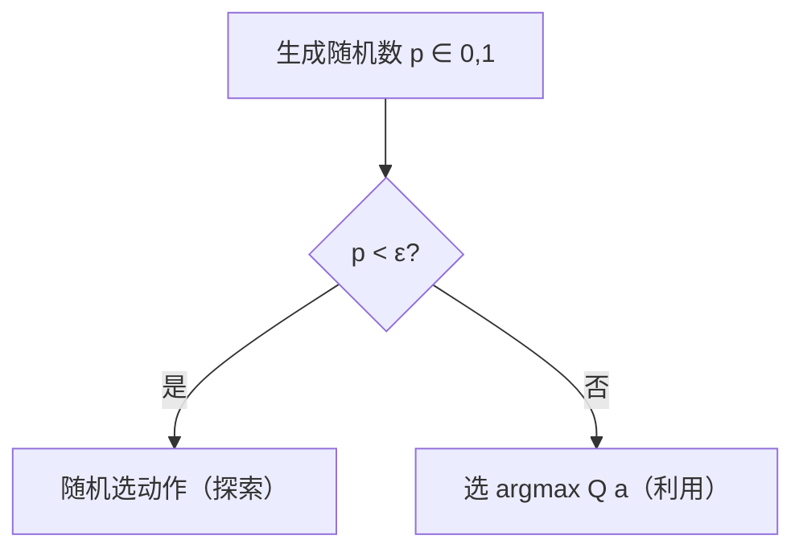

# RL 基础 教程

> **前置知识：** 概率论基础（期望值、条件概率）、Python 编程
> **参考来源：** [Sutton & Barto](../../../textbooks/sutton_barto_rl_intro.pdf) Ch.1-2, [Gymnasium Docs](https://gymnasium.farama.org/)

---

## Section 0: 前置知识速查

1. **期望值 E[X]**：随机变量所有可能取值的加权平均，权重是概率
2. **argmax**：返回使函数值最大的那个参数，不是最大值本身
3. **Python 基础**：会用 NumPy 数组、matplotlib 画图即可

---

## Section 1: 它解决什么问题（Why）

### 没有它会怎样？

- 🔥 **痛点 1：监督学习需要标签，但很多场景没有正确答案**。比如下围棋——你不能给每一步标注"这是最优一步"（因为你自己也不知道），但你知道最后输了还是赢了。监督学习在这种场景下无能为力。

- 🔥 **痛点 2：当前决策影响未来，贪心策略会失败**。比如机器人走迷宫——眼前有两条路，一条看起来近但走到死胡同，另一条看起来远但通向出口。简单地选"当前看起来最好的"会掉坑。

- 🔥 **痛点 3：不试错不知道什么是好的**。一个新手厨师不知道菜谱，只能尝试不同做法、根据味道反馈（奖励）来改进。所有"从反馈中学习"的场景都是 RL 的战场。

### 它的核心价值

1. **从交互中学习**：不需要标注数据，Agent 通过试错自动发现好策略
2. **处理序贯决策**：能应对"当前决策影响未来"的链式效应
3. **平衡探索与利用**：系统化地处理"已知 vs 未知"的权衡

> 📚 Book: Sutton & Barto, [《Reinforcement Learning: An Introduction》](../../../textbooks/sutton_barto_rl_intro.pdf), Ch.1 §1.1

---

## Section 2: 它怎么工作的（How — 底层原理）

### 2.1 RL 交互循环

**整个 RL 就是这个循环**：
1. Agent 看到当前状态
2. 根据策略选一个动作
3. 环境给出新状态和奖励
4. Agent 更新自己的认知（值估计、策略等）
5. 重复

### 2.2 核心机制：多臂赌博机——探索 vs 利用

**为什么用多臂赌博机入门？** 因为它是 RL 的"最小可行版本"——只有动作和奖励，没有状态转移。这让我们能专注理解探索 vs 利用这个核心问题。

**三种探索策略的设计动机：**

| 策略 | 设计思路 | 为什么用这个而不是那个？ |
|------|---------|----------------------|
| 贪心 (Greedy) | 总选估计值最高的 | 不探索 → 可能永远找不到最优 |
| ε-Greedy | 大概率贪心，小概率随机 | 简单有效，但探索是"盲目的" |
| UCB | 估计值 + 不确定性奖励 | 聪明探索：优先试不确定的动作 |

**ε-Greedy 的工作流程：**

**UCB 为什么更好？** ε-Greedy 随机探索，不管哪个动作试了几次都一视同仁。UCB 知道"这个动作我试了很多次了已经比较有信心了"和"那个动作只试了 1 次完全不确定"，会优先去试不确定的。

> 📚 Book: Sutton & Barto, [《Reinforcement Learning: An Introduction》](../../../textbooks/sutton_barto_rl_intro.pdf), Ch.2 §2.1-2.7

---

## Section 3: 局限性

1. **奖励假说的局限**：RL 假设所有目标都能用标量奖励表示。但有些目标是多维的、矛盾的（比如自动驾驶要同时考虑安全、效率、舒适度），很难用一个标量完全捕捉。→ **应对：** 多目标 RL、奖励塑形 (Reward Shaping)

2. **样本效率低**：RL 需要大量交互才能学到好策略。人类小孩几次试错就学会了，RL Agent 可能需要几百万步。→ **应对：** 模型学习 (Model-Based RL)、模仿学习 (Imitation Learning)

3. **探索的代价**：在真实世界中探索可能很危险。你不能让自动驾驶"试试看撞一下会怎样"。→ **应对：** 安全 RL (Safe RL)、离线 RL (Offline RL)

4. **奖励设计难**：定义一个好的奖励函数本身就是难题。设计不好会导致意想不到的行为。→ **应对：** 逆强化学习 (Inverse RL)、RLHF

> 📚 Book: Sutton & Barto, [《Reinforcement Learning: An Introduction》](../../../textbooks/sutton_barto_rl_intro.pdf), Ch.1 §1.5

---

## Section 4: 方案对比

| 方案 | 优点 | 缺点 | 适用场景 |
|------|------|------|---------|
| **纯贪心 (Greedy)** | 简单、计算快 | 不探索，陷入局部最优 | 已知最优动作、非常稳定的环境 |
| **ε-Greedy** | 实现简单、有探索 | 探索盲目、需要调 ε | 通用基线、快速实验 |
| **UCB** | 智能探索、有理论保证 | 计算稍复杂、需要维护计数 | 动作空间不大、需要高效探索 |
| **Softmax (Boltzmann)** | 按价值概率选择 | 需要温度参数、对值尺度敏感 | 需要平滑探索的场景 |
| **Thompson Sampling** | 贝叶斯探索、自适应 | 需要维护后验分布 | 在线学习、推荐系统 |

> 📚 Book: Sutton & Barto, [《Reinforcement Learning: An Introduction》](../../../textbooks/sutton_barto_rl_intro.pdf), Ch.2

---

## 参考来源表

| 来源 | 类型 | 使用位置 |
|------|------|---------|
| [《Reinforcement Learning: An Introduction》Ch.1-2](../../../textbooks/sutton_barto_rl_intro.pdf) | 📚 教科书 | 全文核心参考 |
| [Gymnasium Docs](https://gymnasium.farama.org/) | 📖 文档 | 代码实现参考 |
| [Auer et al. 2002](https://link.springer.com/article/10.1023/A:1013689704352) | 📖 论文 | UCB 理论分析 |
