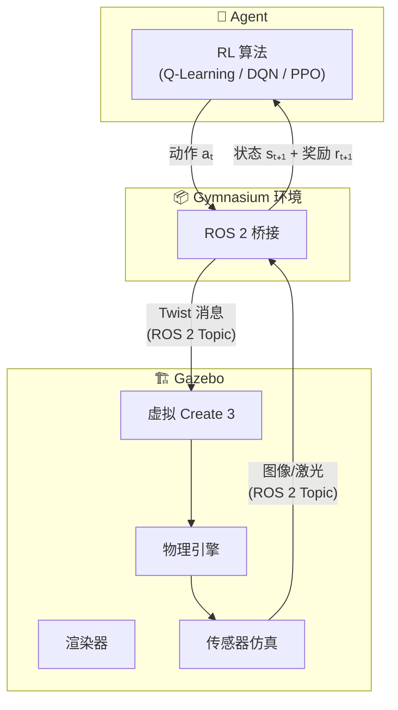

# Gazebo 仿真器 核心概念

> 📖 Slides: CST8509 Week 7; 📖 Docs: [Gazebo](https://gazebosim.org/home), [ROS 2](https://docs.ros.org/en/humble/)

---

## 术语定义

### Gazebo

一个开源的 3D 机器人仿真平台。它能模拟机器人的物理行为（重力、碰撞、摩擦）、传感器（摄像头、激光雷达）和完整的环境（房间、地形）。就像"机器人的虚拟游乐场"——机器人可以在里面随便折腾，摔了也不疼。

> 易混淆：**Gymnasium** — Gymnasium 是 RL 环境的 Python 接口标准，Gazebo 是物理级别的 3D 仿真器。Gymnasium 提供 `step()/reset()` API，Gazebo 提供物理引擎和渲染

> 📖 Slides: CST8509 Week 7 Slide 4

### Classic Gazebo (Gazebo 11)

Gazebo 的旧版本，也叫 Gazebo-11 或 Gazebo Classic。与 ROS 2 Humble 配合良好，生态成熟，文档丰富。课程 Lab 4 使用此版本。

> 易混淆：**Ignition Gazebo / Gazebo Sim** — 新一代 Gazebo 架构，已更名为"Gazebo"（没错，和旧版同名！），版本号用代号（Fortress、Harmonic）。两者完全不同的代码库

> 📖 Slides: CST8509 Week 7 Slide 5

### Ignition Gazebo / Gazebo Sim

Gazebo 的新一代架构，原名 Ignition Gazebo，后来更名为"Gazebo"。使用不同的安装包和 API。版本用字母代号：Fortress、Garden、Harmonic 等。如果你看到有人说"Gazebo"不加版本号，大概率指的是新版。

> 📖 Slides: CST8509 Week 7 Slide 5

### ROS 2 (Robot Operating System 2)

一套用于构建机器人应用的软件库和工具集。核心思想是**节点通信**——不同功能模块（感知、决策、控制）作为独立节点运行，通过**话题 (Topic)** 发布/订阅消息。不是真正的操作系统，而是一个中间件框架。

> 易混淆：**ROS 1** — ROS 的第一代；ROS 2 改进了实时性、安全性和跨平台支持。课程使用 ROS 2 Humble

> 📖 Slides: CST8509 Week 7 Slide 11

### ROS 2 话题 (Topic)

ROS 2 节点之间通信的管道。一个节点可以向话题**发布 (Publish)** 消息，其他节点可以**订阅 (Subscribe)** 该话题来接收消息。比如 Gazebo 摄像头发布图像到 `/camera/image` 话题，RL Agent 订阅这个话题获取观察。

> 📖 Docs: [ROS 2 Topics](https://docs.ros.org/en/humble/Tutorials/Beginner-CLI-Tools/Understanding-ROS2-Topics.html)

### ROS 2 节点 (Node)

ROS 2 系统中的一个独立进程，负责特定功能。比如一个节点负责读摄像头、一个节点负责电机控制、一个节点负责 RL 决策。节点之间通过话题、服务、动作通信。

> 📖 Docs: [ROS 2 Nodes](https://docs.ros.org/en/humble/Tutorials/Beginner-CLI-Tools/Understanding-ROS2-Nodes.html)

### Twist 消息 (Twist Message)

ROS 2 中表达速度命令的标准消息类型（`geometry_msgs/Twist`）。包含**线速度** (linear: x, y, z) 和**角速度** (angular: x, y, z)。在 RL 中作为 Agent 的**动作**发送给机器人。

> 📖 Slides: CST8509 Week 7 Slide 6

### iRobot Create 3

iRobot 公司出品的教育机器人平台，基于 Roomba 底盘。支持 ROS 2 通信，有 Gazebo 仿真模型。课程中用它作为 RL 训练的物理/虚拟机器人。

> 📖 Slides: CST8509 Week 7 Slides 6-8; 📖 Docs: [Create 3](https://iroboteducation.github.io/create3_docs/)

### URDF (Unified Robot Description Format)

ROS 中描述机器人外形、关节、传感器的 XML 文件格式。定义了机器人由哪些**链接 (Link)**（刚体部件）和**关节 (Joint)**（连接方式）组成。Create 3 仿真器就用 URDF 定义机器人模型。

> 易混淆：**SDF (Simulation Description Format)** — SDF 是 Gazebo 原生格式，比 URDF 更强大（支持多机器人、环境描述）。构建过程会把 URDF 转换为 SDF

> 📖 Slides: CST8509 Week 7 Slide 14

### SDF (Simulation Description Format)

Gazebo 专用的仿真描述格式，旨在解决 URDF 的不足。SDF 可以描述完整的仿真世界（多个机器人+环境），而 URDF 只能描述单个机器人。

> 📖 Slides: CST8509 Week 7 Slide 14

### Xacro

XML 宏语言，用于简化 URDF/SDF 文件的编写。支持变量、宏定义和文件包含。就像 C 语言的预处理器——写一个模板，自动展开成完整的 URDF/SDF。

> 📖 Slides: CST8509 Week 7 Slide 14

### Rviz

ROS 2 的图形化可视化工具。可以显示机器人模型、传感器数据（点云、图像）、地图、路径规划等。Rviz 不做仿真（那是 Gazebo 的事），只做**可视化**。

> 易混淆：**Gazebo** — Gazebo 做物理仿真 + 渲染，Rviz 只做数据可视化。两者常同时使用但功能不同

> 📖 Slides: CST8509 Week 7 Slide 16

### Sim-to-Real (仿真到现实迁移)

在仿真器中训练好的 RL 策略直接部署到真实机器人上。核心挑战是**Sim-to-Real Gap**——仿真器的物理永远不完美（摩擦、延迟、传感器噪声），导致策略迁移后性能下降。

> 📖 延伸概念，课程中提到仿真替代真实的动机

---

## 概念辨析

### Gazebo vs Gymnasium

| 维度 | Gazebo | Gymnasium |
|------|--------|-----------|
| **定位** | 3D 物理仿真平台 | RL 环境 Python API 标准 |
| **物理引擎** | ✅ ODE/Bullet/DART | ❌ 无（或简化物理） |
| **渲染** | ✅ 完整 3D 渲染 | ❌/简单 PyGame |
| **传感器仿真** | ✅ 摄像头/激光雷达/IMU | ❌ 无 |
| **RL 接口** | 需要额外桥接 | ✅ 原生 `step()/reset()` |
| **典型用途** | 机器人仿真 + RL | 通用 RL 环境 |

> 📖 Slides: CST8509 Week 7 Slides 3-4, 10-12

### Gazebo vs Rviz

| 维度 | Gazebo | Rviz |
|------|--------|------|
| **功能** | 物理仿真 + 渲染 | 数据可视化 |
| **物理引擎** | ✅ 有 | ❌ 无 |
| **能否"让机器人动"** | ✅ 可以 | ❌ 不行，只能"看" |
| **何时用** | 需要仿真训练时 | 需要查看传感器数据时 |

> 📖 Slides: CST8509 Week 7 Slides 4, 16

### URDF vs SDF

| 维度 | URDF | SDF |
|------|------|-----|
| **来源** | ROS 原生 | Gazebo 原生 |
| **描述范围** | 单个机器人 | 完整世界（多机器人 + 环境） |
| **闭环运动链** | ❌ 不支持 | ✅ 支持 |
| **传感器插件** | 需要 Gazebo 插件 | 原生支持 |
| **课程使用** | ✅ Create 3 模型 | 构建时自动转换 |

> 📖 Slides: CST8509 Week 7 Slide 14

### 实物机器人 vs 仿真机器人

| 维度 | 实物 Create 3 | 仿真 Create 3 (Gazebo) |
|------|--------------|----------------------|
| **训练速度** | 实时（1x） | 可加速（10x+） |
| **安全性** | ⚠️ 危险动作可能损坏 | ✅ 随便摔 |
| **人力成本** | 需人工准备环境 | ✅ 自动化 |
| **物理真实性** | ✅ 100% 真实 | ⚠️ 近似（有 Gap） |
| **可重复性** | ❌ 每次环境不同 | ✅ 完全可重复 |
| **成本** | 💰 硬件+维护 | 💻 只需计算资源 |

> 📖 Slides: CST8509 Week 7 Slides 7-9

---

## 核心属性

### RL + Gazebo 架构图

> 📖 Slides: CST8509 Week 7 Slide 12

---

## 速查表

| 项 | 说明 | 示例 |
|-----|------|------|
| Gazebo | 3D 机器人仿真平台 | 仿真 Create 3 在房间中导航 |
| Classic Gazebo | 旧版 (v11)，课程使用 | `curl -sSL http://get.gazebosim.org \| sh` |
| Gazebo Sim | 新版（原 Ignition） | Fortress / Harmonic |
| ROS 2 | 机器人中间件 | 节点通信 Pub/Sub |
| Topic | ROS 2 消息管道 | `/cmd_vel`, `/camera/image` |
| Twist | 速度命令消息 | linear.x=0.5, angular.z=1.0 |
| URDF | 机器人描述格式 | Create 3 的外形+关节 |
| SDF | 仿真世界描述格式 | 房间+机器人+物体 |
| Xacro | XML 宏语言 | 简化 URDF 编写 |
| Rviz | 数据可视化工具 | 查看摄像头图像/点云 |
| Create 3 | iRobot 教育机器人 | Roomba 底盘 + ROS 2 |
