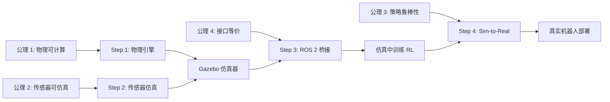

# Gazebo 仿真器 第一性原理

> 📖 Slides: CST8509 Week 7; 📖 Paper: Tobin et al., [Domain Randomization](https://arxiv.org/abs/1703.06907), IROS 2017

---

## 核心问题链

> 用"5 个为什么"递归追问，从表层功能到不可再分公理。

1. **Gazebo 在做什么？** → 在虚拟世界中仿真机器人的物理行为和传感器数据（表层）
2. **为什么需要虚拟仿真？** → 因为真实训练太慢、太危险、太贵，仿真能无限试错（动机）
3. **为什么仿真能替代真实？** → 因为**物理可计算性假设**：真实世界的物理规律可以用数学模型近似计算（更深层）
4. **为什么近似就够了？** → 因为**策略的鲁棒性假设**：在足够多样的近似环境中训练出的策略，能泛化到真实环境（基本事实）
5. **能否继续拆分？** → 不能——这依赖于两个不可再分的假设：**牛顿力学的确定性** + **统计学习的泛化理论** → **到达公理**

---

## 公理与基本假设

### 公理 1: 物理可计算性 (Physical Computability)

**陈述：** 宏观物理世界的行为（刚体运动、碰撞、摩擦）可以用有限步数学运算近似计算到足够精度。

**白话：** 给定一个机器人的形状、质量和初始状态，我可以用方程算出它撞墙后会怎么弹——虽然不是 100% 精确，但"差不多"。

**来源：** 牛顿力学 + 数值计算。Gazebo 使用 ODE/Bullet/DART 引擎求解刚体动力学方程。

**可验证性：**
- ✅ 成立条件：刚体碰撞、低速运动、宏观尺度
- ❌ 不成立条件：柔性物体（布料、绳子）、流体、微观粒子、极端温度

> 📖 物理仿真的数学基础

### 公理 2: 传感器可仿真性 (Sensor Simulability)

**陈述：** 机器人传感器（摄像头、激光雷达、IMU）的输出可以通过渲染引擎和噪声模型合成，使得 Agent 无法区分仿真数据和真实数据。

**白话：** 虚拟摄像头拍的照片看起来和真摄像头拍的"差不多"——至少对算法来说分不出区别。

**来源：** 计算机图形学 + 传感器建模。

**可验证性：**
- ✅ 成立条件：低分辨率任务、添加了合适噪声模型
- ❌ 不成立条件：高保真视觉任务（真实光照/反射太复杂）、特殊传感器（触觉）

### 公理 3: 策略鲁棒性 (Policy Robustness)

**陈述：** 如果一个策略在足够多样的仿真环境变体中都能工作，它就能在真实环境中也工作。

**白话：** 如果机器人在"摩擦系数随机变"、"光照随机变"、"噪声随机加"等各种变体环境里都学会了导航，那放到真实世界大概率也行。

**来源：** 统计学习理论 + Domain Randomization (Tobin et al. 2017)。

**可验证性：**
- ✅ 成立条件：Sim-to-Real Gap 在 Domain Randomization 的覆盖范围内
- ❌ 不成立条件：真实世界有仿真中从未出现过的情况（黑天鹅事件）

> 📖 Paper: Tobin et al., [Domain Randomization](https://arxiv.org/abs/1703.06907), IROS 2017

### 公理 4: 接口等价性 (Interface Equivalence)

**陈述：** 如果仿真器和真实机器人使用完全相同的通信接口（ROS 2 话题/消息），则 Agent 代码可以零修改地从仿真切换到真实。

**白话：** Agent 只看到 `/cmd_vel` 话题上的 Twist 消息和 `/camera/image` 上的图像——不关心这些数据来自 Gazebo 还是真实 Create 3。

**来源：** 软件工程的**接口抽象**原则 + ROS 2 的设计理念。

**可验证性：**
- ✅ 成立条件：消息格式、频率、时序一致
- ❌ 不成立条件：仿真中没有的延迟/丢包、真实传感器的 quirk

> 📖 Slides: CST8509 Week 7 Slides 7-8, 11-12

---

## 从公理到技术的推导链

### Step 1: 从物理可计算性 → 可以建仿真器

**推理：** 因为物理规律可以数值计算（公理 1），所以可以构建物理引擎（ODE/Bullet）来仿真刚体运动

**结果：** → Gazebo 的物理仿真核心

### Step 2: 从传感器可仿真性 → 可以生成训练数据

**推理：** 因为传感器可以合成仿真数据（公理 2），Agent 可以用仿真数据训练，就像用真实数据一样

**结果：** → Gazebo 的摄像头/激光雷达插件 → RL Agent 的状态输入

### Step 3: 从接口等价性 → 零修改部署

**推理：** 因为仿真和真实用同一个 ROS 2 接口（公理 4），训练代码不需要修改

**结果：** → `ros2 launch` 换一个 launch 文件就能从仿真切到真实

### Step 4: 从策略鲁棒性 → 仿真训练能打

**推理：** 因为策略在多样化仿真中能泛化（公理 3），仿真训练的策略可以部署到真实机器人

**结果：** → Domain Randomization 技术 → Sim-to-Real Transfer

### 推导链全景图

---

## 如果公理不成立？

### 公理 1 失效：物理仿真不准

**如果不成立：** 柔性物体（绳子、布料）、流体（倒水）、复杂接触（手指操作）——这些 ODE 引擎算不准

**技术后果：** 在仿真中学会的策略放到真实世界就失效

**替代方案：** 更高精度的引擎（MuJoCo/DART 在关节接触上更好）、数据驱动的物理模型（学习的残差物理）

### 公理 2 失效：传感器仿真差距太大

**如果不成立：** 仿真图像"太干净"，没有真实世界的光照变化、镜头畸变、运动模糊

**技术后果：** 用仿真图像训练的视觉策略到真实世界直接失明

**替代方案：** Domain Randomization（随机化光照/纹理/颜色）、GAN 风格迁移（把仿真图像变得像真实的）

### 公理 3 失效：策略不够鲁棒

**如果不成立：** 真实世界出现了仿真中从未覆盖的情况（比如地毯区域、儿童冲过来）

**技术后果：** 策略遇到未见过的情况直接崩溃（不安全）

**替代方案：** 安全 RL (Safe RL)、人在回路 (Human-in-the-Loop)、真实世界微调 (Fine-tuning)

### 公理 4 失效：接口不完全等价

**如果不成立：** 真实 ROS 2 话题有延迟、丢包、频率不稳定——仿真中没有这些

**技术后果：** 策略假设"数据总是按时到达"，但真实中会卡顿 → 动作延迟 → 撞墙

**替代方案：** 在仿真中加入通信延迟噪声、使用时间戳而不是假设固定频率

---

## 第一性原理速查表

| 公理/假设 | 一句话陈述 | 成立条件 | 失效后果 |
|----------|-----------|---------|---------| 
| 物理可计算性 | 物理规律可以数值近似 | 刚体、宏观、低速 | 柔性/流体场景仿真不准 → 用更好引擎 |
| 传感器可仿真性 | 传感器输出可以合成 | 低精度任务、加了噪声 | 高保真视觉失效 → Domain Randomization |
| 策略鲁棒性 | 多样仿真 → 泛化到真实 | Gap 在 DR 覆盖范围内 | 黑天鹅情况 → Safe RL + 微调 |
| 接口等价性 | 仿真和真实用同一接口 | 消息格式/频率一致 | 延迟/丢包 → 加通信噪声 |
