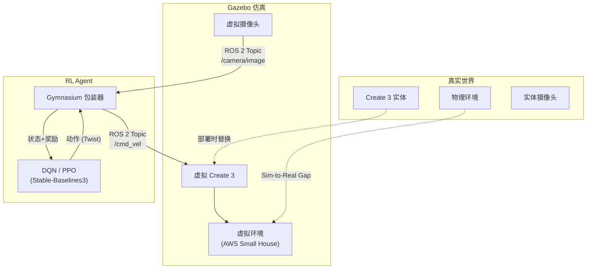

# Gazebo 仿真器 教程

> **前置知识：** RL Foundations（Agent/环境/奖励）、Linux 基础命令、Python
> **参考来源：** [CST8509 Week 7](../../../courses/rl/slides/CST8509_07_Gazebo_DynamicP_MC.pdf), [Gazebo Docs](https://gazebosim.org/home), [Create 3 Docs](https://iroboteducation.github.io/create3_docs/sim/setup/)

---

## Section 0: 前置知识速查

1. **RL 交互循环**：Agent 观察状态 → 选动作 → 环境返回新状态+奖励 → 重复
2. **Gymnasium API**：`env.reset()` 初始化，`env.step(action)` 执行一步
3. **Linux 基础**：`apt install`、`source`、终端操作

---

## Section 1: 它解决什么问题（Why）

### 没有它会怎样？

- 🔥 **痛点 1：真实机器人训练太慢**。RL 算法需要成千上万个 episode 来学习。如果用真实 Create 3 训练，DQN 可能需要几万个 30 秒 episode——算下来要几百个小时的连续运行。谁来盯着？电池够吗？

- 🔥 **痛点 2：真实探索太危险**。RL 训练早期，Agent 的策略基本是随机的。机器人可能会撞墙、翻下楼梯、撞到人。你不能让一个"婴儿大脑"的机器人在真实世界里瞎试。

- 🔥 **痛点 3：需要人类参与太贵**。课程中 Create 3 跟随手势移动——训练期间谁来一直挥手？如果训练 3 天，那个人不就累死了？（Slide 9 原话：_"Won't that person get tired?"_）

- 🔥 **痛点 4：实验不可重复**。真实世界每次都不一样（光线、地面摩擦、电池电量）。你无法精确复现一个 bug。

### 它的核心价值

1. **无限试错**：仿真机器人摔了重来，没有成本
2. **加速训练**：仿真可以比实时快 5-10x 甚至更多
3. **安全探索**：随机策略不会伤害任何人/物
4. **完全可控**：固定随机种子 → 完全可重复的实验
5. **零硬件**：只需一台笔记本，不需要买机器人

> 📖 Slides: CST8509 Week 7 Slide 9

---

## Section 2: 它怎么工作的（How — 底层原理）

### 2.1 仿真替代真实的架构

**核心思想：** 训练时用 Gazebo 里的虚拟 Create 3，部署时换成真实 Create 3。ROS 2 话题是它们之间的"接口标准"——Agent 代码不需要改，只要换物理层。

### 2.2 Gazebo 内部架构

Gazebo 是一个**插件架构**：

| 组件 | 功能 | 插件机制 |
|------|------|---------|
| **物理引擎** | 计算碰撞、重力、摩擦 | ODE (默认) / Bullet / DART |
| **渲染引擎** | 生成视觉画面 | OGRE |
| **传感器管理器** | 仿真摄像头、激光雷达等 | 各传感器独立插件 |
| **世界管理器** | 管理所有模型和环境 | SDF 文件定义世界 |
| **ROS 2 桥接** | 与 ROS 2 节点通信 | gazebo_ros_pkgs |

### 2.3 为什么选 Classic Gazebo 11？

| 考虑因素 | Classic Gazebo 11 | Gazebo Sim (新版) |
|---------|-------------------|-------------------|
| ROS 2 Humble 兼容 | ✅ 成熟 | ✅ 但生态较新 |
| Create 3 仿真支持 | ✅ 官方支持 | ⚠️ 迁移中 |
| 社区文档/教程 | ✅ 丰富 | ⚠️ 较少 |
| 长期维护 | ❌ 已停止开发 | ✅ 持续更新 |

> 结论：课程用 Classic Gazebo 11 是因为 Create 3 的 Gazebo 包已经做好了，开箱即用。

> 📖 Slides: CST8509 Week 7 Slides 5, 13

---

## Section 3: 局限性

1. **Sim-to-Real Gap**：仿真物理永远不完美。Gazebo 的 ODE 引擎在柔性物体、流体、精细接触力上有明显偏差。→ **应对：** Domain Randomization（随机化仿真参数）、System Identification（测量真实物理参数）

2. **计算资源瓶颈**：3D 物理仿真 + 渲染很吃 CPU/GPU。在笔记本上 RTF 可能 < 1（比实时还慢）。→ **应对：** 无头模式 (headless) 关闭渲染、降低物理精度

3. **版本混乱**：Classic Gazebo vs Ignition Gazebo vs Gazebo Sim 命名混乱，安装时容易装错版本。→ **应对：** 严格按文档版本匹配 ROS 2 版本

4. **调试困难**：仿真中的 bug（传感器数据异常、碰撞检测失败）不像代码 bug 那样容易定位。→ **应对：** 先用简单世界（空世界+一个障碍物）验证，再上复杂场景

> 📖 Slides: CST8509 Week 7 Slides 5, 9

---

## Section 4: 方案对比

| 仿真平台 | 物理精度 | RL 集成 | 机器人支持 | 免费 | 适用场景 |
|---------|---------|---------|-----------|------|---------|
| **Gazebo (Classic)** | ⭐⭐⭐ | ROS 2 桥接 | ✅ 丰富 | ✅ | 课程、机器人研究 |
| **MuJoCo** | ⭐⭐⭐⭐⭐ | Gymnasium 原生 | ⭐⭐ | ✅ | 关节控制、locomotion |
| **Isaac Sim** | ⭐⭐⭐⭐⭐ | Isaac Gym | ✅ 丰富 | 免费 | 大规模 GPU 并行训练 |
| **PyBullet** | ⭐⭐⭐ | Gymnasium 原生 | ⭐⭐⭐ | ✅ | 快速原型 |
| **Unity ML-Agents** | ⭐⭐⭐ | 自有 API | ⭐ | ✅ | 视觉丰富环境 |

> 📖 延伸比较，帮助理解 Gazebo 在仿真器生态中的定位

---

## 参考来源表

| 来源 | 类型 | 使用位置 |
|------|------|---------|
| [CST8509 Week 7 Slides](../../../courses/rl/slides/CST8509_07_Gazebo_DynamicP_MC.pdf) | 📖 课件 | 全文核心参考 |
| [Gazebo Docs](https://gazebosim.org/home) | 📖 文档 | 仿真器架构和使用 |
| [Create 3 Sim Docs](https://iroboteducation.github.io/create3_docs/sim/setup/) | 📖 文档 | Create3 仿真设置 |
| [ROS 2 Humble Docs](https://docs.ros.org/en/humble/) | 📖 文档 | ROS 2 通信机制 |
