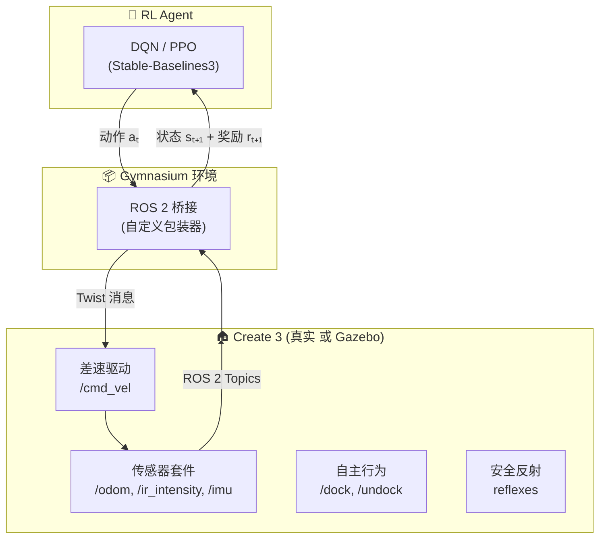

# iRobot Create 3 教程

> **前置知识：** RL Foundations（Agent/环境/奖励）、ROS 2 基础概念（Topic/Service/Action）
> **参考来源：** [Create 3 Docs](https://iroboteducation.github.io/create3_docs/), [Simulator](https://iroboteducation.github.io/create3_docs/sim/setup/), 📚 Sutton & Barto [《RL: An Introduction》](../../../textbooks/sutton_barto_rl_intro.pdf) Ch.1

---

## Section 0: 前置知识速查

1. **RL 交互循环**：Agent 观察状态 → 选动作 → 环境返回新状态+奖励 → 重复（📚 Sutton & Barto Ch.1.1）
2. **ROS 2 Topic**：发布/订阅模式，异步消息传递
3. **ROS 2 Action**：目标/反馈/结果模式，适合长时间动作（如导航）
4. **Twist 消息**：`geometry_msgs/msg/Twist`，包含 linear (x,y,z) 和 angular (x,y,z)

---

## Section 1: 它解决什么问题（Why）

### 没有它会怎样？

- 🔥 **痛点 1：缺少物理硬件验证平台**。你写了一个 RL Agent，在 CartPole 上表现很好——但怎么验证它能控制一个真实移动机器人？你需要一个有真实传感器和执行器的硬件平台。

- 🔥 **痛点 2：自建机器人太复杂**。从零搭建一个带轮编码器、IMU、碰撞传感器、充电站的机器人需要电气/机械/嵌入式知识——你只想学 RL，不想先学焊接。

- 🔥 **痛点 3：ROS 2 接口不一致**。不同机器人厂商的 API 各不相同。如果用了一个非标准机器人，你的代码就无法迁移到其他平台。

### 它的核心价值

1. **开箱即用的 ROS 2 平台**：所有传感器/执行器通过标准 ROS 2 接口暴露——不需要写驱动
2. **仿真完全等价**：Gazebo 仿真的 Create 3 暴露**完全相同**的 ROS 2 API——代码零修改迁移
3. **内置安全系统**：反射机制保护机器人不会跌落悬崖/撞坏——训练期间的安全兜底
4. **真实传感器套件**：7 对 IR、4 个悬崖传感器、IMU、光学里程计——提供丰富的状态信息

> 📖 Docs: [Create 3 Home](https://iroboteducation.github.io/create3_docs/)
> 📖 Paper: Soragna et al., [ROS 2 Node Composition](https://arxiv.org/abs/2305.09933) — Create 3 是 ROS 2 Composition 技术的商业应用案例

---

## Section 2: 它怎么工作的（How — 底层原理）

### 2.1 Create 3 在 RL 系统中的角色

**核心思想：** Create 3 就是 RL 环境的"物理执行层"。Agent 通过 Gymnasium 包装器发送 Twist 消息控制轮子，通过传感器 Topic 获取状态。这个架构对真实机器人和仿真机器人**完全相同**。

### 2.2 Create 3 的 ROS 2 节点架构

Create 3 内部运行多个 ROS 2 节点，通过 Node Composition 合并到同一进程：

| 节点 | 功能 | 暴露的接口 |
|------|------|-----------|
| `motion_control` | 运动控制和安全反射 | `/cmd_vel`(订阅), `max_speed`/`safety_override`(参数) |
| `robot_state` | 姿态估计和 TF 发布 | `/odom`(发布), `/tf`(发布), `publish_odom_tfs`(参数) |
| `static_transform` | 静态坐标系 | `/tf_static`(发布), `wheel_base`/`wheels_radius`(参数) |
| `ui_mgr` | 灯环和按钮 | `/cmd_lightring`(订阅), `/interface_buttons`(发布) |
| `system_health` | 系统健康监控 | 电池/温度日志 |

> 📖 Paper: Soragna et al., [ROS 2 Node Composition](https://arxiv.org/abs/2305.09933) — Composition 节省 28% CPU、33% RAM

### 2.3 仿真 = 真实（接口等价性）

Create 3 仿真器的设计原则是**接口等价**——仿真机器人暴露与真实机器人完全相同的 ROS 2 话题、服务和动作。

> 📖 Docs: [Simulator Setup](https://iroboteducation.github.io/create3_docs/sim/setup/) — "This application completely simulates a Create® 3 robot, thus exposing to the user all the same ROS 2 APIs as the real robot."

---

## Section 3: 局限性

1. **仅限室内平坦地面**：Create 3 基于 Roomba 底盘，无法越过门槛、爬楼梯或在粗糙地面上稳定运行 → **应对：** 选择 AWS 小房子等平坦仿真世界

2. **无原生摄像头**：Create 3 出厂不带摄像头——需要通过 URDF 添加虚拟摄像头（仿真）或物理安装 USB 摄像头（真实）→ **应对：** 创建 `camera.urdf.xacro`

3. **嵌入式资源有限**：Create 3 的处理器无法在机器人上直接运行深度 RL → **应对：** RL 训练跑在外部笔记本/服务器上，通过 ROS 2 网络通信

4. **安全反射可能干扰训练**：`REFLEX_BUMP` 等反射在 RL 探索初期可能频繁触发 → **应对：** 用 `safety_override=full` 禁用反射（仅在仿真中！）

> 📖 Docs: [Safety](https://iroboteducation.github.io/create3_docs/api/safety/), [Hardware Overview](https://iroboteducation.github.io/create3_docs/hw/overview/)

---

## Section 4: 方案对比

| 平台 | ROS 2 原生 | 传感器丰富度 | 仿真器 | 价格 | 适用场景 |
|------|-----------|------------|--------|------|---------|
| **iRobot Create 3** | ✅ 完全原生 | ⭐⭐⭐⭐ | ✅ Gazebo (官方) | ~$300 | 室内导航 RL 教学 |
| **TurtleBot 4** | ✅ 完全原生 | ⭐⭐⭐⭐⭐ (含 LiDAR) | ✅ Gazebo | ~$1200 | SLAM + 导航研究 |
| **Duckiebot** | ⚠️ 需要桥接 | ⭐⭐ (仅摄像头) | ✅ Duckietown Gym | ~$150 | 视觉 RL 入门 |
| **自制 Arduino 小车** | ❌ 需自己写 | ⭐ | ❌ 无 | ~$50 | DIY 入门 |

> 📖 Docs: [Create 3 Home](https://iroboteducation.github.io/create3_docs/)

---

## 参考来源表

| 来源 | 类型 | 使用位置 |
|------|------|---------|
| Soragna et al., [ROS 2 Node Composition](https://arxiv.org/abs/2305.09933) | 📖 论文 | Section 2.2 节点架构 |
| Sutton & Barto, [《RL: An Introduction》](../../../textbooks/sutton_barto_rl_intro.pdf) Ch.1 | 📚 教科书 | Section 0 前置知识 |
| [Create 3 Docs](https://iroboteducation.github.io/create3_docs/) | 📖 文档 | 全文核心参考 |
| [Simulator Setup](https://iroboteducation.github.io/create3_docs/sim/setup/) | 📖 文档 | Section 2.3 仿真等价 |
| [Safety Docs](https://iroboteducation.github.io/create3_docs/api/safety/) | 📖 文档 | Section 3 局限性 |
