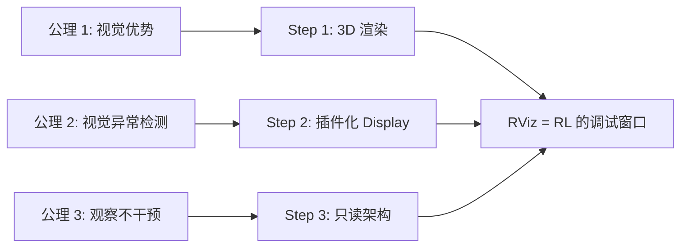

# RViz 可视化工具 第一性原理

> 📖 Slides: CST8509 Week 7; 📖 Docs: [RViz2](https://docs.ros.org/en/humble/Tutorials/Intermediate/RViz/RViz-User-Guide/RViz-User-Guide.html)

---

## 核心问题链

> 用"5 个为什么"递归追问，从表层功能到不可再分公理。

1. **RViz 在做什么？** → 把 ROS 2 话题上的数据渲染成 3D 画面（表层）
2. **为什么需要 3D 渲染？** → 因为机器人的传感器数据和状态是不可见的，人类需要用眼睛"看到"才能理解和调试（动机）
3. **为什么人类需要"看到"？** → 因为**视觉认知优势假设**：人类视觉系统处理空间信息的能力远超处理原始数字的能力（更深层）
4. **为什么视觉优势就能帮助调试？** → 因为**异常检测的视觉直觉**：空间数据中的错误（坐标系偏了、传感器范围不对）在视觉上非常明显，但在数字上很难发现（基本事实）
5. **能否继续拆分？** → 不能——这依赖于人类认知的基本特性：**视觉 > 文本 > 数字**，这是进化决定的 → **到达公理**

---

## 公理与基本假设

### 公理 1: 视觉认知优势 (Visual Cognition Superiority)

**陈述：** 人类处理空间信息的视觉系统，处理速度和模式识别能力远超处理同类信息的文本/数字系统。

**白话：** 看一张 3D 图中激光扫描打到墙壁的形状，0.1 秒就知道"墙在这"。但如果给你 1000 个 (距离, 角度) 数字对，你得分析好久才能理解同样的信息。

**来源：** 认知心理学——人类视觉皮层占大脑皮层约 30%，是进化中最强大的信息处理模块。

**可验证性：**
- ✅ 成立条件：空间关系、形状、运动轨迹等空间信息
- ❌ 不成立条件：精确数值比较（如 0.3578 vs 0.3581）、时间序列趋势

### 公理 2: 异常检测的视觉直觉 (Visual Anomaly Detection)

**陈述：** 空间数据中的异常模式（坐标系偏转、传感器遮挡、路径偏离）在视觉上立刻可辨，但在原始数据中极难发现。

**白话：** 如果摄像头的坐标系设反了，RViz 里你一眼看到摄像头朝天了。但看 URDF 的 `<origin rpy="1.57 0 0"/>` vs `<origin rpy="0 0 1.57"/>` 你很难直觉判断哪个对。

**来源：** 经验假设，机器人开发实践中广泛验证。

### 公理 3: 观察-理解分离 (Observation-Understanding Separation)

**陈述：** 可视化工具应该**只观察不干预**——它显示数据但不改变数据的产生过程。这保证了观察结果的真实性。

**白话：** RViz 只是一面镜子——它反映机器人的状态，但不会因为你打开 RViz 就改变机器人的行为。（类比量子力学中的"观测不影响被观测系统"——虽然 RViz 订阅话题会带来微小的计算开销，但不改变数据内容）

**来源：** 软件工程的**单一职责原则** + 调试的**最小干扰原则**。

---

## 从公理到技术的推导链

### Step 1: 从视觉优势 → 需要 3D 渲染

**推理：** 因为人类视觉系统处理空间数据最高效（公理 1），所以需要把传感器数据渲染成 3D 图形

**结果：** → RViz 的 3D 渲染引擎 (OGRE)

### Step 2: 从异常检测 → 需要多种 Display

**推理：** 因为不同类型的数据异常表现不同（公理 2），需要针对每种数据类型定制渲染方式

**结果：** → 插件化 Display 系统（LaserScan ≠ PointCloud ≠ Image ≠ TF）

### Step 3: 从观察-理解分离 → 只读不写

**推理：** 为了保证观察的真实性（公理 3），RViz 只订阅话题（读），不发布数据（写，除了 2D Nav Goal 等交互工具）

**结果：** → RViz 不修改仿真状态，安全用于调试

### 推导链全景图

---

## 如果公理不成立？

### 公理 1 失效：数字比图形更有效

**如果不成立：** 某些分析任务中，精确数值比 3D 图形更重要（如比较两个策略的平均奖励差异到小数点后 4 位）

**技术后果：** RViz 无法满足需求

**替代方案：** 用 rqt_plot / PlotJuggler / TensorBoard 看数值曲线

### 公理 2 失效：异常在视觉上不明显

**如果不成立：** 某些微小的数值错误在 3D 视图中看不出来（如 IMU 的 0.01° 偏差）

**技术后果：** 开发者以为一切正常，但实际上有累积误差

**替代方案：** 用 `ros2 topic echo` + 数值分析脚本做精确验证

### 公理 3 失效：观察改变了被观察系统

**如果不成立：** RViz 订阅高带宽话题（如 4K 视频）导致系统性能下降，间接影响了 RL 训练结果

**技术后果：** 有 RViz 和没有 RViz 时的训练结果不同

**替代方案：** 用异步日志记录 + 离线回放（rosbag），不实时可视化

---

## 第一性原理速查表

| 公理/假设 | 一句话陈述 | 成立条件 | 失效后果 |
|----------|-----------|---------|---------| 
| 视觉认知优势 | 看图比看数字快 | 空间信息 | 精确数值分析 → 用 Plot 工具 |
| 视觉异常检测 | 空间错误一眼能看到 | 明显偏差 | 微小误差 → 用数值分析 |
| 观察不干预 | 看不会改变结果 | 低带宽话题 | 高带宽订阅 → 用 rosbag 离线 |
