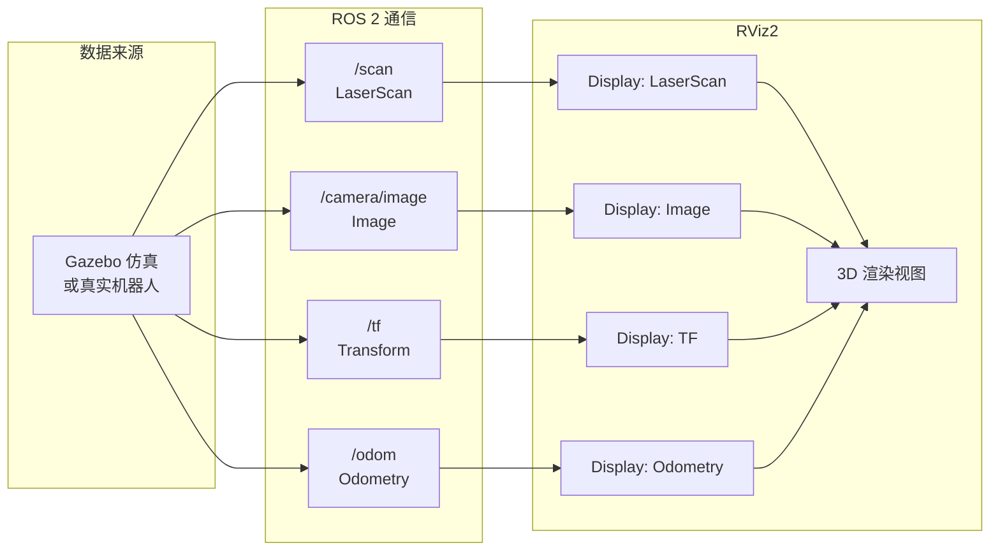

# RViz 可视化工具 教程

> **前置知识：** ROS 2 基础（Topic/Node）、Gazebo 仿真器
> **参考来源：** [CST8509 Week 7](../../../courses/rl/slides/CST8509_07_Gazebo_DynamicP_MC.pdf), [RViz2 User Guide](https://docs.ros.org/en/humble/Tutorials/Intermediate/RViz/RViz-User-Guide/RViz-User-Guide.html)

---

## Section 0: 前置知识速查

1. **ROS 2 话题**：节点间通过 Publish/Subscribe 通信的管道
2. **Gazebo**：物理仿真器，产出 ROS 2 话题数据
3. **URDF**：机器人模型描述文件

---

## Section 1: 它解决什么问题（Why）

### 没有它会怎样？

- 🔥 **痛点 1：RL Agent 行为不可观察**。Agent 选了动作、得了奖励，但你看不到机器人到底做了什么。它往哪走了？摄像头看到了什么？激光雷达扫到了什么障碍物？没有可视化 = 盲人调试

- 🔥 **痛点 2：传感器数据难以验证**。你的 Gymnasium 环境从 ROS 2 话题读取传感器数据——但数据是对的吗？摄像头真的对着正确的方向？激光雷达范围够不够？没有 RViz，你只能 `echo` 原始数字

- 🔥 **痛点 3：坐标系对不对无法直觉判断**。如果 `camera_link` 的旋转偏了 90°，摄像头其实是朝天的——但光看 URDF 数字你很难发现。RViz 直接画出坐标轴，一眼看到

### 它的核心价值

1. **行为可视化**：实时看到机器人在做什么——走路、转弯、停下
2. **数据验证**：确认传感器数据正确——激光扫描形状、摄像头视野
3. **坐标系调试**：TF 树可视化，一眼发现坐标系配置错误
4. **RL 调试利器**：用 Marker 标注奖励区域、目标点、探索边界

> 📖 Slides: CST8509 Week 7 Slide 16

---

## Section 2: 它怎么工作的（How — 底层原理）

### 2.1 RViz 的数据流



**核心机制：** RViz 不直接和 Gazebo 通信，而是通过 **ROS 2 话题**间接获取数据。每个 Display 订阅一个话题，接收到消息后在 3D 视图中渲染。

### 2.2 RViz 界面布局

```
┌─────────────────────────────────────────────────────┐
│  [工具栏] Move Camera | Interact | Select | Measure │
├──────────────┬──────────────────────────────────────┤
│              │                                      │
│  Displays    │        3D 渲染视图                   │
│  面板        │                                      │
│              │     [机器人模型 + 激光扫描           │
│  ┌─────────┐│      + TF 坐标轴 + 路径]            │
│  │Grid     ││                                      │
│  │TF       ││                                      │
│  │RobotMdl ││                                      │
│  │LaserScan││                                      │
│  └─────────┘│                                      │
├──────────────┼──────────────────────────────────────┤
│  Views 面板  │  Time 面板                           │
└──────────────┴──────────────────────────────────────┘
```

### 2.3 RViz 在 RL 调试中的典型用法

| RL 调试场景 | RViz 做什么 |
|------------|-----------|
| Agent 不往目标走 | 用 Marker 标注目标位置和 Agent 轨迹，看路线是否合理 |
| 奖励总是 0 | 用 Marker 画出奖励区域，检查 Agent 是否经过 |
| 碰撞太频繁 | 显示 LaserScan，看 Agent 是否"看到了"障碍物 |
| 摄像头图像黑屏 | 添加 Image Display，检查虚拟摄像头是否正确配置 |
| TF 报错 | 显示 TF Display，检查变换链是否完整 |

---

## Section 3: 局限性

1. **无物理仿真能力**：RViz 只能看不能动。想让机器人移动需要 Gazebo 或真实机器人。→ **应对：** 总是配合 Gazebo 使用

2. **性能消耗大**：3D 渲染 + 订阅多个话题 = 吃 CPU/GPU，嵌入式设备上跑不动。→ **应对：** 在单独的电脑上运行 RViz，或减少 Display 数量

3. **配置繁琐**：每次启动需要手动添加 Display、设 Fixed Frame。→ **应对：** 保存 `.rviz` 配置文件，通过 launch 文件自动加载

4. **无时间序列分析**：RViz 看的是"当前瞬间"的空间数据，不擅长看"随时间变化"的趋势（如奖励曲线）。→ **应对：** 用 rqt_plot 或 PlotJuggler 看时间序列

---

## Section 4: 方案对比

| 工具 | 维度 | 擅长 | 不擅长 | RL 中何时用 |
|------|------|------|--------|-----------|
| **RViz2** | 3D 空间 | 机器人+传感器+路径 | 时间序列 | 看 Agent 在哪、传感器对不对 |
| **rqt_plot** | 2D 时序 | 话题数值趋势 | 空间可视化 | 看奖励/损失曲线 |
| **PlotJuggler** | 2D 时序 | 高级数据分析 | 空间可视化 | 详细奖励/值函数分析 |
| **Gazebo GUI** | 3D 渲染 | 仿真世界预览 | ROS 数据可视化 | 看仿真环境外观 |
| **TensorBoard** | 2D 图表 | 训练指标 | 空间可视化 | 看训练曲线/权重分布 |

---

## 参考来源表

| 来源 | 类型 | 使用位置 |
|------|------|---------|
| [CST8509 Week 7 Slides](../../../courses/rl/slides/CST8509_07_Gazebo_DynamicP_MC.pdf) | 📖 课件 | RViz 在 RL 工具箱的定位 |
| [RViz2 User Guide](https://docs.ros.org/en/humble/Tutorials/Intermediate/RViz/RViz-User-Guide/RViz-User-Guide.html) | 📖 文档 | 完整使用指南 |
| [TurtleBot4 RViz Manual](https://turtlebot.github.io/turtlebot4-user-manual/software/rviz.html) | 📖 文档 | 实际使用案例 |
